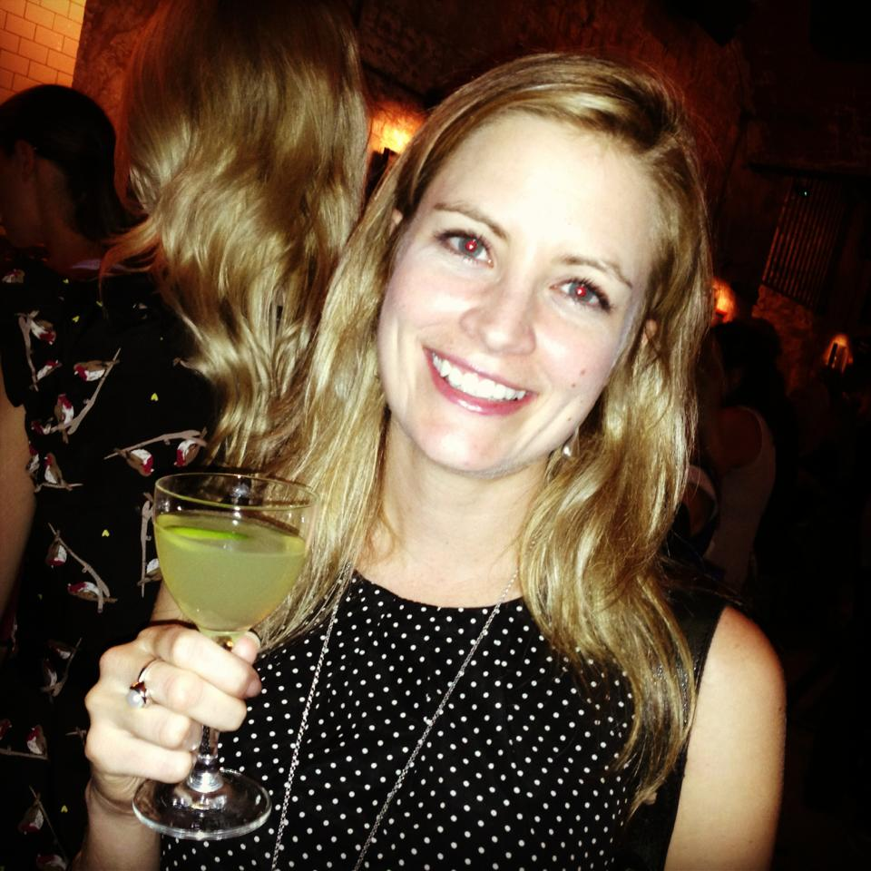
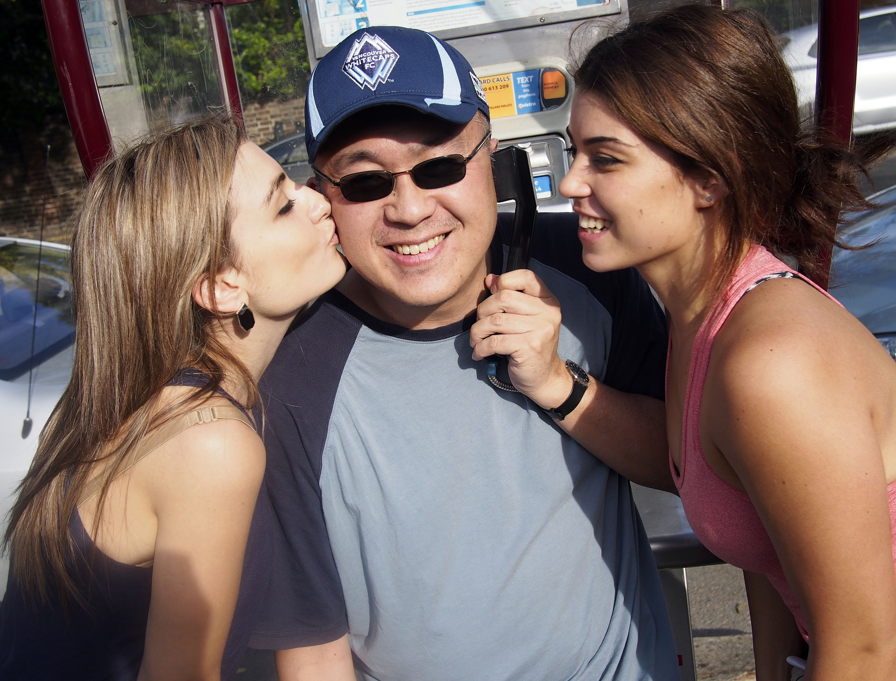
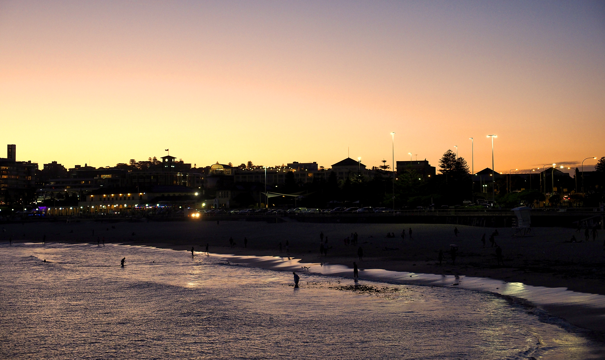
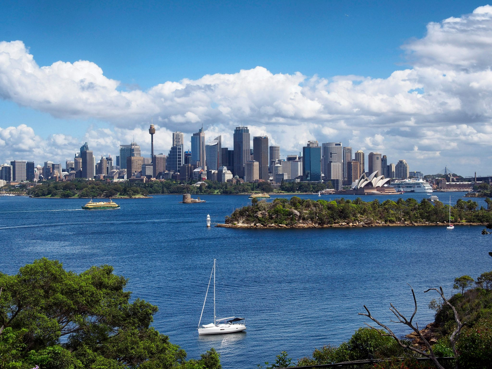
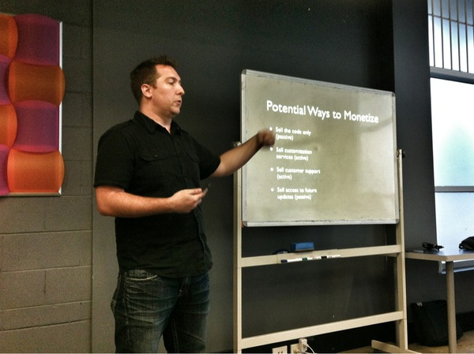

I recently returned returned about four month’s ago from a three week visit to Australia. I managed to make it as far as New Zealand in 2011, but didn’t have the time to get across to Australia. Despite appearances, most people think Australia and New Zealand are fairly close – but they are actually separated by a distance that would take between 3.5 and 4 hours to fly between them, which is obviously quite far (like going from Calgary to Toronto).

I left Vancouver on a Wednesday with the goal of being in Sydney on the Friday (you lose a day crossing the date-line). It was a long flight (14 hours), but I managed to sleep during some of it so it ended up not feeling like an extremely long time. It’s hard to believe at this stage in my traveling career that a 5 hour flight used to seem really long to me, considering many of the flights I’ve had in the last year have been 10 hours or longer.

Nadine in Sydney

I had plans to meet up with two people in Sydney. The first is my friend Nadine, who I actually met in South Africa at another friend’s, Samantha’s, wedding. I had told her for about a year that I was hoping to make it to Sydney, but never managed to get there until recently.

I met her downtown on Friday night and she proceeded to take me around to some of the cooler bars in the city. One thing that caught me a bit off guard was the prices of things in Sydney; I knew it was expensive there, but I wasn’t prepared for just \*how\* expensive it was. For example, at the first bar we were at cocktails were priced around $18-$19 AUD, which is pretty pricey. For a guy like me that can hold his liquor, it’s was really easy to drop $100 in a bar. The high prices weren’t exclusive to liquor either – hotels, food, and transportation were equally as expensive. Sydney officially takes the spot as the most expensive place I’ve ever visited.

The other person I wanted to meet up with was my friend Henry, who was actually visiting Australia from Canada at around the same time as I was. When we finally met up, we did what any Canadian guys would do when looking for adventure on a Saturday – we did an impromptu pub crawl around ‘The Rocks’, an area of pubs and restaurants right around the harbour area in Sydney. The highlight of the day was encountering a group of girls who got a photo of Henry to satisfy a requirement of some ‘Amazing Race’ scavenger hunt they were currently on.

Henry Being Kissed in Sydney, Australia

I did some exploring with my friend Nadine while in the city – hitting a pubs, a few restaurants, and of course, Bondi Beach (pronounced BON-DIE – don’t get this wrong). Bondi Beach is famous in Sydney, since it’s a beautiful beach that’s easily accessible from downtown Sydney by both car and bus, so many locals go there for evening swims, surfing, or for drinks on the beach.

Bondi Beach, Sydney Australia

I even managed to head down to the Sydney Zoo as well while in Australia. Some of the highlights for me were seeing another type of penguin (I’ve seen 4 out of the 17 different types so far now), giraffes, and even a few lions. The ferry ride to the zoo is amazing, so if you have time you should definitely enjoy both the ferry and an afternoon at the Zoo. Ferries leave from the harbour every 30 minutes or so on the weekends.

Sydney, Australia, Viewed from the Sydney Zoo

Since it was my first time in Australia I decided to reach out to some of the local WordPress community to see if there was any interest in me giving a talk. As it turns out, there was, and I did a [presentation about how to commercialize a WordPress plugin](http://www.meetup.com/WordPress-Sydney/events/105806252/?action=detail&eventId=105806252).

Me Discussing Ways to Commercialize an Open-Source WordPress Plugin

The talk was well received, and I had a great time down at a local pub later with many of the people from the audience. As is my tradition, I was happy to buy a few pictures of local brew to share with my fellow WordPress brethren. I was even happily surprised and a bit humbled to learn that several people flew in from other parts of Australia to hear my presentation.

I only had 18 days to spend in Australia, so I spent all my time in Sydney. It reminded me a lot of Vancouver, probably because they are both on the ocean where people enjoy similar, laid-back lifestyles. Even though Vancouver is an expensive city by world standards, Sydney is easily at least 10% more expensive across the board. It’s not totally unaffordable, but it’s definitely not a destination for anyone on a budget.

If you do go, expect to spend over $100 a day if you want to enjoy yourself, excluding accommodation (which cost me around $300 per night for a hotel in the downtown core). If I had more time I would have ventured further away from Sydney, most likely to Melbourne. But I thoroughly enjoyed my time in Sydney visiting friends, walking around the city with a coffee, and enjoying some beach time down at Bondi.