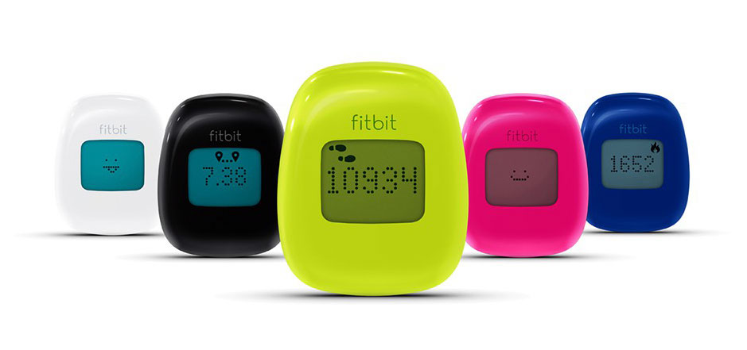
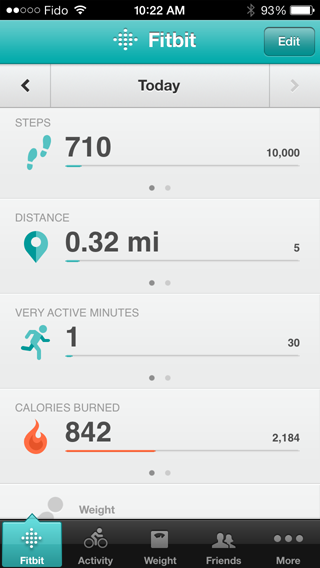

I recently returned from Brazil, and decided to stock up on some new electronics. While down at the Apple store I managed to grab a new [bluetooth keyboard for my iPad Mini](http://amzn.to/1ePJLKD), as well as a few other gadgets. That’s when my eye caught some of the Fitbit devices on display in the Apple store, and I decided to get one.

### What Is The FitBit Zip?

The [Fitbit Zip](http://amzn.to/16QBfIn) is basically a pedometer, a device that measures and records each step you take. If you wear it around during the day you can log how many steps you take, and in term how many calories you burned during the process.

Fitbit Zip: Wireless Activity Tracker

The advertised features of the Fitbit Zip are:

- Tracks steps, distance and calories burned
- Syncs automatically to your computer or select Bluetooth 4.0/Bluetooth Smart Ready devices (iPhone 4S or later, and the iPad (3rd generation)
- Set goals, view progress, and earn badges
- Share and compete with friends throughout the day
- Free iPhone and Android Apps
- Small and discreet – wear in pocket, on belt or bra
- Log food, weight and more on Fitbit’s website or apps
- Sweat-, rain-, and splash-proof
- Replaceable battery, lasts 4-6-months

As you can see from the photo above, the device comes in various colours, so you can colour coordinate if that is important to you.

### Why I Like Technology Like This

I’ve been a big fan of [RunKeeper](http://www.runkeeper.com) over the last few years, even though I would generally rather go to the dentist that go for a run. But I like the social aspect of it – you can see what activities your friends are going, and in term they can see what you are doing. It’s like having a gym buddy, but one who isn’t physically present when you are doing activities.

I also like how you get the occasional email congratulating you when you pass a new milestone. Just walked your further distance ever? Congrats! Just biked further than you ever have before? Good job!

Fitbit has a similar strategy in that they will occasionally email you (if you sign up for their free service) badges for each accomplishment, such as longest distance walked to date. Personally I love the positive reinforcement that getting a badge gives you, since it makes going out and getting some exercise fun.

### Fitbit Zip vs Fitbit One

The Apple store I visited had two Fitbit versions: the [FitBit One](http://amzn.to/17ShP51) and the [FitBit Zip](http://amzn.to/16QBfIn). The main differences between the two was that the Fitbit One also includes a sleep quality tracker as well as a stair counter. I personally wouldn’t find either of those features useful (especially since I’ve used a few of the iPhone sleep tracking apps), so I decided to save myself nearly $50 by getting the Fitbit Zip.

I picked one up for my girlfriend as well, hoping we can start going on more walks when we get to Europe.

### iPhone and Android Applications

FitBit Zip iPhone Application

While the [Fitbit Zip](http://amzn.to/16QBfIn) has a dot-matrix style LCD display, I personally don’t think it is very useful. Instead I assume most people will download the Android or iPhone applications and use it to view the information on the device.

To use the application you also have to sign-up to the FitBit website where they will collect all your stats. I have no problem with that, especially since they also use your email address to send you little badges and what-not whenever you do something awesome (like making any attempt to go get some exercise).

One slightly weird thing about the device is that you have to essentially ‘smack’ it whenever you want to wake it up during synching. This process hasn’t really been super smooth for me, often taking 15 to 20 seconds for my iPhone to find the device after I whack it. I recently found an option in the application settings to synchronize in the background instead of on-demand, and this appears to be working much better. So I would go that route instead.

The application tracks steps that you take each day (by synchronizing with the FitBit) and translate that into a calorie count that you can use to figure out how many calories you can eat each day. It also lets you track the water you consume, the foods that you eat, what activities (other than walking) that you do, and even your daily measurements.

You can also look for friends that use the service as well so that you can have some additional motivation, which is similar to RunKeeper. I looked for some of my friends on the device, but I can’t seem to find anyone else that I know who uses it. That will thankfully change when I give my girlfriend her device.

### Final Thoughts

I’ve only had the [Fitbit Zip](http://amzn.to/16QBfIn) for about a week now, but the device has found a permanent spot on my belt. Since I almost always wear my belt each day, I’ve found that it is always on me, tracking how many steps I walk.

If you like walking and don’t really care how many steps you take each day, then maybe this isn’t a device that you would find useful. Personally I’m using the water tracker in the iPhone application, and trying to hit 10,000 steps a day, but don’t really think I’ll bother tracking my food or weight, at least not routinely.

That being said, I do find myself motivated to at least try and hit my 10,000 step goal each day. I’ve had a few instances where I’ve purposefully gone for a walk because I’ve been short steps for that day. And I’ll admin, getting the occasional email congratulating me is also a nice touch that I enjoy, at least for now.

You can [buy a Fitbit Zip](http://amzn.to/16QBfIn) on Amazon, or visit your local Apple store and see if they have them there.