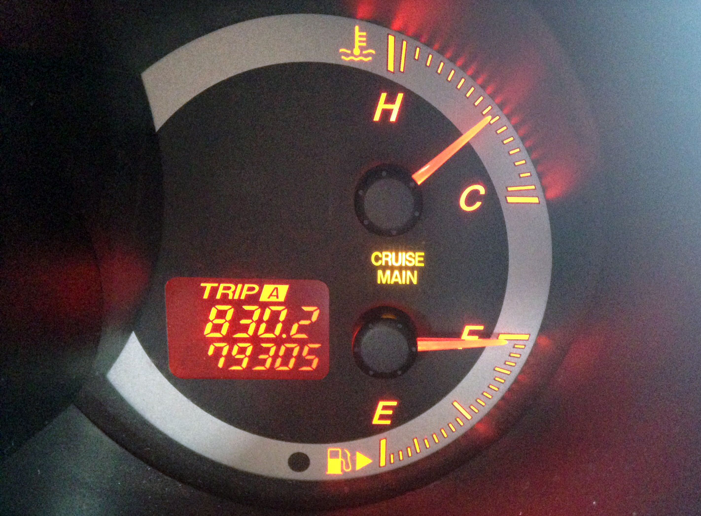
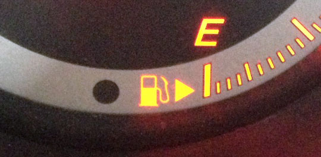

When you travel around as much as I do, you eventually find yourself in need of a rental car. While I’m usually quite happy to take a bus, often it’s more economical to rent a car for a few days, especially if you’re trying to get to a hard to reach destination (Cape Reinga in New Zealand was one location where I purposefully rented a car).

If you’ve ever pulled up to a gas station in a rental or unfamiliar car, I’m sure some of you have wondered how to find the gas tank. I personally used to slow the car down, pop the gas tank open (often using the lever near the floor), then rock my head back and forth a few times hoping to catch a glimpse of the gas tank in either the left or the right side-view mirrors. In dire situations I would be forced to pull the car over, stop, then get out of the vehicle and walk around to locate which side the gas tank was on.

Last year someone I met along the way (and unfortunately I can’t remember who it was) told me that this information is actually shown on the dashboard in most cars, but in a very subtle way. I wasn’t entirely sure I believed them, but sure enough they were absolutely correct.

Here’s a photo I snapped today of the fuel gauge area on my Mazda 3 Sport to show you how to find this information:

Finding The Gas Tank Location

See if you can figure out where the gas tank is located just using this photo. Can you see it?

Let me help you out with this close up crop of the same photo:

The Magic Fuel Arrow, Showing The Location Of The Gas Tank

Right next to the gas symbol (at least on the dash of my car) is that little sideways arrow, and that little arrow is pointing to the right. What that means is the gas tank is located on the right-hand side (when sitting in the driver’s seat) of the car.

I’ve probably driven at least 10 different vehicles since learning about this, and that arrow has been near the fuel gauge on every single one of those vehicles. So next time you’re in a rental car (or someone else’s vehicle) and pull into the gas station, simply glance down at the fuel gauge to find the little arrow.

If you happen to find a car that doesn’t have this, let me know! Maybe it’s a relatively new feature, but like I said, it’s been in every car so far that I’ve checked.