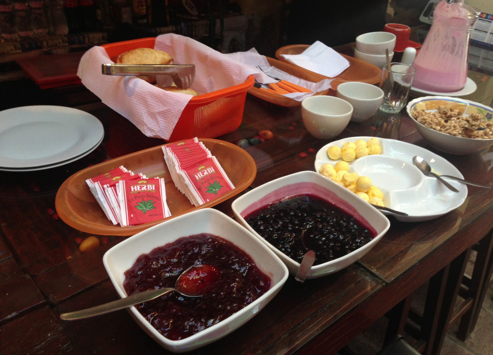

Whenever I look to book a hostel nowadays, I almost always gravitate towards one of the online booking services such as [HostelWorld](http://www.hostelworld.com/findabed.php?ChosenCountry=Peru&ChosenCity=Cusco&affiliate=duanestorey). Not only can you see a huge inventory of available hostels in the area, but you can also see reviews from recent visitors. Sometimes a hostel with a good rating will have a bunch of poor reviews recently due to something like construction noise nearby, so it is always a good idea to read the reviews in detail.

For our trip to Cuzco, Peru, we decided to stay three nights in Cuzco upon arriving to eat some of the local cuisine and to help get our bodies acclimatized to the 11,000 feet altitude. I’m glad we made this decision, because I pretty much had a headache the entire time in Cuzco due to my body adapting to the thinner air.

July is one of the prime months to visit Machu Picchu since it doesn’t rain as much during this time of year. As such, finding room in the various hostels can be a bit challenging, and we had to view three or four on HostelWorld to find one with three consecutive days in a private room. While some people enjoy bouncing between hostels, I’m not really one of them, and much prefer staying a few days in a row so I can get to know some of the staff and also enjoy a tiny bit of routine.

The Pisko &amp; Soul hostel had great reviews on HostelWorld, and had a cumulative 93% rating. They offered a shuttle service from the airport for 20 Peruvian Soles (about $8 CAD), which we took advantage of. We may have been able to get a taxi cheaper, but we didn’t really want to deal with it after 8 hours of traveling from Sao Paulo.

Upon arriving we were warmly greeted by Roní, a Peruvian employee here at the hostel who could speak both english and spanish. Check-in was very simple, and after taking a photocopy of our passports and our entry papers, we were given a room key. We were then offered tea made from [coca leaves](http://en.wikipedia.org/wiki/Coca), which is the local remedy for altitude sickness. The tea is somewhat similar in taste to a typical green tea, but I found it a bit sweeter – I didn’t feel the need to add any sugar to it at all.

Mate de Coca – a local remedy for altitude sickness

Another nice perk at the hostel is that they offer a free breakfast between 8am and 10am every morning consisting of coffee, toast and jam, scrambled eggs, and cereal. I’ve been trying to challenge myself lately by spending as little as possible on food during a day (since eating out can quickly eat up your budget), so a free meal in the morning definitely helps with keeping expenses low.

Morning breakfast at the Pisko Soul hostel

### Final Thoughts

My girlfriend and I really enjoyed our time in the Pisko &amp; Soul hostel in Cusco, Peru. It was only two blocks to Plaza de Armas, and was on a street filled with good restaurants. And best of all the people who worked at the hostel were always pleasant and helpful.

I definitely recommend the Pisko &amp; Soul Hostel where you’re in Peru. You can find a detailed list of [hostels to book in Cusco, Peru](http://www.hostelworld.com/findabed.php?ChosenCountry=Peru&ChosenCity=Cusco&affiliate=duanestorey) here.