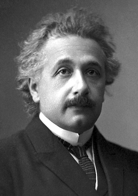

Probably the best book I read last year was [Steve Job’s biography by Walter Isaacson](http://amzn.to/1d824yR). I thought it was a fascinating book that showed just what a polarizing figure Steve Jobs actually was.

Recently I found myself looking for a new book, and Amazon recommended [Walter Isaacson’s biography of Albert Einstein, Einstein: His Life And Universe](http://amzn.to/1bA2Lgp). I recently finished reading it and I wanted to share my review of it here.

Einstein in 1921. Photo from [Wikipedia](http://en.wikipedia.org/wiki/Albert_Einstein).

As someone with a physics background, I was impressed with how Isaacson dealt with some of the technical achievements of Einstein, such as the photoelectric effect (which Einstein won the Nobel Prize for) and of course relativity. I assumed beforehand that these would be glossed over, and was happy that most of them were not. Presenting these topics to the average layperson without dumbing them down too far is a big achievement, and Isaacson did it surprisingly well.

I personally love Isaacson’s writing style. It must be very difficult to assemble so much information about a person’s life and then present that information in a readable format. But Isaacson has demonstrated both in the Steve Job’s biography and the [Einstein biography](http://amzn.to/1bA2Lgp) that he’s able to navigate complex topics in a person’s life and present them methodically to a reader.

I found it both sad and fascinating that Einstein was almost passed over scientifically because he was Jewish. I always thought that he was a patent clerk that eventually came up with the general theory of relativity. That’s true, but not in the way I originally thought. For example, Einstein was already a gifted theoretician, but nobody would hire him for anything scientific. The patent clerk position was the only one he could find after applying for countless jobs over a period of years.

The first half of the book basically deals with his rise to the prominent scientific position most people remember him for. But the second half of the book is equally as interesting, as it deals with his flight from Germany (when Hitler came to power), his pacifist views, and the fallout from his involvement with the Manhattan Project. He actually sent the original letter to the president of the United States urging him to set up a special committee (which would eventually become the Manhattan Project that developed the first two atomic bombs) to investigate the creation of an atomic bomb before Germany could acquire one, something that he regretted long after the two bombs fell on Japan.

I also thought his personal life was quite interesting. He showed a strange emotional detachment to almost everything in his life other than his work, yet he seemed to love interpersonal relationships and long walks with friends. There’s one event in his life where a young girl walks up to his house later in his life, rings the doorbell, and then asks for his help with her homework. He happily agrees, but only in exchange for some of the cookies she brought with her.

All in all it’s another great book by Isaacson, and I highly recommend [Einstein: His Life and Universe](http://amzn.to/1bA2Lgp) if you’re looking for a really interesting biography.