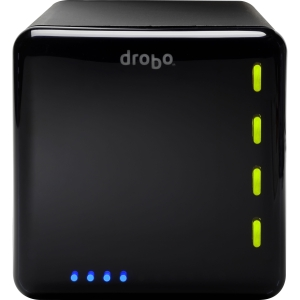

Drobo

I first heard about the [Drobo Storage Array](http://amzn.to/19RB4m7) from my friend Tony a few years ago. A Drobo Data Array is basically a self-contained RAID-5 data storage array in a box. For anyone that doesn’t know what that means, it’s basically a fault-tolerant form of storage where you can lose any one drive completely and still recover all of your data.

Unlike most RAID-5 software or hardware systems though, the Drobo unit is intelligent in that it will work with different sized drives, and expand accordingly in the future if you pop a new drive in. My business partner picked up a Drobo about six months ago, and he’s been really happy with it. So a few months ago I went to NCIX here in Langley and decided to grab one.

The unit I purchased is a 4-bay unit that supports Firewire 800, but you can get units now that support [Thunderbolt and USB 3.0](http://amzn.to/19RByIZ). Each bay can support up to a 4 TB drive, which means the unit can support up to 16 TB worth of data. Typical RAID-5 gives you (n-1) drives of usable space, so if you are using four 4 TB drives then you will only end up with 12 TB of usable space with 4 TB being used for the redundancy information. I picked up three 2 TB drives, which should give me around 4 TB of usable space.

I set it up last night with my three drives and managed to get everything transferred over to it. I created two partitions on it, one that’s 1 TB large for time machine backups, and another using the remaining space for everything else.

One of the tips I learned on the internet is that it’s important to format your original partition for as large as possible, in this case 16TB (even though you don’t have 16TB at first). That way when you insert an additional drive later on your system will automatically grow to accommodate the new space.

When I go travelling, I typically take my [WD Passport drive](/reviews/products/best-external-hard-drive-for-travel/) with me. But whenever I get back from a trip, I automatically make another backup of my computer and all my photos from my trips to my Drobo unit.

If you’re looking for a home data storage solution and don’t want to think too much about it, then I’d highly recommend a [Drobo Storage Array](http://amzn.to/19RB4m7) unit. Given that you can add or replace drives at will and the system can survive a drive failure, this unit is a great way to ensure data integrity while having space for additional room in the future.