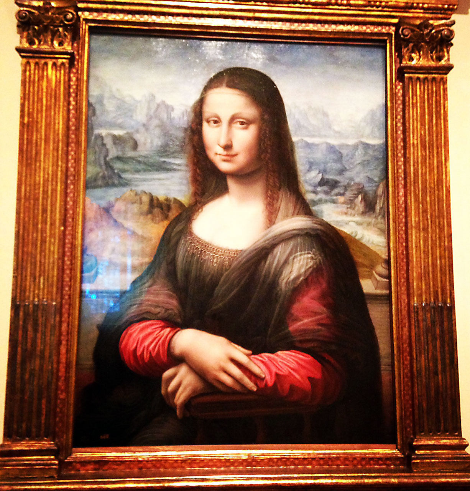

Last year while in Paris I decided to head down to the Louvre, one of the finest museums of art in the world. While there are several masterpieces there, one of the most valuable paintings in the world in also displayed inside the Louvre: The Mona Lisa.

The Mona Lisa, or *La Gioconda*, is a painting by Leonardo da Vinci, and is thought to be a painting of Lisa Gherardini, the wife of Francesco del Giocondo. Part of the painting’s appeal is the beautiful Tuscan background and the enigmatic pose of Lisa in the painting.

The Mona Lisa, shown here in the Louvre

Prior to viewing it last year, I decided to do a quick Google search to read about the Mona Lisa’s history. One interesting tidbit of information that I found was that another version of the Mona Lisa had been recently discovered by a museum in 2012. The owners of this painting previously thought that the painting was a cheap imitation, primarily because the background of the portrait was black instead of displaying the Tuscan sky that the original shows. But during a restoration process on the painting, the restoration artists discovered that beneath the black background of the portrait was actually the Tuscan sky, just like on the original.

More than that, an X-ray of the painting showed the original markings that were used to sketch the main aspects of the painting, and these matched the original sketches on the painting in the Louvre. Taken together it means that whoever painted the recently restored painting was likely with Leonardo when the original was painted as well. The Louvre actually confirmed this findings, and the current theory is that the second painting was actually worked on by a pupil of Leonardo’s, probably while Leonardo was painting the original.

I actually completely forgot about the second Mona Lisa painting until yesterday. While in Madrid, Luciana and I decided to head down to the famous Museo Del Prado (Prado Museum) and see some of the art work there. I was actually surprised when walking into the first room near the entrance to see a beautiful version of the Mona Lisa on the wall.

The Mona Lisa’s Twin Sister, shown here in the Museo del Prado in Madrid

It turns out that the establishment that found the copy of the Mona Lisa that I read about was actually the Museo del Prado in Madrid, Spain. It was a pleasant surprise to see it on the wall after reading about it last year, and it really is a beautiful painting.

The original Mona Lisa shown at the Louvre in Paris is covered in layers in dirt and varnish – the colours are quite faded and the subject in the photo looks prematurely aged. Looking at the copy of the Mona Lisa in the Museo Del Prado, one can see how the original painting likely looked when Leonardo completed it. In addition, some aspects of the painting are slightly different in the copy, namely that Lisa in the Prado copy has eyebrows, but doesn’t in the Louvre version. It is thought that the eyebrows in the Louvre copy were removed accidentally during a restoration attempt years ago.

So if you’ve ever in Madrid, you should definitely head down to the Museo del Prado to see the Mona Lisa’s twin sister, shown in all her glory. It’s a gorgeous painting, and is in a much better condition than the original version in the Louvre.