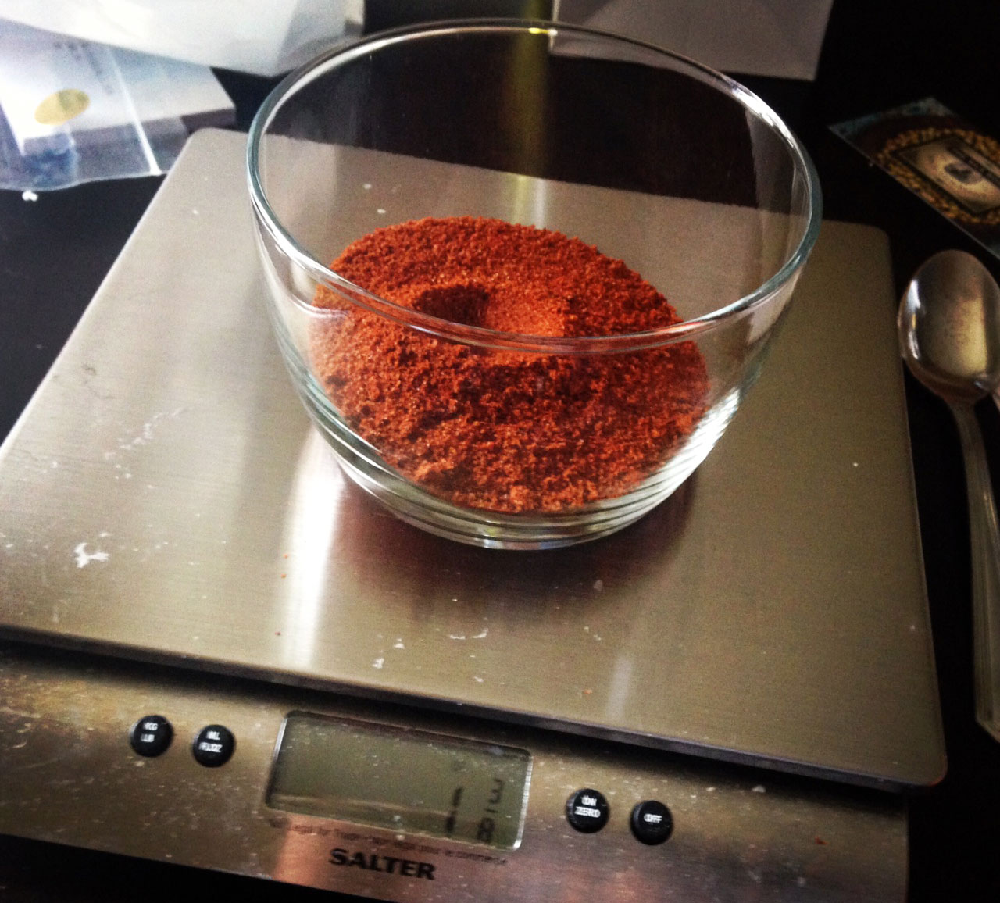
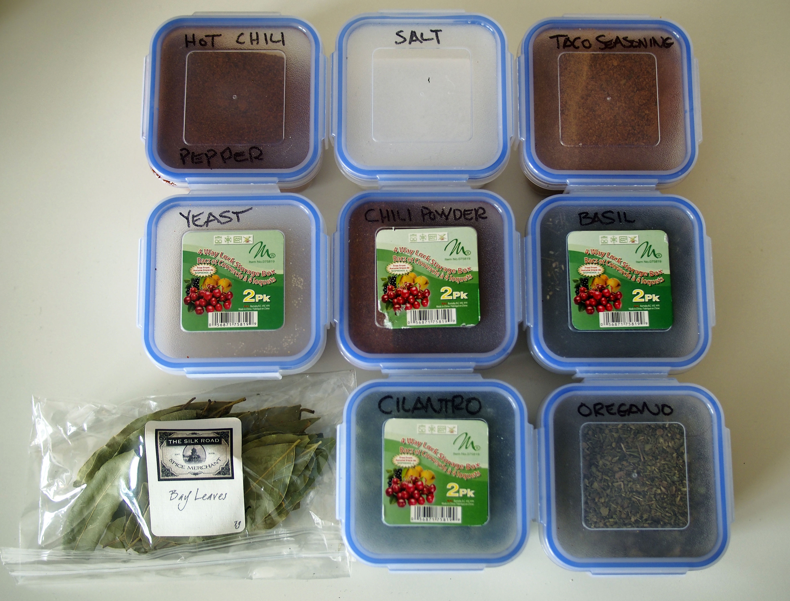

Anyone who likes to cook can appreciate the challenge of making food without a nice selection of herbs and spices. When I’m back at home, I have a pretty full spice cabinet with probably about 30 different containers ranging from saffron to gran masala to coriander.

But unfortunately when I travel finding some of the herbs and spices that I’m used to can be a challenge in many parts of the world, and basically impossible in other parts. A good example of that is chilli powder – it’s basically available in every supermarket in Canada, but I couldn’t find it anywhere when I was in Brazil.

Since I was making plans to go travelling for at least a few months, I thought it would be a good idea to take along some of my favourite spices for my trip. That way when I rent apartments for a few weeks or a month at a time I don’t have to waste money buying spices in each place I visit. Not only that, but it guarantees I can make some of my favourite dishes whenever I get a bit tired of the local cuisine (which happens from time to time).

There are actual a key [travel spice kits](http://amzn.to/19042M1) available online, but I decided that since I had many of these already at home I would simply build my own. After I made the decision, I thought for a while about what kind of containers I should take. I found some cheap glass ones at the local dollar store, but it seemed like they would be quite heavy in my suitcase.

Ultimately I found eight small tupperware containers that I purchased for only $4 CAD. What I liked about them is that they seemed really light and also had four snaps to close, which meant they likely wouldn’t pop open in my suitcase and create a huge mess.

Next I had to decide what spices to bring with me. I purchase most of my spices in Canada from [Silk Road Spices](http://www.silkroadspices.ca/), based in Calgary. Prior to leaving Brazil a few months ago, I placed another order with them that was waiting for me when I got back home to Canada. So most of the spices I brought with me on this trip were from Silk Road.

Measuring Out Chilli Power For My Travel Spice Kit

I only had eight containers so I needed to decide carefully which spices to bring. Here’s what I ultimately decided on and why.

- Taco Seasoning – one of my favourite cuisines is Mexican, and finding taco seasoning is quite difficult in many parts of the world. So I brought this along for seasoning meat whenever I am craving tacos or burritos
- Sea Salt – you can buy salt everywhere you go, but often you have to buy it in large quantities. I decided just to bring a small container with me that should hopefully last for four months
- Hot Chilli Pepper – I love making chilli con carne, so I decided to bring some hot chilli pepper. This is a nice addition to pretty much any dish that you’re looking to make a bit hotter
- Chilli Pepper – I probably could have left this one at home, since I have the hot chilli pepper. But often it’s nice to use chilli pepper without having a ton of heat. And since this is from a different pepper than the hot chilli pepper, it’ll provide extra complexity to chilli con carne when I make it.
- Yeast – I don’t eat a lot of bread, but I do like making it from time to time when the weather isn’t so great. Same goes for pizza dough
- Basil – this can be used in a lot of dishes, but I primarily bring it for making Italian dishes such as spaghetti
- Oregano – similar to basil, I use it mostly for Italian dishes
- Cilantro/Coriander – I love making guacamole, and it’s one of my favourite side dishes. It’s best to have fresh cilantro, but it’s not always available. So I brought this for when I can’t find any locally. In some parts of the world it’s known as coriander, and in others cilantro. So if you travel it’s best to memorize both names just in case you go looking for it
- Bay Leaves – I use these in a lot of different dishes, but primarily for Italian as well. But it’s nice in beans and chilli, or anything that simmers for a while

Travel Spice Kit

Together all of these weighed about 1 lb. Given that I can bring about 50 lbs in my suitcase for most airlines, it represents 2% of the total weight in my suitcase. But when you’re 10,000 kms from home and craving some of your favourite foods, it sure is rewarding being able to cook them yourself thanks to your own travel spice kit. It also can save you quite a bit of money if you’re used to buying spices in new locations as you go.

Bringing these along doesn’t mean I don’t cook locally as well, but everyone gets tired of eating the same foods again and again over time. When I’m back in Canada I don’t sit around and eat poutine or hamburgers every day, and when I travel to Spain I don’t always want to eat tapas and paella. Having a travel spice kit is a great way to be able to cook the foods you want when you want, without the added hassle of having to hunt down and buy spices as you travel.