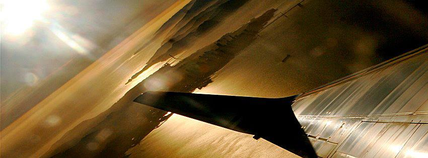

Many people don’t realize that if they are in another country that they will often have to pay for all their medical expenses out of their own pocket. A simple visit to a doctor’s office probably won’t set you back too far in most countries, but being hospitalized can potentially bankrupt a person in certain parts of the world, such as the United States. I had a friend who got into a scooter accident in Thailand years ago, and only avoided hefty medical bills thanks to the travel health insurance he purchased before leaving Canada.

So without a doubt one of the first items that should be on everyone’s to-do list for an upcoming trip is to either insure that you have adequate travel health insurance for your trip, or purchase travel insurance before leaving.

### Check For Pre-existing Coverage

If you have a higher end credit card, often one that has an annual fee, it will sometimes include travel health insurance for a period of time. In my experience they usually cover trips for 14 days or less, but nothing that’s of a longer duration.

If you have a health care plan through your work or through a third-party, you can check if there are any provisions in your policy to provide health insurance while travelling. Chances are though your health insurance policy won’t provide any substantial coverage for travelling, so you will likely need to buy your own.

### Buying Travel Health Insurance

One of the best travel insurance providers on the Internet is World Nomads, and they have a really good reputation amongst travellers. I have some travel insurance on my credit card, but will often use World Nomads for longer duration trips as well.

With travel insurance from WorldNomads.com, a person can buy, extend and [claim online](http://www.worldnomads.com/af.aspx?affiliate=mignerd&subid=travhealthpost&path=http://www.worldnomads.com/claimstories.aspx?keyword=aneurysm&type=general&utm_source=mignerd&utm_medium=Para&utm_campaign=para_v1), even after you’ve left home. It’s available to people from over [150 countries](http://www.worldnomads.com/af.aspx?affiliate=mignerd&subid=travhealthpost&path=http://www.worldnomads.com/allcountries.aspx&utm_source=mignerd&utm_medium=Para&utm_campaign=para_v1) and is designed for [adventurous travellers](http://www.worldnomads.com/af.aspx?affiliate=mignerd&subid=travhealthpost&path=http://www.worldnomads.com/whatwecover.aspx&utm_source=mignerd&utm_medium=Para&utm_campaign=para_v1), with cover for overseas medical, evacuation, baggage and a range of adventure sports and activities.

Here are some of the features that make World Nomads one of the most recommended travel insurance providers on the Internet:

1. **Reliable Underwriters**WorldNomads.com is backed by a suite of strong, secure, specialist [travel insurers](http://www.worldnomads.com/af.aspx?affiliate=mignerd&subid=travhealthpost&path=http://www.worldnomads.com/insurers.aspx?&utm_medium=affiliate&utm_term=easy_url_ins&utm_content=para&utm_campaign=7things) who provide you with [great cover](http://www.worldnomads.com/af.aspx?affiliate=mignerd&subid=travhealthpost&path=http://www.worldnomads.com/whatwecover.aspx?&utm_medium=affiliate&utm_term=easy_url_wwc&utm_content=para&utm_campaign=7things), 24 hour emergency assistance and the highest levels of support and claims management when you need it most.
2. **Great Value and Coverage**WorldNomads.com provides coverage for what’s important for travellers from over [150 countries](http://www.worldnomads.com/af.aspx?affiliate=mignerd&subid=travhealthpost&path=http://www.worldnomads.com/insurance.aspx?&utm_medium=affiliate&utm_term=easy_url&utm_content=para&utm_campaign=7things). By focussing on what you need and leaving out what you don’t, World Nomads [prices](http://www.worldnomads.com/af.aspx?affiliate=mignerd&subid=travhealthpost&path=http://www.worldnomads.com/prices.aspx?&utm_medium=affiliate&utm_term=easy_url_prc&utm_content=para&utm_campaign=7things) are some of the most competitive online.
3. **Flexibility**Had a change of plans? You can extend your policy indefinitely or claim online while you are still away. You can even [buy](http://www.worldnomads.com/af.aspx?affiliate=mignerd&subid=travhealthpost&path=http://www.worldnomads.com/insurance.aspx?&utm_medium=affiliate&utm_term=easy_url&utm_content=para&utm_campaign=7things) a World Nomads policy if you’re already travelling.
4. **Coverage For Many Activities**From [skiing &amp; snowboarding](http://www.worldnomads.com/af.aspx?affiliate=mignerd&subid=travhealthpost&path=http://www.worldnomads.com/skicover.aspx?&&utm_medium=affiliate&utm_term=easy_url_ski&utm_content=para&utm_campaign=7things) in New Zealand to whitewater rafting in Colorado, WorldNomads.com covers a range of [adventure activities](http://www.worldnomads.com/af.aspx?affiliate=mignerd&subid=travhealthpost&path=http://www.worldnomads.com/a2z.aspx?&utm_medium=affiliate&utm_term=easy_url_a2zc&utm_content=para&utm_campaign=7things), giving you peace of mind to get the most from your travels.
5. **Safety Alerts**All WorldNomads.com members have access to up-to-date [travel safety alerts](http://www.worldnomads.com/af.aspx?affiliate=mignerd&subid=travhealthpost&path=http://safety.worldnomads.com/?&utm_medium=affiliate&utm_term=easy_url_safe&utm_content=para&utm_campaign=7things), as well as travel safety advice and tips online through the World Nomads [Travel Safety Hub](http://www.worldnomads.com/af.aspx?affiliate=mignerd&subid=travhealthpost&path=http://journals.worldnomads.com/safetyhub?&utm_medium=affiliate&utm_term=easy_url_safehub&utm_content=para&utm_campaign=7things).

You can find out more [about what is covered](http://www.worldnomads.com/af.aspx?affiliate=mignerd&subid=travhealthpost&path=http://www.worldnomads.com/whatwecover.aspx?&utm_medium=affiliate&utm_term=easy_url_wwc&utm_content=para&utm_campaign=7things) and the [5 key parts](http://www.worldnomads.com/af.aspx?affiliate=mignerd&subid=travhealthpost&path=http://www.worldnomads.com/policyparts.aspx?&utm_medium=affiliate&utm_term=easy_url_ppts&utm_content=para&utm_campaign=7things) of a World Nomads’ travel insurance policy.

I’ve used World Nomads for a few trips, and so has my girlfriend. I personally love that I can simply book it online with a few clicks and get ready to travel, which is a much better experience than heading down to my local insurance broker and waiting in line for 30 minutes.

If you’re looking to [buy travel health insurance for a trip](/tips/travel/buy-travel-health-insurance/) you are going on or one you have already started, then definitely check out [Travel Health Insurance](http://www.worldnomads.com/af.aspx?affiliate=mignerd&subid=travhealthpost&utm_source=mignerd&utm_medium=textlink&utm_campaign=easy_url) from Worldnomads.com. They are the #1 travel insurance provider on the internet for a reason.

If you’re likely to go on a future trip but aren’t ready to purchase insurance now, consider navigating to [World Nomads travel insurance](http://www.worldnomads.com/af.aspx?affiliate=mignerd&subid=travhealthpostbot) and adding a bookmark so you can access it at a later date.

If you’re also interested in learning how to fly for free, check out my recent article on [how to fly for free and earn elite status](/tips/mileage/how-to-fly-for-free-and-earn-elite-status/).