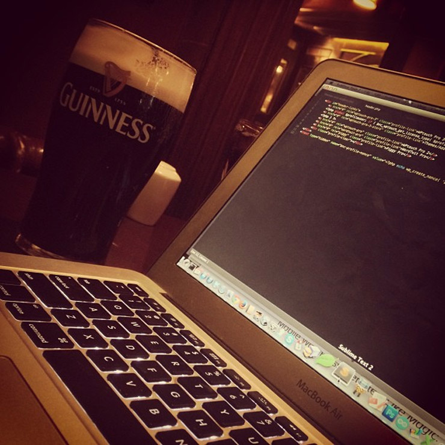

I’ve been bouncing around Galway for a week now, and one thing that surprises me compared to a lot of other countries I have visited is how hard it is to find free WiFi. Lots of places seem to offer it on the internet, but when you actually show up to use it you typically only get 20 minutes for free via BitBuzz or Boingo. As someone who typically works remotely as I am travelling, 20 minutes just doesn’t cut it.

Working In Galway

Thankfully I found a pub in completely free WiFi in Galway: [The Front Door](http://www.frontdoorpub.com/). So while I typically prefer to spend my days working in coffee shops, for the time being I’m upgrading to beer-filled days due to the free WiFi here.

So if you are visiting Galway and looking for a place to sit down for a bit and get reconnected with people back home, or possibly even do a bit of remote work like me, then head-on down to the Front Door Pub in Galway for a few pints of Guinness and enjoy the open WiFi. They not only have great food, but lots of different beers on tap. And of course, free WiFi – a rarity in Galway so far.