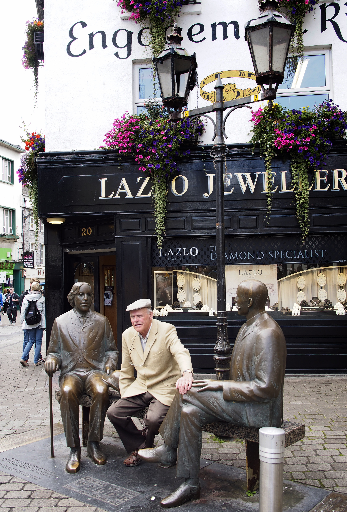

Back in high school I signed up to take English Literature, which for me at the time was a rather unusual departure. One of the reasons I decided to take the plunge was due to the rather passionate sales pitch by the teacher at the time, Mr. Chadsey. As it turns out, it was one of my most enjoyable courses ever, and many of the poems and prose I read at the time has stayed with me throughout most of my adult life.

Oscar Wilde Statue in Galway

One play we read at the time was [The Importance of Being Earnest](http://amzn.to/16k35yF) by Oscar Wilde. Due to the controversial (at least at the time) life of Oscar Wilde, the play didn’t get performed much while he was alive. But it’s become a bit of a classic since that time, and he’s now recognized as an important playwright.

It turns out that Oscar Wilde was Irish, something I didn’t know until yesterday. While going around the Irish city of Galway on a walking tour, we encountered a statue of his and learned a bit of his history. He spent time in prison due to his homosexuality, and eventually moved to France later in life. He died young and mostly penniless.

But if you’re a history or literature buff, then make sure you check out the statue while in Ireland. You can find it on the main street in Galway – just look for the tourists snapping photos.