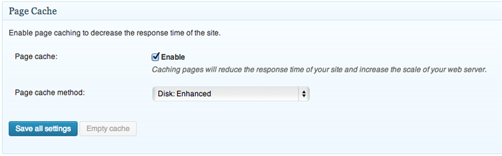
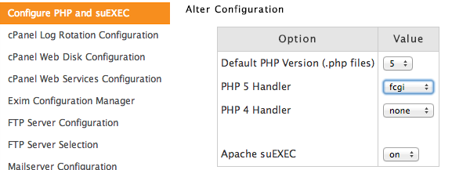
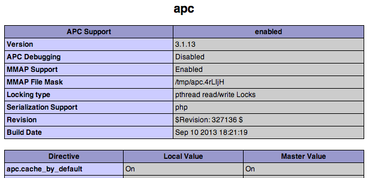
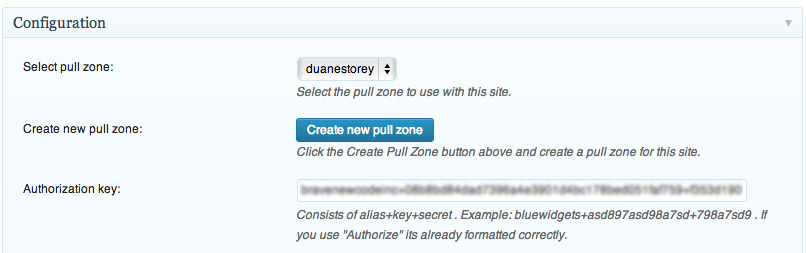

I’ve recently been optimizing a few different WordPress websites, and wanted to share with everyone some of the easy ways to speed up your WordPress website. Some of these tips are intended for server administrators and assume that you have root access to your server and/or cPanel/WHM (if you’re using cPanel). Other tips are intended for any WordPress website administrator.

This article has 5 different tips for how to speed up your WordPress website. If you currently don’t have a WordPress website but are considering setting one up, here is information on [how to setup a WordPress blog](/tips/blogging/how-to-set-up-a-wordpress-blog/).

1. ### Install a Caching Plugin
    
    *Applies To: WordPress Administators*
    
    Whenever a user views your website on a default WordPress installation, your webserver, which is often a program called Apache, will load all the PHP scripts for WordPress, compile them, execute the scripts, access all your content in the MySQL database, and ultimately send HTML output (your web page) to the end-user. It’s great and all, but it’s a painfully slow process.
    
    For the most part the content on your website only changes when someone interacts with it – either you will write a new page or a post, or someone will post a comment. Other than that, the state of your website is pretty much over long periods of time.
    
    A WordPress caching plugin can help in this scenario. It will basically make a copy of the HTML output that is generated by PHP and save it to disk or memory. The next time a user visits your website, instead of generating that page entirely from scratch, the caching plugin will serve the saved copy. The end result is a much faster response time and less CPU cycles spent generating the same content over and over.
    
    My favourite caching plugin for WordPress right now is [W3 Total Cache](http://wordpress.org/plugins/w3-total-cache/). You can add this plugin in WordPress by navigating to your plugins area and clicking “Add New” and searching for *W3 Total Cache*.
    
    You can probably spend a full day iterating over options in W3 Total Cache and potentially get yourself into a bit of trouble in the process. My recommendation is to just start simple by only enabling the Page Cache on the General Settings page in W3 Total Cache.
    
    [](_images/5-ways-to-speed-up-your-wordpress-website-1.png)Enable The Page Cache
    
    
    
    I would also make sure the setting “Don’t cache pages for logged in users” is enabled on the Page Cache configuration page to make sure logged in users (i.e. website administrators) see everything as it is meant to be (especially important if you are actively working on your website theme, for example).
2. ### Enable the MySQL Query Cache
*Applies To: Server Administators*

The default configuration for MySQL is to read data from the disk whenever a request is made. For a CMS system like WordPress though, often there are many requests that essentially return the same information for each page load. An example of this would be the generation of your main menu. Like most menus, it hardly ever changes, so there’s really no point to read this information from disk every time when each request can be saved for later.

This functionality is provided by the MySQL query cache. To enable it you’ll need to edit the main MySQL configuration file, usually located at /etc/my.cnf and add the following:

```
[mysqld]
query_cache_limit=1M
query_cache_size=32M
query_cache_type=1
```

If you have sufficient memory on your VPS or server, you can increase the query cache size above 32M. But I find that’s a good size for most small to medium sized VPS images.

Once you add those three lines, you can restart MySQL.

```
service mysqld restart
```

10. ### Switch To A More Efficient PHP Handler
*Applies To: Server Administators*

WordPress is written in PHP, which means that your web server needs to instantiate PHP to have the PHP text files compiled and then interpreted. How that is done varies from installation to installation, and often involves something known as a PHP handler.

Configuring the PHP Handler


The default PHP handler on most cPanel based sites is called DSO. It basically loads PHP directly inside Apache which makes it quite fast. The downside is that all scripts are basically executed as the website owner (usually “apache” or “www”) and this sometimes results in the inability in WordPress to easily add or updates plugins and themes from the admin panel, or even upload files (since the file system owner isn’t the web server owner).

Many tutorials recommend switching to the suPHP PHP handler since it executes each PHP script as the owner of that PHP file. So if “duane” owns info.php, then info.php will be executed as if the user “duane” was actually running it, not the web server. With this configuration there are generally no permissions issues with file uploads or plugin and theme updates.

Unfortunately suPHP has a few key disadvantages. The first main disadvantage is that it’s really slow. The second key disadvantage is that suPHP isn’t compatible with any PHP Opcode caches (discussed in the next section), making it even worse in terms of an overall PHP handler since PHP output can’t be cached.

The best PHP handler for WordPress in my opinion is FastCGI (called fcgi in cPanel/WHM) combined with Apache suEXEC (the dropdown shown in the image above). FastCGI is an extremely fast PHP handler that can increase the performance of your web server and suEXEC allows each PHP file to be executed as if it was being run by the file owner, similar to suPHP. In addition, the FastCGI handler \*is\* compatible with PHP Opcode caches, making it an ideal choice.

In most cases you can simply switch your cPanel/WHM installation between the two and it’ll work flawlessly. In the odd event your website stops working, you can simply switch it back to the way it was.

19. ### Install a PHP Opcode Cache
*Applies To: Server Administators*

Whenever a PHP script is executed, the PHP executable has to compile (turn the text into machine code) and then interpret all of your code. If that one script references other scripts, then it has to compile all of those too. For a framework such as WordPress, that usually means including, compiling, and executing 100s of different PHP files for each single web page request.

A PHP Opcode cache will store the compiled output in memory after each request and utilize the stored PHP code for each subsequent request.

The following commands can be used to install APC on a Centos Linux machine. First you need to install PECL.

```
yum install php-pear php-devel httpd-devel pcre-devel gcc make
```

Once PECL is done installing, you can install APC. You can simply answer the defaults to the questions you are presented with during the installation.

```
pecl install apc
```

Next you have to create the default configuration file.

```
echo "extension=apc.so" > /etc/php.d/apc.ini
```

You should then edit the apc.ini file and configure the APC cache like so:

```
extension = apc.so
apc.enabled=1
apc.shm_segments=1
apc.shm_size=64M
apc.num_files_hint=1024
apc.user_entries_hint=4096
apc.ttl=7200
apc.use_request_time=1
apc.user_ttl=7200
apc.gc_ttl=3600
apc.cache_by_default=1
apc.filters
apc.mmap_file_mask=/tmp/apc.XXXXXX
apc.file_update_protection=2
apc.enable_cli=0
apc.max_file_size=1M
apc.stat=1
apc.stat_ctime=0
apc.canonicalize=0
apc.write_lock=1
apc.report_autofilter=0
apc.rfc1867=0
apc.rfc1867_prefix =upload_
apc.rfc1867_name=APC_UPLOAD_PROGRESS
apc.rfc1867_freq=0
apc.rfc1867_ttl=3600
apc.include_once_override=0
apc.lazy_classes=0
apc.lazy_functions=0
apc.coredump_unmap=0
apc.file_md5=0
```

Now restart apache, which should cause APC to be loaded by PHP.

```
service httpd restart
```

You may have to restart it using this command:

```
/etc/init.d/httpd restart
```

To see if APC is actually loaded, you can create a simple PHP file that displays PHP info and then navigate to that in a web browser:

```
<?php phpinfo();
??>
```

If you navigate to that file in a web browser, you should be able to locate an APC section in the webpage which shows that the module is loaded.

APC is Properly Configured


39. ### Utilize a Content Delivery Network
*Applies To: WordPress Administators*

If you have a lot of static (i.e. rarely changing) resources on your website such as images, Javascript, or CSS files, then you can definitely benefit from using a Content Distribution Network (CDN). Basically a CDN will make copies of your static content and redistribute them to various locations around the world. When a user visits your website from Japan, for example, they will be able to download your static resources from a server in Asia as opposed to wherever your server is, likely North America (if you live in Canada or the USA).

Using a CDN won’t really affect the amount of pages your server can serve, but it has an noticeable impact on the end-user responsiveness of your website since your static resources will load much quicker. It’ll also likely improve your Google PageSpeed score, which also factors into your ranking on Google.

W3 Total Cache CDN Settings


I personally use [MaxCDN](http://www.kqzyfj.com/click-4154459-11373487) on this website, and we use them on [BraveNewCode](http://www.bravenewcode.com) as well. If you use W3 Total Cache, there’s a section in the configuration where you set up your [MaxCDN](http://www.kqzyfj.com/click-4154459-11373487) account and automatically have your content hosted on their CDN.


### Results

To test these changes, I used the Apache stress tester *ab* with a concurrency level of 2 and a total of 50 requests. I purposefully picked my latest posts page, as it has a lot of database queries on it. I also implemented these tips slightly out of order, since activating a caching plugin tends to mask the results of the other changes.

The command I used to execute each of these tests was the following:

```
ab -c 2 -n 50 http://www.migratorynerd.com/latest/
```

This website is currently hosted on a $20/mo VPS over at [Digital Ocean](https://www.digitalocean.com/?refcode=c62a4d3586fc), and these benchmarks were performed there. If you’re looking to learn more about Digital Ocean, check out my [Digital Ocean VPS Review](/reviews/services/digital-ocean-vps-review/).

**suPHP Handler (Starting Configuration)**

*Tips benchmarked: None*

This first result was the default configuration of my VPS when I commissioned it – suPHP as the PHP handler, and no PHP opcode, MySQL query, or WordPress page cache were active.

```
Total transferred:      2575200 bytes
HTML transferred:       2549000 bytes
Requests per second:    2.34 [#/sec] (mean)
```

As you can see, the VPS server can only handle 2.34 requests per second for my latest posts page, which is quite slow.

**FastCGI Handler**

*Tips benchmarked: 2*

This benchmark shows the result of only switching from suPHP to the FastCGI (fcgi) handler in cPanel.

```
Total transferred:      2575200 bytes
HTML transferred:       2549000 bytes
Requests per second:    3.12 [#/sec] (mean)
```

This simple change results in a performance increase of 33%.

**FastCGI Handler, APC PHP Opcode Cache**

*Tips benchmarked: 2 and 3*

This next benchmark shows the result of enabling the APC PHP Opcode cache as well as FastCGI. suPHP isn’t compatible with any opcode caches due to the it works, so switching to FastCGI is necessary for this to work.

```
Total transferred:      2575200 bytes
HTML transferred:       2549000 bytes
Requests per second:    4.10 [#/sec] (mean)
```

This change results in an additional performance gain of 31%, for a total performance gain of 75%.

**FastCGI Handler, APC PHP Opcode Cache, MySQL Query Cache**

*Tips benchmarked: 2, 3, and 4*

```
Total transferred:      2575200 bytes
HTML transferred:       2549000 bytes
Requests per second:    4.63 [#/sec] (mean)
```

This change results in an additional gain of 13%. All three improvements together represent almost a 100% improvement over the original configuration.

**FastCGI Handler, APC PHP Opcode Cache, MySQL Query Cache, W3 Page Cache**

*Tips benchmarked: 1, 2, 3, and 4*

This next benchmark leaves everything the same as the previous ones, but also enables the W3 Page Cache.

```
Total transferred:      2573626 bytes
HTML transferred:       2560050 bytes
Requests per second:    84.89 [#/sec] (mean)
```

Whoa Nelly! We’ve gone from being able to handle 4.6 requests per second to almost 85: that’s a huge improvement.

This one change is obviously the most important, as it can make up for all the other inefficiencies in your server configuration. Once a page is cached using the page cache, additional requests for it do not cause PHP, MySQL, or the PHP handler to be used. So if you’re only going to do one change then obviously based on these results adding a WordPress caching plugin is the way to go. But tips 1 through 4 will definitely help in real world scenarios where often many different pages are requested, as well as the administration panel from time to time.

Taken together, all of these changes can significantly increase the responsive of your website as well as the amount of traffic it can handle. If you have a self-hosted WordPress website, on a shared-hosting environment, a dedicated sever or a VPS, then hopefully these tips will help increase the amount of traffic you can serve from your website.