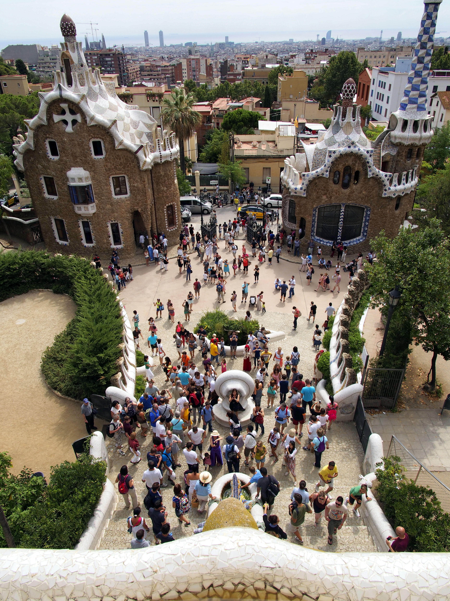
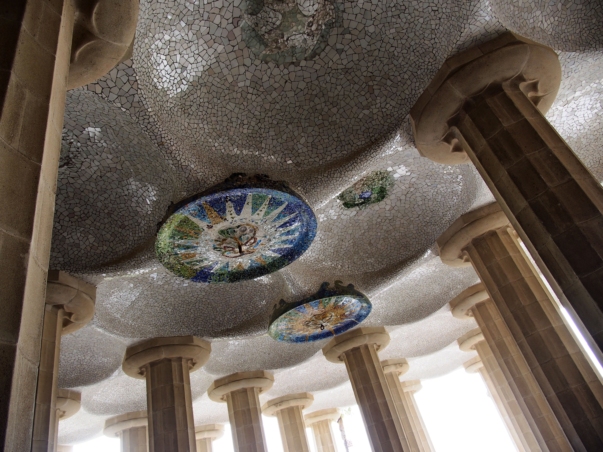
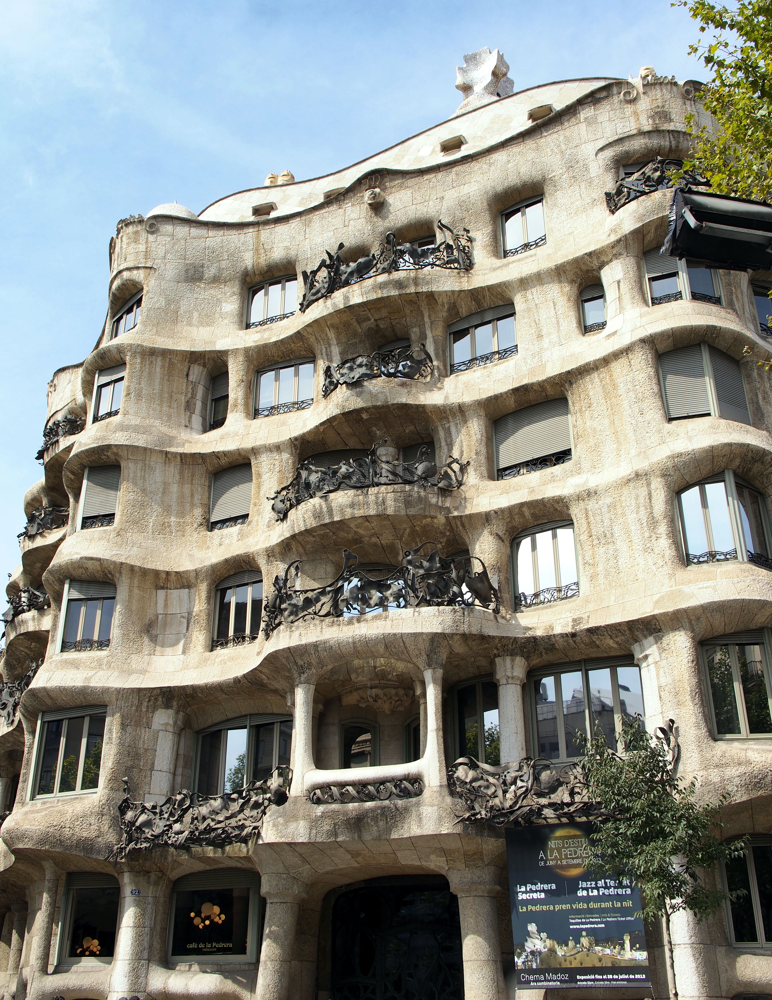
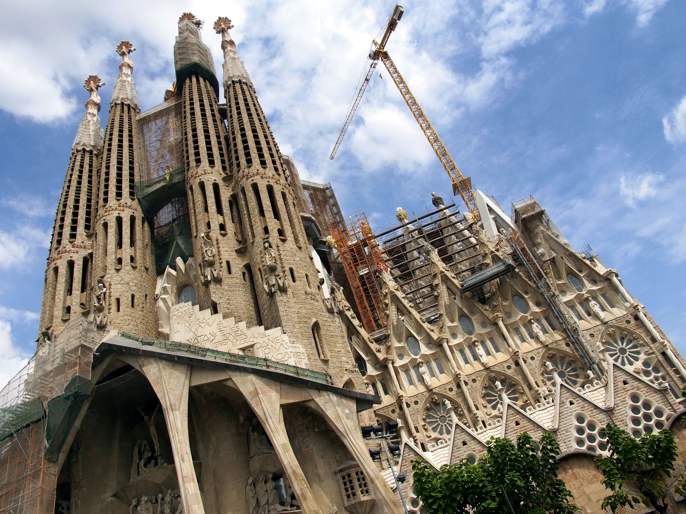
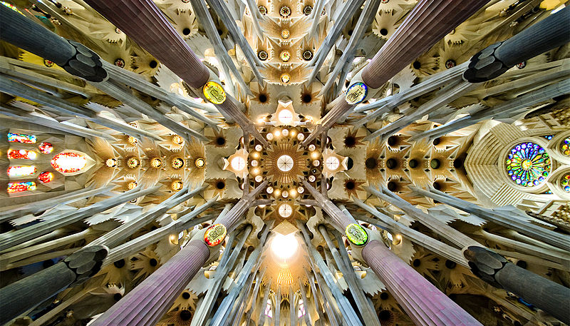

Prior to visiting Barcelona for my first time this year, I had no idea who [Antoni Gaudi](http://en.wikipedia.org/wiki/Antoni_Gaud%C3%AD) was. But after spending a few days in Barcelona visiting architectural sites, it’s pretty clear what a revolutionary architect he was.

Park Güell in Barcelona

### Park Güell

Antonia Guadi was a Catalan architect whose various works in Spain have become extremely important, and draw huge crowds of tourists each day. While not entirely appreciated when he was alive, several of his works have now been classified as Unesco World Heritage Sites and he is one of Spain’s most revered architects.

The first of his creations we went to visit was Park Güell. Our apartment was close enough Park Güell to walk to, but the nearest Metro station is Lesseps. Even from there though be prepared to walk for about 20 minutes, with the last part uphill. But don’t worry, the park is well worth the hike.

Inside the park you’ll find various forms of wildlife, as well as a look at many of the great architectural structures he devised, such as the columns near the top of the Parc. You’ll likely even run into a few buskers or entertainers, as the Parc is a big draw for locals and tourists alike. While we didn’t have any food near the Parc, there were many advertisements for restaurants with low-cost paella and other Spanish dishes. My recommendation would be to just pack a small snack or lunch for yourself and find a remote spot inside to relax.

In total we probably spent an hour walking around the Parc and snapping photos. Make sure if you visit that you go out of your way to take a photo of yourself with the mosaic lizard on the stairs leading up to the columns – you’ll likely have to fight other would-be photographers, but it’s the iconic photo when you visit Parc Güell in Barcelona.

Mosaics in Park Güell

### Casa Milà

Casa Milà in Barcelona

[Casa Milà](http://en.wikipedia.org/wiki/Casa_Mil%C3%A0) is a building designed by Antoni Gaudi and built during the years of 1906-1912. It is located in the Eixample district of Barcelona. We actually decided to give our FitBits some exercise and walked there from the Sagrada Familia. It took about 30 minutes, but it was a nice relaxing walk through a nice part of Barcelona and it saved us a few dollars for the metro.

In 1984 the Casa Milà was declared a World Heritage site by UNESCO. You can pay to get inside to take a closer look, but we decided instead to simply marvel at the outside and then head down to a café for some wine.

One interesting aspect of Gaudi’s work is that much it resembles some type of organism or living being. Instead of sharp corners or lines, Gaudi often incorporated subtle or flowing curved structures. This type of architecture is known as [biomorphism](http://en.wikipedia.org/wiki/Biomorphism) and it is heavily apparently is much of Gaudi’s works around Barcelona.

Once you visit Casa Milà, it’s only a seven minute walk (according to Google maps) to get to the next of Gaudi’s works in Barcelona: the Casa Batlló.

### Casa Batlló

Casa Batlló in Barcelona

Similar to Casa Milà, [Casa Batlló](http://en.wikipedia.org/wiki/Casa_Batll%C3%B3) is another masterpiece of Gaudi’s that incorporates biomorphism. The front facada shown in the photo above is a curved stone structures that makes me think of something that is alive instead of just stone. It truly is a marvel, so make sure you visit both it and the Casa Milà when in Barcelona.

In 2005 Casa Battló was also classified as a Unesco World Heritage Site.

### Sagrada Família

The magnum opus of Gaudi’s work is undoubtedly the [Sagrada Família basílica in Barcelona](http://en.wikipedia.org/wiki/Sagrada_Fam%C3%ADlia). Work on the Sagrada Família started in 1882, almost 140 years ago, and continues to this day.

The basílica is unlike anything I have ever seen before, and completely dominates the skyline of the area. Even as an engineer I have a hard time imagining how something of this magnitude can actually be constructed. It’s a testament to modern day construction methodology, let alone the techniques they used over 100 years ago.

Sagrada Família in Barcelona

Just as impressive of the outside of the Sagrada Família is the inside. One simply has to gaze up at the ceiling to see what a visionary Gaudi was – the entire column structure was designed to resemble a forest, complete with trees and branches to form a canopy.

The ceiling of The Sagrada Famîlia, Photo from Wikipedia

Tickets to the inside of the Sagrada Família were approximately 20 Euros and included a trip to the top of the nativity tower (but you can choose another tower). I was originally going to skip seeing the inside, but decided at the last minute to cough up the cash and take advantage of the opportunity. I’m definitely glad that we did, because it truly is a marvel to behold. The only other place where I’ve been almost as speechless was at St Paul’s Cathedral in Rome. In addition since the Sagrada Família has been constructed completely with private funding, a portion of the cost of your ticket goes into the fund to help complete the project.

Even though it is incomplete, the church is already classified as a Unesco World Heritage Site and in 2010 Pope Benedict XVI also declared it a minor basilica. The current estimate for the completion date for the Sagrada Família is 2026, at which time Gaudi’s most impressive structure should hopefully be complete.