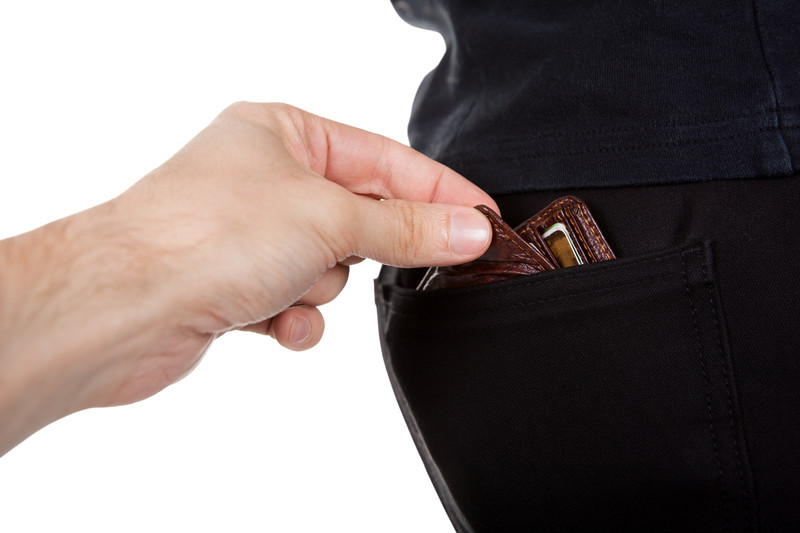

*The following is an excerpt from my [FREE Travel Book](/free-travel-book/). If you’re like to learn more travel tips like these, [sign-up to receive my travel book](/free-travel-book/) as soon as it is released*.

Every time I tell my mom about some of the places I’ve recently visited, she seems to reach as though I just barely escaped being killed or taking hostage due to all negative media that certain parts of the world get on the local news. The truth is though that in much of the world it’s just as safe as it is in your part of the world.

But crime does happen from time to time, and many criminals purposefully target tourists. In almost all cases the type of crime is simply petty theft – stealing a camera that was left on a table while someone went to the bathroom, or lifting a wallet out of someone’s back pocket while on the subway. In almost all of these cases though, the crime would likely have been prevented if the tourist had exercised just a a bit of common sense.

Here are some of my best tips for how to stay safe while traveling.

- ### Be Aware Of Your Surroundings
    
    Whenever you walk into a new situation, take a moment to observe everyone who is there. While I don’t recommend judging every book by its cover, often you can spot someone who looks like they are up to no good simply by being a good observer.
    
    One time when I was using a bank machine in the Alto Palermo shopping centre in Buenos Aires I noticed a guy hanging around the side of the ATM machine, discretely watching everyone who used it. Since I was getting a bad feeling from him, I decided to go for a walk around the mall and come back to the machine later. When I came back 15 minutes later, at first it looked like that individual left. But after taking a long look around, I noticed that he had simply shifted to another location on the other side of the mall and was watching people withdraw money from there. At that point I left the mall and went to find somewhere else that had a bank machine.
- ### Don’t Let Anyone Into Your Personal Space
    
    The area around you when you are traveling should be sacred ground – don’t ever let anyone enter your personal space. If someone you don’t know approaches you and tries to touch you, simply back away and make sure they can’t. If they persist, make it clear that you don’t want to be touched. Nobody can steal anything from you if they can’t touch you, so don’t let them near you, even if they seem well intentioned.
    
    A common tactic in Argentina is for a pickpocket to spray you with a goo that looks a bit like bird droppings. Then another person will approach you with a towel or a handkerchief, show you where the goo is, and then offer to help you clean it off. If you let that person touch you, you will likely be distracted enough to not notice their accomplice stealing your wallet or the contents of your purse or bag.
- ### Keep Valuable Objects Hidden
    
    There’s really no need to wear an expensive watch while out taking photographs or walking around a new city, so leave it at home. In many parts of the world that watch is likely the equivalent of a year of salary, so don’t flaunt it or make it obvious that it’s valuable.
    
    If you’re going out to take photos with a camera that looks expensive, keep it in your backpack until you are actively taking photos. The moment you are done taking photos, put it away. If you have a camera bag, then I recommend putting the entire camera bag into a backpack, otherwise it’s painfully obvious you are carrying a camera around and could potentially be targeted for your camera.
- ### Don’t Keep All Your Money Together
    
    It’s never a good idea to keep all your money and credit cards in the same place. If you lose your wallet/purse or if you get robbed, you’ll essentially be stranded until you can get some of your cards replaced or someone lends you some money.
    
    Whenever I get somewhere new I will usually separate out at least one credit card and usually about $100 worth of currency and leave those back in my apartment or hotel room – often in a safe if it’s available, otherwise hidden somewhere. I figure with that much cash and my credit card I could easily take a taxi to the airport and book a flight back home if I really got into trouble.

If you execute the same common sense that you have back home with regards to your belongings and your personal space, you should have no problem staying safe while traveling abroad or on vacation.

*For more tips like these, grab a copy of my [free travel book](/free-travel-book/).*