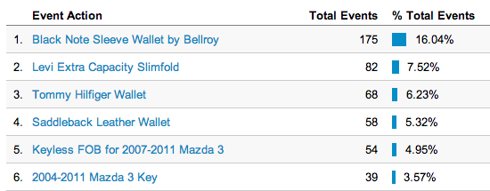

I’ve been trying to track where exactly people go when they leave my website for a few pages recently, and wrote some code based on a few other examples on the Internet. Basically this bit of Javascript will force Google Analytics to log a special request so that you can see where the user went. It uses jQuery, so you have to make sure you have that included in your theme.

Here’s some code that will let you track outbound links on your WordPress website.

```
jQuery( 'a' ).on( 'click',function( e ) {
  var url = jQuery( this ).attr( 'href' );
  var customName = jQuery( this ).attr( 'data-link-name' );
  if ( !customName ) {
      customName = url; 
  } 

  if ( e.currentTarget.host != window.location.host ) {
      ga( 'send', 'event', 'Outbound Link', customName, document.title );
      if (e.metaKey || e.ctrlKey) {
          var newtab = true;
      }
      if (!newtab) {
          e.preventDefault();
          setTimeout('document.location = "' + url + '"', 250);
      }
  }
});  		
```

I’ve set it up to use a custom attribute called *data-link-name* on the hyperlink so I can give it a friendly name instead of just logging the URL. A typical hyperlink with this on it looks like this:

```
<a data-link-name="My Cool Website" href="http://mywebsite.com">My Website</a>
```

Once it’s all set up, you can view all outbound links in Google Analytics under the “Events” section. If you have a data-link-name attribute defined then it will log that, otherwise it will log the URL.

Tracking Outbound Links in Google Analytics


The photo above shows some of the Google Analytics results for links on various pages on my website, along with the friendly names I defined for them using the *data-link-name* attribute.