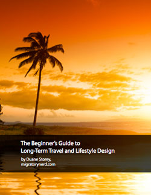

I’ve been working on a travel eBook for a few months now, mostly on airplanes and during the odd evening. It’s been slow going since I have a lot of other things going on right now, but I’ve managed to make a bit of progress each week. I’m pleased to announce that last night I managed to put the finishing touches on it, and it’s now officially available.

My travel ebook contains two main topics: how you can make and execute plans for long-term travel (anything more than a week or two), and how you can redesign your life to make traveling easier. There are lots of great resources include, such as the top travel services I use on the internet, where the best places to find cheap travel insurance are, and some of the best motivation and business books I’ve read during my travels.

The book is now available as a 47 page PDF file. If you read it please drop me a line and let me know any feedback that you have as I will likely revise it from time to time, and would ultimately like to eventually release a larger version on Amazon.

If you’re interested, you can get your free copy of [Beginner’s Guide to Long-Term Travel and Lifestyle Design](http://mignerd.com/book) now.

Thanks again, and enjoy!