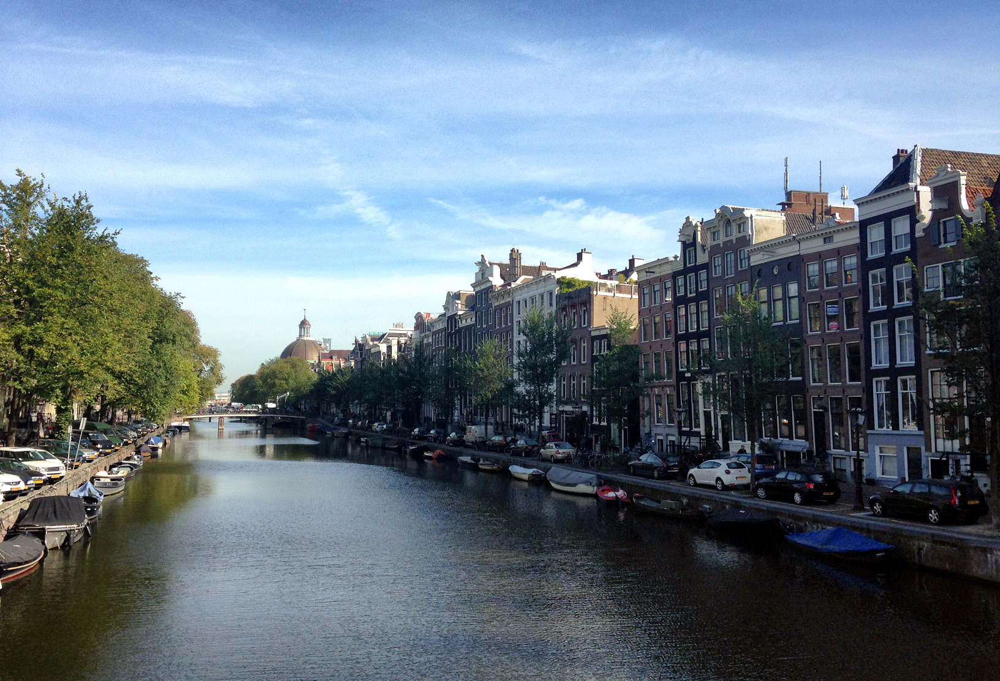

One of my favourite aspects of travelling is the process of arriving in a new destination. It doesn’t really matter how much research you do online before getting there, the actual experience of seeing it for yourself for the first time is always unique and usually unexpected. Almost always a place is better in person that you imagine in your head after doing research, but sometimes it takes a little time to overcome your first impressions after arriving.

For example, both me and a friend of mine thought Buenos Aires was fairly dirty when we first arrived. But it’s the type of city that grows on you over a few weeks while you discover all the little aspects of the city that make it appealing. Often though I usually think a city is much better in person when compared to everything I’ve read about it prior to arriving.

That’s one of the reasons why I was pleasantly surprised with Amsterdam when arriving here – I basically knew nothing about Amsterdam when I arrived, other than its reputation for marijuana houses.

My Visit To Amsterdam

For example, I was surprised to see so many canals within the city. That’s apparently one of the defining aspects of Amsterdam, one that I would have known had I done a little research. But it was nice to discover it myself instead of reading about it online.

Another great feature of the city is that most people here seem to use bicycles to get around. That means you see people all over the place that are outside and riding bicycles. You see a few cars here and there as well, but walking and bicycling seem to be the main forms of transportation.

There also seem to be a lot of coffee shops and restaurants, which I love in cities that I visit. One of my favourite activities is just grabbing a latte and walking around for 30 minutes, which is what I did after lunch today.

I can usually tell within 24 hours of arriving in a new destination whether or not I’d like to live in a place for more than a month or so. Amsterdam is a really comfortable city, and I could definitely see myself spending a few months living here at some point in time. Luciana and I are here just until tomorrow, and then we are heading over to Leiden for WordCamp Europe, which should be a great event.