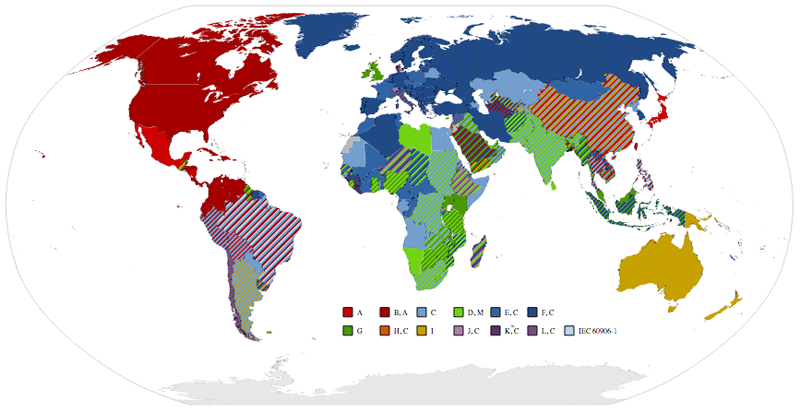
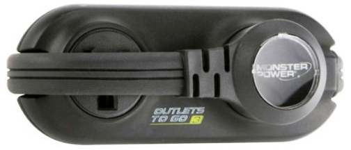

If you travel outside of North America you’ll quickly realize just how different we do things with regards to power. First, power in North America is typically around 110V, but can range from around 100V all the way up to around 125V. In Europe and many other parts of the world, a voltage of around 220V is normal.

In the old days, prior to intelligent power adapters, if you plugged a device designed for 110V into a wall socket wired for 220V, you could pretty much kiss that device goodbye as it would likely fry with a puff of smoke. The same goes for razors, hair dryers, curling irons, etc.

Different Voltages Used Around The World

You probably won’t destroy your device by plugging a device designed for 220V into a power socket wired for 110V, but your device likely won’t work at all.

### Intelligent Power Adapters

Nowadays most commercial power adapters are dual voltage, meaning that they will work on either 110V or 220V. The best devices are ones that can determine the voltage automatically and switch without you having to do anything – the power adapter for my Macbook Air is a good example.

The next best thing is a device where you can manually select the voltage, such as hair dryers which typically have a physical switch that you can use to switch the voltage. Those work great, if you can remember to switch them. Forget to do so in Europe and you’ll likely smell something burning fairly quickly after plugging it in. So whenever possible try to find devices that have power adapters that can switch automatically between different voltages.

### Different Plug Types

The difference in voltage is unfortunately only half of the problem. The other half is that the type of wall socket and plugs that many countries use are distinctly different from each other. For example, most of North America uses plugs with three prongs: two flat ones and one rounded one for grounding. In much of Europe you’ll simply find plugs with two round prongs, which of course won’t accept any of the device connectors from North America.

Different Plug Types Around The World

Prior to going on any trip, I usually consult Mr. Google. to figure out which plug types I’ll encounter in a new country. Here is a handy internet resource you can use to [figure out what plug type a country uses](http://www.kropla.com/electric2.htm).

### How To Power Your Devices

Here are a few quick guidelines for how to power your devices when you travel.

1. Go out of your way to buy devices that work on all voltages. Usually on the package it’ll say “120V-240V AC” or something like that. If it just says 120V or 240V, I’d just keep looking as often you can find something else. For example, I recently bought a new razor in Ireland. The first few I looked at only supported 240V, but the last one supported 120V-240V AC, so that’s the one I ended up buying – there’s no sense buying a razor in Europe if I can’t use it when I get back home to Canada.
2. Try and find a good universal plug adapter that isn’t a huge burden to carry along. I’ll highlight some of the items I bring with me when I travel further down in this post, but everyone should carry a plug adapter with them. If all your devices support dual voltage and you have a plug adapter, you’ll be able to power your devices all over the world.

### What I Bring When I Travel

These are the tools I bring whenever I travel so that I can make sure all my devices can stay powered.

- Apple World Travel Kit
    
    
    
    [Apple Power Kit](http://amzn.to/1cGLO77) – My friend Dale actually bought this for me as a Christmas present a few years ago, and it’s been really great to travel with. Basically if you have any Apple devices, including a laptop or an iPhone, the power kit comes with all the various plugs you’ll need to connect your devices to power all over the world. My only real issue with it is that you can really only power one device at a time with it, which is why I think it’s a good compliment to having a universal power adapter. You also can’t use this to power anything that isn’t an Apple product, so most people will need something else as well if they have a digital camera or other accessory.
- [Universal Power Adapter](http://amzn.to/19GjJWw) – The Apple Power Kit works great for my laptop or my iPhone, but unless you want to always power your iPhone or mobile phone from your laptop, you need another solution. So I usually bring along a universal power adapter such as the one linked to above. You can almost always find these in various supermarkets or hardware stores around the world, but I always bring one with me in my laptop bag. Basically you can connect your device to any socket around the world using this one adapter, so it’s a great compliment. One thing people should realize is that these adapters don’t convert voltage in any capacity. So you need to make sure the device you are plugging in will work properly at socket voltage.
- Power Strip for Travel
    
    
    
    [Travel Power Strip](http://amzn.to/166V1yn) – I only started bringing a power strip with me this last year, but it’s been a great addition to my normal travel gear. Basically I can plug my Travel Power Strip into my Universal Power Adapter and power up to four devices without having to use an adapter for all four. And because it’s meant for travel, it folds up really small and hardly takes any room in my suitcase. Between my girlfriend and myself, this power strip is usually full charging various iPads, digital cameras or mobile phones when we travel.

At the bare minimum, everyone should probably have a plug adapter to take with them when they travel. But if you’re going for more than a week or two, a travel power strip is a great addition too. If you’re a hardcore Apple user, then the Apple Power Kit is a great addition too. I often usually just grab the adapters I need from the kit before I go on my trip and leave the rest at home, so it doesn’t take up much room in my bag.