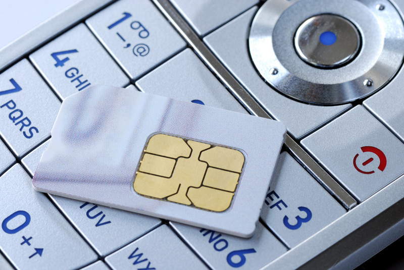

One of the first orders of business I take card of whenever I land in a new country is to try and get a pre-paid data plan for my phone. Some people chose not to have a working phone when they travel, since it’s sometimes a bit of a pain to find the right provider. But I don’t see much point in owning a smartphone and not having access to data with it whenever I want.

Getting A Pre-paid SIM When You Travel

Here are some other reasons why I love having a prepaid data plan with my phone when I travel.

1. I can message friends and family back home using WhatsApp or iMessage whenever I want
2. I can check in on my business from my phone whenever I want
3. I can catch up on news whenever I have a few free minutes
4. I can look find, and often book, accommodation while on metros or busses
5. If I ever get lost, I can simply fire up Google maps and find out where I am going

Of course to use a pre-paid SIM in another country, you have to make sure your phone is unlocked. If you signed a contract to get your phone, then chances are it’s locked to that carrier. In that case you can sometimes contact the carrier and pay a fee to have it unlocked, or can simply buy a cheap unlocked smartphone for when you travel.

The best resource for finding a new SIM card with data when you get to a new country is to take advantage of the [Pay as you Go Data Wiki](http://prepaidwithdata.wikia.com/wiki/Prepaid_SIM_with_data). It’s a website that is routinely updated with all the best information available for cell phone providers with pay-as-you-go data plans in other countries. Normally before I land in a new country I will go to that website and determine ahead of time which carrier I want to use. Then when I arrive I can skip all the other carrier’s booths in the airport and usually just go to the carrier I want to get my new SIM card.

Other than North America and Australia/New Zealand, most of the data plans around the world are really affordable. I was recently in Ireland and I paid 25 Euros a month for 1GB a data, and am paying about 20 Euros a month for 2GB here in Portugal. It’s a small price to pay for all the conveniences of having your cell phone working all the time, especially if you get lost and need to consult with an online map.