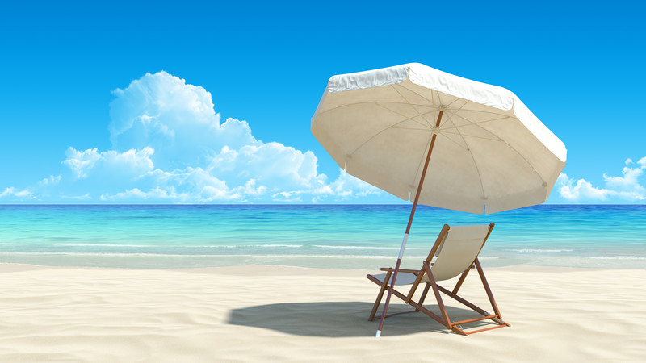

*I recently sent this out to my newsletter subscribers. For information like this on a periodic basis, [sign-up here](http://eepurl.com/CWVT9). I hate SPAM too, so don’t worry, I’ll only send you great travel tips, and you can unsubscribe at any time.*

I hope by now most of you have read my [free eBook, “The Beginner’s Guide to Long-Term Travel and Lifestyle Design”](/guide-to-long-term-travel-and-lifestyle-design/). I plan to update it periodically and send a new version to all of you from time to time, so please contact me if you felt there was anything missing or if there is a particular topic you would like addressed. One area I realized I left out was information on currency exchange, which is important when you travel to different countries. I’ll update it soon and send the new version to all of you via email.

Your next free vacation?

Without a doubt one of the questions I get asked the most is how I can afford to travel so often. I obviously save money to travel, which is just a matter of prioritization. But I also try to get as many free flights as I can. Just the other day I redeemed some reward mileage for a full return flight to Auckland, New Zealand from Vancouver, Canada – I’ll be spending New Year’s Eve in the land of Hobbits with my girlfriend.

This flight was free for me because I redeemed 104,000 points from my Capital One travel reward visa card. If you’re not familiar with a travel rewards cards, it’s essentially a credit card that lets you earn mileage whenever you use it. Whenever a person makes a purchase with a credit card, often the merchant (the store you are at), will get charged between 2-3% to accept it. Usually that 2-3% goes back to the credit card company as revenue, partially to offset fraud that happens from time to time. A travel rewards card is basically a form of revenue sharing – instead of keeping the entire profit from that 2-3%, they share it with you in the form of free travel as a means to entice you to use their card (and help them make money).

By using a travel rewards card for your day to day purchases, most people can easily earn enough mileage for a free flight or vacation once a year, especially if you include the sign-up bonus that the company often gives you. For example, one of the best travel cards in the United States is the Barclaycard Arrival Plus™ World Elite MasterCard® – they give you 20,000 free reward miles (approximately a $200 value) for their no-fee card (after spending $1,000 in the first three months), and 40,000 free reward miles (after spending $3,000 in the first 90 days) for their card with an annual free (which is waived in the first year) –

I obviously don’t recommend using a credit card for your purchases if you don’t have the willpower to pay it off each month in full. But if you can pay your credit card each month without difficulty, then every person who likes to travel should definitely use a travel reward card. Not only do you get free mileage to use for flights, you also get a host of other great benefits, such as travel health

If you’re one of those people and are in the United States, my advice is to sign-up for the Barclaycard Arrival Plus™ World Elite MasterCard® with the annual fee ($89/year) if you’re in the United States. They waive the fee for the first year (i.e. it’s basically free), so you get all the value of the free card \*plus\* an additional 20,000 miles ($200 worth of travel) to use. That’s $400 in free travel, just for signing up and spending $3,000 within 90 days. Even if you cancel the card at the end of the first year before the fee kicks in for the second year, you’ll likely have earned a free flight or two. If you’re going to spend the money anyways on things like groceries, going to the movies or even the odd beer, you might as well earn some free travel in the process, right?

You can find out more information about the [Barclaycard Arrival Plus™ World Elite MasterCard® travel reward card here](http://mignerd.com/barclaypaidflyfree), and how to sign-up. Like I said, it’s $400 worth of free travel (after meeting the spending requirements), plus a pile of other bonuses (such as travel health insurance, and no-fee currency conversions), all for free during the first year. Once you claim your free flight or two, you can simply cancel the card and get a different card with a new sign-up bonus. It’s what many of the more successful travel bloggers do to earn flights each year.

If you’re in Canada, in my opinion the best travel card is the [Capital One Travel Rewards Card](http://www.capitalone.ca/credit-cards/aspire-travel-world/) – it’s the one I use the most, and the one I earned my free trip to Auckland with. You can also read one of my more popular posts for more information, [How To Fly For Free and Earn Elite Status](http://www.migratorynerd.com/tips/mileage/how-to-fly-for-free/).