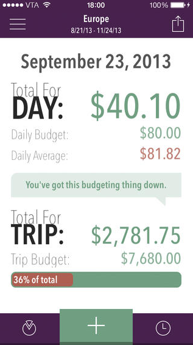

There are a few privileged travelers that you encounter from time to time who don’t really seem to have any sort of budget. Often they have saved for several years and intend to continue traveling until it simply runs out.

But for the rest of us, traveling for more than a week or two often means that we have to stick to a pre-defined budget for a particular trip. I know personally that spending money is the one main aspect of traveling that causes me stress, more so than worrying about theft or how to get to and from places. That’s why I try to set aside a certain amount of money beforehand for each trip, to minimize the anxiety and stress on a day-to-day basis when constantly bombarded with things that cost money. Without a budget you’re likely to spend a crazy amount of money, often for things that probably don’t add much to the overall enjoyment of your trip.

As soon as you set a budget you are forced to make decisions on which aspects of the trip are the most important to you. In my experience it’s much better to spend your time and money on a key few touristy-type things than to spread your money out and try to see and do everything in every place you arrive at – it’s a really quick way to burn through all your money, and also burn yourself out by trying to do too much.

Once you’ve set a budget, you’ll have to do your best to stick to it on a daily basis. Of course, some days you can spend more money than you budgeted (and often you will), but you need to balance that somewhere else with a day that you didn’t spend that much money. So if you go out for a fancy dinner one night, try to spend the next day eating street food and walking around instead of taking busses. It’ll help provide some variety to your adventure, and also help you meet your personal budgetary goals.

If you’re looking for some ways to try and make your money last a bit longer, here are some of my personal tips for saving money while on the road.

- **Skip The Restaurant** – Eating at restaurants is expensive, especially if you factor in a 10-15% tip as well (which is normal in many parts of the world). Obviously from time to time it’s nice to sit in a restaurant and have a nice meal, but you will save a lot of money by avoiding them. Street vendors are a much better option than restaurants, and often provide the most memorable meals. In many parts of the world you can eat for less than $10 a day if you stick to street food. An even better option to save money is to go a grocery store and pick up a sandwich or some fruit.
- **Reduce Coffee Consumption**. If you’re from North America, then chances are you are used to having a few nice coffees or cappuccinos each day. I sure know I am. One of my favorites parts of the day is sipping my morning coffee while catching up on emails and news. But unfortunately all that coffee comes with a pretty hefty price tag. Here in New Zealand a ‘Flat White’ (similar to a Latte back home) will set you back at least $5, often more. Have two of those a day and suddenly you’re out $300 extra dollars for the month. I’m not saying you should skip your daily pleasures entirely (you are trying to enjoy your trip after all!) but try to limit them to only once a day at most. And seriously, you can’t substitute instant coffee for a nice latte, so don’t try – also ignore anyone who tells you that you can.
- **Reduce Soda Consumption**. Similar to coffee, drinking a lot of soda can set you back as well overseas. While a coke or a diet coke back home is reasonably priced at around $2, in many parts of the world (such as Australia) a coke can easily cost $5 for a small bottle. A much better solution is to simply buy a cheap bottle of water from a grocery store ($2 or so) and then continue to refill it for free whenever you get a chance. If you switch the odd cup of coffee or bottle of soda for a free water refill once and a while, you’ll be surprised at how much money you can save over the course of your trip.
- **Stay Sober**. I know, I know – I’m such a killjoy. But the reality is that alcohol is one of the most expensive items on a trip, especially if you’re into wine or fancy alcohols like scotch. I’m definitely in favour of drinking a few beers from time to time, but unless you’re on a 1-week all-inclusive vacation there’s no need to spend an entire trip with a hangover. You’re much more likely to head out and do some exploring if you wake up sober, and you’ll even have the money to do so since you wouldn’t have blown it drinking four pitchers of beer the night before.
- **Travel Overnight**. Accommodation is one of the most expensive aspects of most trips. My current budget for New Zealand is approximately $100 CAD per night (which is a cheap budget for this part of the world, and takes into account that I’m splitting costs with my girlfriend), including accommodation, food, entertainment and transportation. Of that, at least 50% of the budget is allocated for accommodation. While sleeping on a bus or train doesn’t provide the most restful sleep, it does allow you to skip out on paying for accommodation when you take an overnight trip. So an easy way to save some money is to plan to take a few overnight trips for any journey of 6 or more hours. You’ll still end up in your destination, and save one night in a hostel or hotel in the process. We’re taking the overnight bus from Hamilton to Wellington in New Zealand, and saving about $90 NZD in the process.

I recently stumbled across a great little iPhone application for tracking travel expenses called Trail Wallet, obviously written by someone who understands travel intimately. You can configure individual Trips in the application, for example New Zealand Wedding or Thailand Elephant Tour, and also which currencies you are likely to use. The application will correctly track expenses in multiple currencies in real-time by converting all currencies into the configured base currency, in my case Canadian Dollars.

Using this application it’s extremely easy to track your purchases and also keep tabs on where you sit in terms of your overall day-to-day budget and also the budget for your entire trip. They recently introduced a new feature where you can split an expense out over an arbitrary amount of days, and it is one of the features I find that I use all the time. For example, instead of logging the $1,800 NZD 14-day rental of our Campervan one one day (which would destroy the daily budget for that day and also mess-up the budget for the next 13-days), I can correctly tell the application to spread that expense out over 14 days. You can also categorize each expense into the application’s pre-defined categories or even create your own. That feature has allowed me to split out the tracking of both coffee and alcohol expenses so I can see at the end of the trip how much I spent on each one.