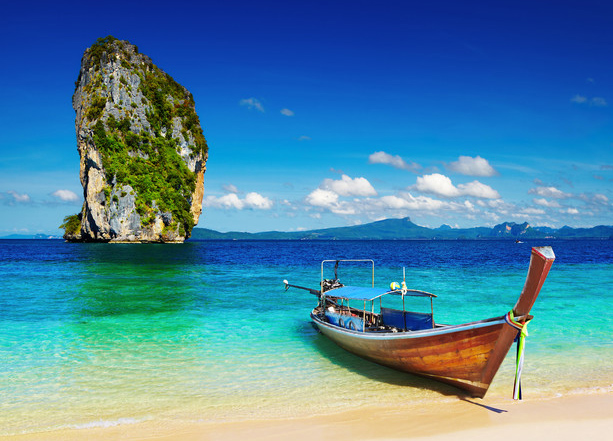

Over the past few years I’ve flown to many exotic destinations New Zealand, Brazil, and even Peru. Normally those trips would costs thousands of dollars, but I managed to do all three trips for free thanks to several of my travel reward credit cards.

Most seasoned travellers already know this, but many credit card companies offer travel products that help their customers earn free travel. For every purchase you charge to your credit card, the credit card company will give you a credit for future travel in the form of ‘mileage’. That mileage is usually tracked on your credit card statement on a monthly basis, but can quickly add up to a free airline ticket after just a few months.

Without a doubt, one of the best credit card in the United States right now for earning free travel is the [Barclaycard Arrival World Mastercard](http://track.linkoffers.net/a.aspx?foid=22907635&fot=1002&foc=1). Upon signing up and spending $1,000 on this card in the first 90 days, you’ll automatically receive a 20,000 miles for future travel, equivalent to $200.

In addition you’ll also receive these benefits:

- Earn 2X miles on travel and dining purchases with no caps
- Earn 1X miles on all other purchases
- Book any airline, any time with no blackout dates or seat restrictions (other credit cards often force you to use their own travel services)
- Get 10% miles back when you redeem for travel (so you basically get a 10% bonus with each purchase)
- No foreign transaction fees (this is a big deal if you travel, since often you’ll be dinged a few percentage points extra with other cards when you do purchases in another currency)
- $200,000 Worldwide Automatic Travel Accident Insurance
- Reimbursement for expenses if your baggage is delayed or misdirected
- Trip cancellation/interruption coverage
- MasterCard® Global Service with 24-hour emergency assistance

As you can see in addition to earning free travel with each purchase this card offers a ton of great benefits. And the best part is there’s no annual fee. If you’re a traveller in the United States, then you really should consider picking up one of these cards to start earning free travel.

Obviously, earning free travel with the Barclaycard Arrival card only works if you are able to pay off your credit card each month in full. If you’re not someone who has the discipline to do that, then earning free travel with a credit card isn’t a good strategy for you. But if you can pay it off monthly then it makes perfect sense to make your every day purchases with a card like this so you can earn mileage instead of earning nothing at all by paying with debit or cash.

If you’re interested in earning even more free travel, check out the [Barclaycard Arrival World Mastercard](http://track.linkoffers.net/a.aspx?foid=22907634&fot=1002&foc=1) with the $89 fee. That fee is waived in the first year, essentially make this card free during that time period. In addition you’ll also receive an extra 20,000 miles for a total of 40,000 miles after signing up (but you need to spend $1,000 in the first three months to receive the bonus), equivalent to $400 worth of travel. If you spend $1,000 on your card each month (which is easy to do if you charge all your groceries, clothes, etc. to the card monthly), then at the end of the year you will have earned an extra 24,000 miles, bringing your total free travel earned during the year up to $640, enough for a free round-trip plane ticket to many parts of the world.

I use this strategy all the time to earn free miles, as do many other professional travellers. If you’re going to spend the money any way, you might as well earn something free in the process. Coupled with all the extra travel benefits such as travel insurance and no foreign transaction fees, it’s easy to see why the [Barclaycard Arrival World Mastercard](http://track.linkoffers.net/a.aspx?foid=22907635&fot=1002&foc=1) is one of the best rewards cards in the United States.