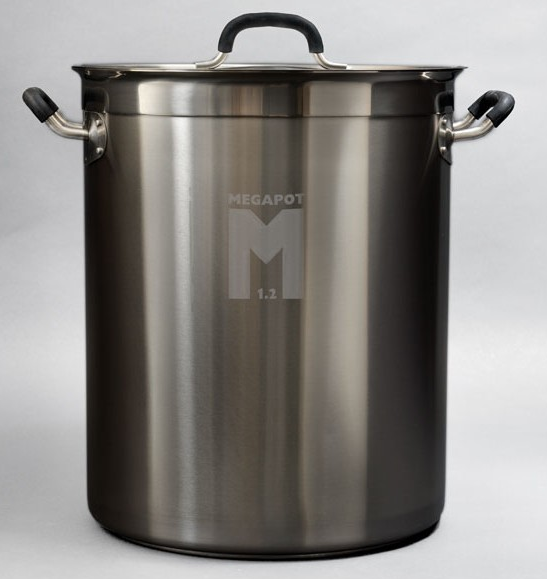

I started brewing beers at home a little over a year ago. Having no real experience before starting, I did what most people do in this day and age and tried to read as much as I could on the internet as I could before starting. While many people start with extract brewing, I decided at the time to just dive right in with all-grain brewing. Like most beginners, I made many mistakes when I started. But over time I have slowly improved the areas where I felt most deficient and have generally been making better and better beers (at least in my mind).

Like most home brewers, the part of the process I least enjoyed was bottling. Washing and sanitizing bottles can take a lot of time, as does the actual bottling process. If you make a measurement error while priming, you’ll get to look forward to drinking a lot of over or under-carbonated beer until you finish off that batch. And unless you’re reusing all your bottle caps, you’ll also need to buy fresh ones for each batch you make.

Kegging on the other hand is a much simpler process. You simply clean and sanitize the keg, siphon in your completely beer, pressurize, and enjoy. If your beer is undercarbonated, you simple increase the pressure slightly. Overcarbonated? No problem, reduce the pressure and bleed some of gas out of the keg. And there’s nothing better than coming home after a hard day at the office and filling up a glass of beer directly from your own kegerator.

I also recently made one more improvement in my home brew setup – I purchased a separate bar fridge (on sale, thanks to Christmas!) to act as a fermentation cabinet. While I haven’t had huge problems controlling the fermentation temperature previously, making a lager hasn’t been possible for me, nor has any beer that could benefit from a fermentation temperature of below 65F or so. With my new fermentation fridge I can basically make any type of beer I want, and will also have no problem cold crashing them as well.

About six months ago I was brewing around the internet and came across a great beer resource called [The Electric Brewery](http://www.theelectricbrewery.com/). The owner of the site, Kal, set out to build a completely electric brew system, and the results are really impressive. Since I had been considering using a HERMS or RIMS setup at that time, and knew that I would ultimately have to replace some of my equipment to go that route, I decided I might as well try and build a completely electric brew system.

New Brew Kettle

Since that time I’ve purchased about 80% of what’s required to build a new brew system, completely electrical. That includes a new stainless steel kettle, hot liquor tank, mash tun, hoses, electrical components, hoses, connectors, and even a custom bent stainless steel HERMS coil. I have a few more loose ends to purchase over the next month or so, but I’m hoping to start assembling it all at the end of February.

I added a new “Beer” menu item to my site-menu, and plan to document the whole process as I go. Kal’s site is already an amazing resource for people, but I hope I can add some value as well for anyone looking to undertake something similar themselves. I’m making a few small changes compared to Kal’s setup, but it’s very similar and I’ve borrowed heavily from his documentation and design.

Like many home brewers and beer connoisseurs, I’ve often dreamt of maybe someday running a little brew pub or nano/micro brewery. I ventured into the pub business 18 months ago as an investor, so it’s not an area that’s completely out of my realm at this point. It may not ever happen, but I purposefully am building this system so that if the opportunity ever arose to open a little pub in a few years time in some country presented itself, that I could easily get started with the system I have. I still have lots to learn in terms of brewing beer, but it’s something I quite enjoy.

So hopefully in a month or so I’ll start putting all the pieces together. I imagine it will take six weeks or longer before first brew, but I should be ready just in time to brew up some nice beers for the spring season. If you want to follow along, you can add your email address below for periodic updates from this website.

*Update: You can follow along with my current build here – [Building An Electric Brew System](/electric-brewery/introduction/)*