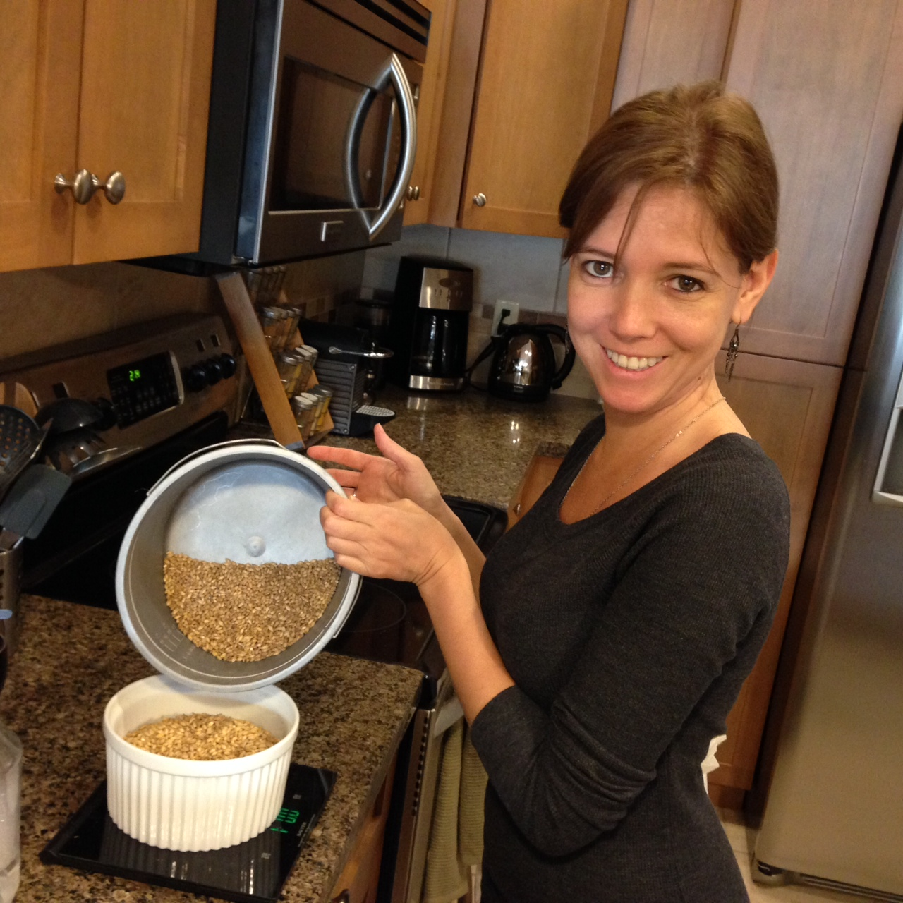

I friend of mine recently asked if I was putting all my beer recipes online, and I unfortunately was forced to answer no. When I started brewing I tried to put them all online, but the write-ups just took too long.

So I’ve decided to start posting them again, but in a very limited format. That way it doesn’t take me long to post them, and hopefully I can solicit input from others.

#### Beer Information

My goal for this beer was to make something easily drinkable for some of my family that generally prefers lagers, and tend not to like really bitter ales. I find most blonde ales a bit boring, so I mashed it at 152F to add a bit of body to it, and also used some left-over hops (in small quantities) from a recent IPA I had. I’m hoping these end-up having a subtle presence (due to the lower amounts used), even though they are hops with noticeable characters on their own.

Luciana, helping measure grains

Here are the target stats for this brew:

- BJCP Style: Light Hybrid Beer, Blonde Ale
- OG: 1.049
- FG: 1.012
- IBU: 17
- Color: 4.7
- Batch Size: 5G
- Boil Duration: 60 mins
- Mash Temperature: 152F

**Grain Bill**

Fairly typical grain bill for a low gravity ale, although I added a tiny bit of wheat malt for some added complexity. Had I had normal Canadian 2-row malt on-hand I would have used that, but instead I used grains from my sack of Pale Alt malt.

- 11lb 8oz – Canadian Pale Ale Malt
- 8oz – Wheat Malt
- 4oz – Caramel 10L
- 2oz – Caramel 15L

**Hop Bill/Schedule**

- 0.25oz Citra @60 mins
- 0.25oz Centennial @30 mins
- 0.25oz Chinook @10mins

**Fermentation**

- Yeast: Wyeast 1056
- Temperature: 68F
- Duration: 2 Weeks
- Dry-hopping: None

### Notes

I haven’t tasted this one yet, as it’s been clearing in a fridge at home for the last 5 weeks. But I’ll update this post when I get back and tapped. Looking at it before I left though, it seems slightly darker than predicted, likely because the SRM for the pale alt malt I used didn’t quite match the one in BeerAlchemy. Not a big deal though.