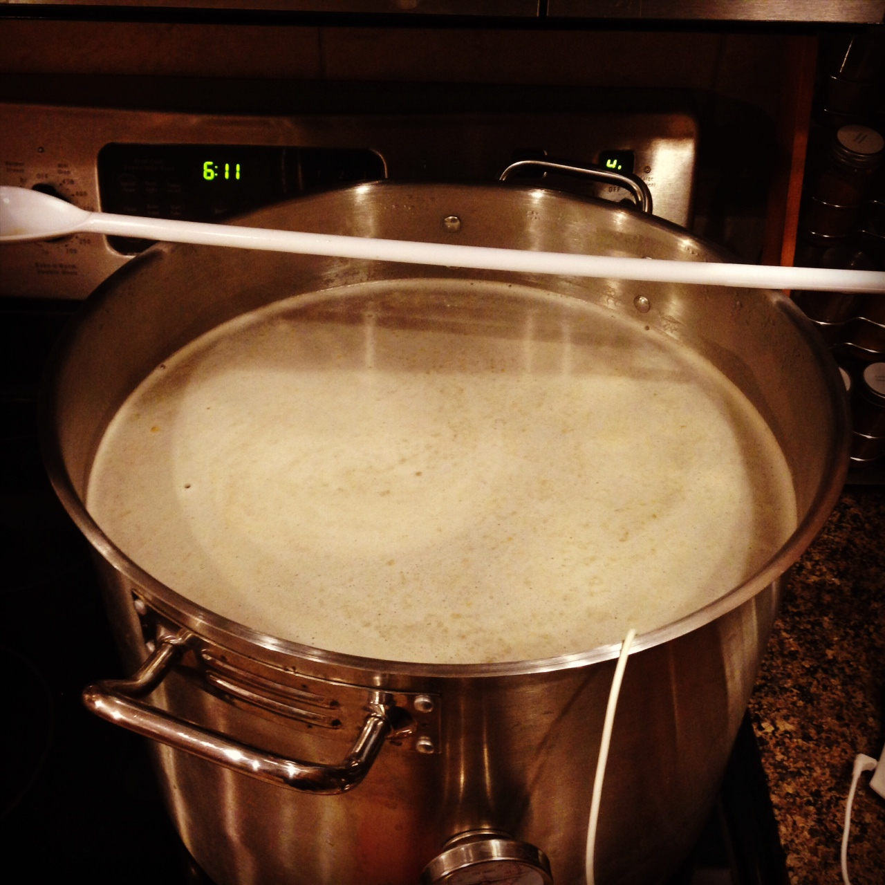

A recently brewed an American India Pale Ale over the Christmas break.

### Beer Information

Roughly 8G of wort on the stove

I’m a big fan of American IPAs, and it’s usually what I drink when I’m lounging around home and I feel the need for a beer. Here are the target stats for this brew:

- BJCP Style: India Pale Ale – American IPA
- OG: 1.064
- FG: 1.010
- IBU: 65
- ABV: 6.5%
- Color: 8
- Batch Size: 5G
- Boil Duration: 60 mins
- Mash Temperature: 151F
- Brew Date: December 24th, 2013

**Grain Bill**

- 13lb 10oz – Canadian Pale Ale Malt
- 10oz – Caramel 40L
- 6oz – Caramel 15L
- 6oz – Wheat Malt

**Hop Bill/Schedule**

- 1oz Simcoe – First wort hopped
- 0.3oz Centennial – @ 30 mins
- 0.8oz Citra – @ 15mins
- 1oz Chinook – @ 10mins
- 1oz Amarillo – @ 10mins
- 1oz Amarillo – Dry-hop
- 1oz Columbus – Dry-hop

**Water Treatment**

I recently checked out my town’s (Chilliwack’s) water report and have been experimenting with brew-salt additions. Based on my water and a target profile of a hop-forward beer, these were the additions I made.

- 7g Gypsum
- 1g Salt

**Fermentation**

- Yeast: Wyeast 1056
- Temperature: 68F
- Duration: 2 Weeks
- Dry-hopping: 2oz, as listed above

### Notes

I haven’t tasted this one yet, as it’s still in the fermenter at home (6 weeks basically). I’ll dry-hop it when I get back, cold-crash it, and then keg it. I’ll have my first pint in a few weeks and update this post.