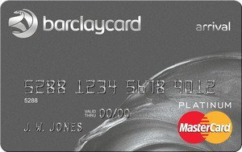
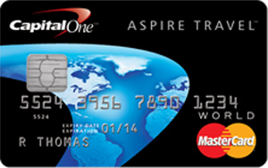

One of my main strategies for earning free airline travel that I [discuss in my eBook](http://mignerd.com/book) is leveraging a travel rewards card. For most people simply using a travel reward card for day-to-day purchases is enough to earn a free vacation each and every year. I’ve been using a few different cards for three years now, and I’ve earned a full return trip to Machu Picchu in Peru, a free return trip to Auckland, New Zealand, and enough for another trans-continental trip already accumulated. And all I had to do was sign-up and use it monthly.

Almost all travel reward cards include health-insurance for short-term trips (usually two weeks or less) and often flight-cancellation or trip-interruption insurance. If you were to buy these items yourself you’d often spend $50-$100 for each trip, so these cards can save you money there as well.

### Best Travel Reward Card in the United States

*The [Barclaycard Arrival](http://track.linkoffers.net/a.aspx?foid=22907635&fot=9999&foc=1)*

Best Travel Reward Card in the United States

The Barclaycard Arrival card is easily the best offering in the United States, and ranks at usually #1 in every review I’ve seen. There is an annual fee for this card (most of the best cards have one) of $89 per year, but it’s waived in the first year. When you sign-up for this card you’ll receive 40,000 miles, which is the equivalent of around $400 worth of travel. You can book that travel anyway you want, which is a huge advantage compared to many other travel credit cards.

You’ll earn miles at at rate of 2 miles for every $1 you spend with this card. If you spend $250 per week on your credit card (which I usually accomplish by putting all my food and entertainment on the card), you’ll earn an additional 26,000 points by the end of the year. All together in your first year you would have earned 64,000 points, enough for $660 worth of travel. In addition you’ll receive a 10% refund in the points you redeem, which effectively lets you earn 2.2 miles for each $1 spent.

Often when you make foreign purchases on credit cards you’ll pay a foreign currency fee. That fee is waived on the [Barclaycard Arrival](http://track.linkoffers.net/a.aspx?foid=22907635&fot=9999&foc=1), which can save you quite a bit of money if you are routinely out of the country.

In terms of health and insurance benefits, this card comes with $200,000 worth of accidental health insurance (in case you get into an accident), compensation for delayed or misdirected baggage, and trip cancellation and interruption insurance. For a card that’s essentially free for the first year, you really can’t go wrong with all of the included benefits.

A summary of the Barclaycard Arrival benefits are:

- Sign-up bonus of 40,000 miles, equivalent to $400
- Annual fee of $89 – waived for the first year
- Accumulate mileage at a rate of 2 miles for each $1 spent
- 10% mileage refund when points are redeemed
- No foreign transaction fees
- Accidental health, lost baggage and trip cancellation/interruption insurance

This card has incredible value, and I really wish I could own it myself (I’m in Canada). My favourite Canadian card is listed below, but it has slightly less value than the Barclaycard Arrival. If you want to learn more, check out [The Barclaycard Arrival](http://track.linkoffers.net/a.aspx?foid=22907635&fot=9999&foc=1) travel reward card. There’s also a [version without an annual fee](http://track.linkoffers.net/a.aspx?foid=22907634&fot=9999&foc=1), but it gives less rewards.

### Best Travel Reward Card In Canada

*The [Capital One Aspire Travel World Mastercard](http://mignerd.com/canadacapitalone)*

Best Travel Reward Card in Canada

In my opinion the best travel reward credit card in Canada is the Capital One Aspire Travel World Mastercard, and it’s one I own myself. Upon signing up you’ll receive 35,000 miles, which is the equivalent of $350 worth of travel. There’s an annual fee of $120, which is more than the Barclaycard, but it is offset by the fact that you also earn an extra 10,000 miles each year just for owning the card. So effectively the cost per year is about $20 if you factor in the free mileage.

You’ll earn mileage with this card at a rate of 2 miles for each $1 spent, which is similar to the Barclaycard Arrival. If you spend $250 per week on average, you’ll end up accumulating an additional 26,000 miles throughout the year. Combined with the 35,000 mile sign-up bonus, that’s $610 worth of travel that you can book in any way that you want. The first year fee is unfortunately not waived, which means your $510 value cost you $120, for a net gain of $490. That’s still good value though, since for most people accumulating that $490 simply means charging their everyday normal expenses to the card.

In terms of insurance, it comes with trip health insurance for up to 8 days, $500,000 accidental health insurance, and trip cancellation and interruption insurance. It will also extends the warranty by up to two years on any item you purchase.

A summary of the [Capital One Aspire Travel World Mastercard](http://mignerd.com/canadacapitalone) benefits are:

- Sign-up bonus of 35,000 miles, equivalent to $350
- Annual fee of $120
- 10,000 mile bonus each year
- Accumulate mileage at a rate of 2 miles for each $1 spent
- Accidental health, lost baggage and trip cancellation/interruption insurance
- Up to two years of extended warranty for purchased items

I’ve earned two full free trips with this card, one to Machu Picchu in Peru (from Vancouver) and another to Auckland, New Zealand, and have one more trip left to use based on my current mileage balance. While there are several other alternatives travel reward cards in Canada (I own most of them), this is by far my favourite and it’s the one that several of my friends also use. If you’d like to learn more, check out the [Capital One Aspire Travel World Mastercard](http://mignerd.com/canadacapitalone).

### Travel Reward Cards

If you have bad credit or have trouble paying off a credit card in full each month, then you probably shouldn’t look to using a travel reward credit card. If you miss even payment or two on the card, you’ll basically negate any travel benefits that these cards can give you.

But if you can manage to make purchases to a travel reward credit card and pay them off in full each month, then leveraging these cards is a great way to earn free trips. I personally have earned several free trips from Vancouver to other continents simply by leveraging a travel reward card whenever I make most of my day-to-day purchases.

And hey, who doesn’t like a free trip to some exotic destination?