I posted around Christmas about a project I was starting to build an electric brewery. I realized recently that I hadn’t given an update with it basically since then, and thought it was time to share the progress.

Most of the parts were waiting for me back in Canada when I arrived back from Australia, so I laid them all out on my temporary butcher block work station for assembly. That butcher block is actually a 7′ countertop from Home Depot that I got on sale – eventually it will form the base for the brewery itself.

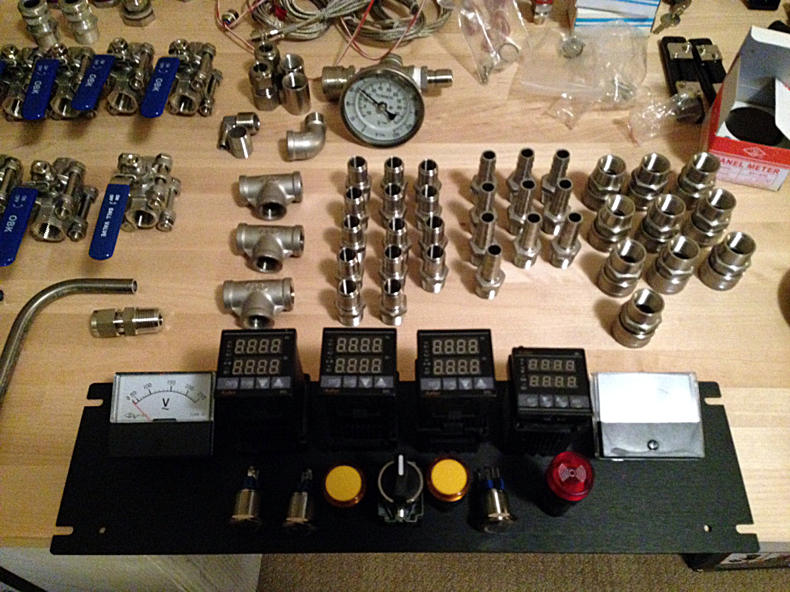The parts for the electric brewery

Before working on the brew kettles, I decided I would attempt to build most of the control panel. Once my 1/2″ knockout punch arrived, I decided I would knock-out the holes for all the buttons on the front of the control panel.

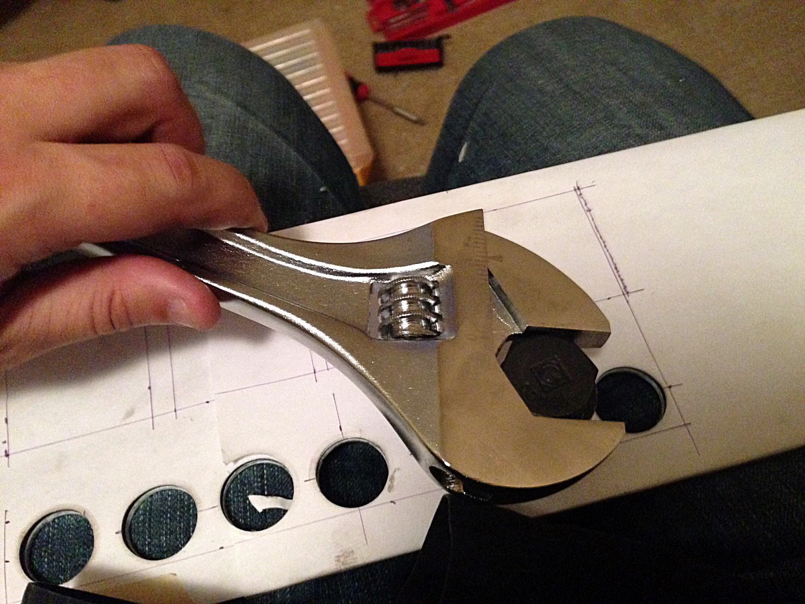Using a knock-out punch

As you can see in the photo, I wrapped some 8.5″ x 11″ paper around the front panel and then made markings for where I wanted everything to go. Then I drilled pilot holes for the knock-out punch, and took each of the circular sections out for the buttons.

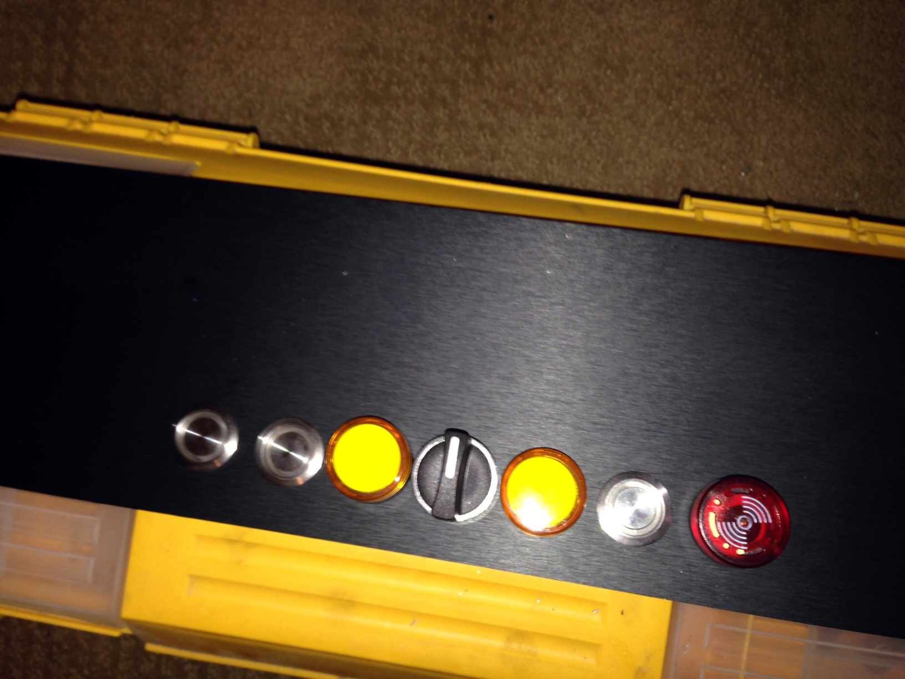Mounting the buttons and switches for the electric brewery

Mounting the hardware at that point was easy, and I decided to call it a night.

About a week later I went down to my friend Tony’s shop in Abbotsford to do most of the hardcore assembly, which involved using drill presses and jig saws for most of the day. The first order of business was to cut out the square holes for the PID controllers and the countdown timer.

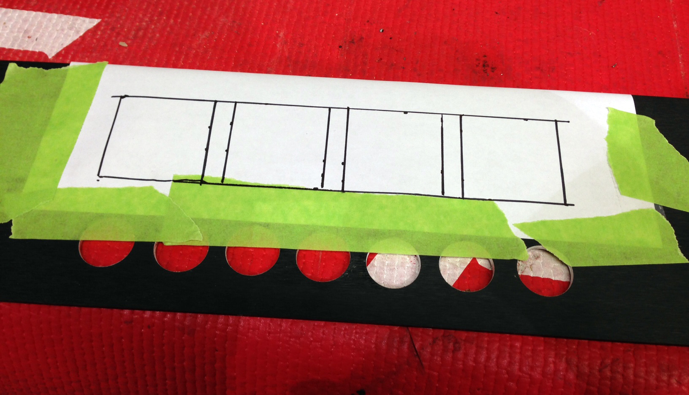Marking the positions for the PID controllers and countdown timer

I basically marked where the square openings would go for the controllers and then drilled holes in all four corners. Once that was done I carefully used the jig saw to cut out each opening (which was easier than I thought actually). I tested the first hole by inserting and mounting one of the PID controllers. Once I proved to myself that the hole was the correct size, I drilled the other three.

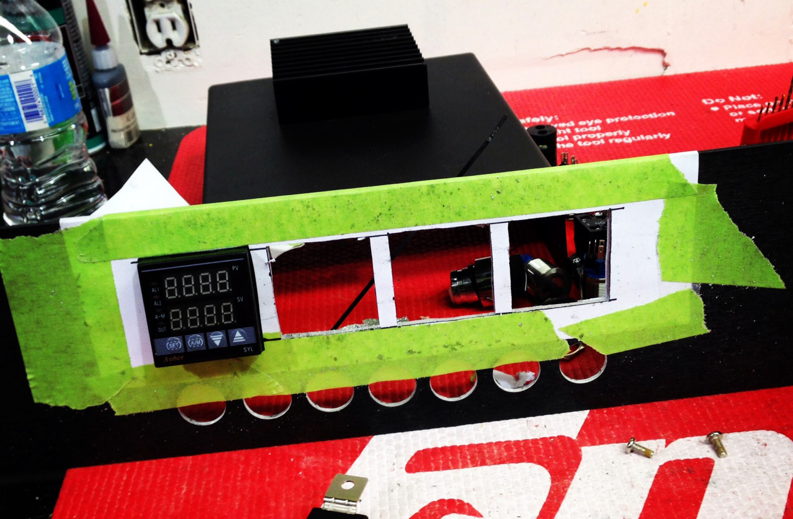Finished holes for the PID controllers

Once that was done I used the drill press with a hole saw to cut the circular holes for the analog voltage and amperage meters. I actually made a slight mistake here and drill one hole slightly larger than it needed to be. Thankfully the volt meter was large enough to cover the hole completely, so it’s not noticeable in the final assembly.

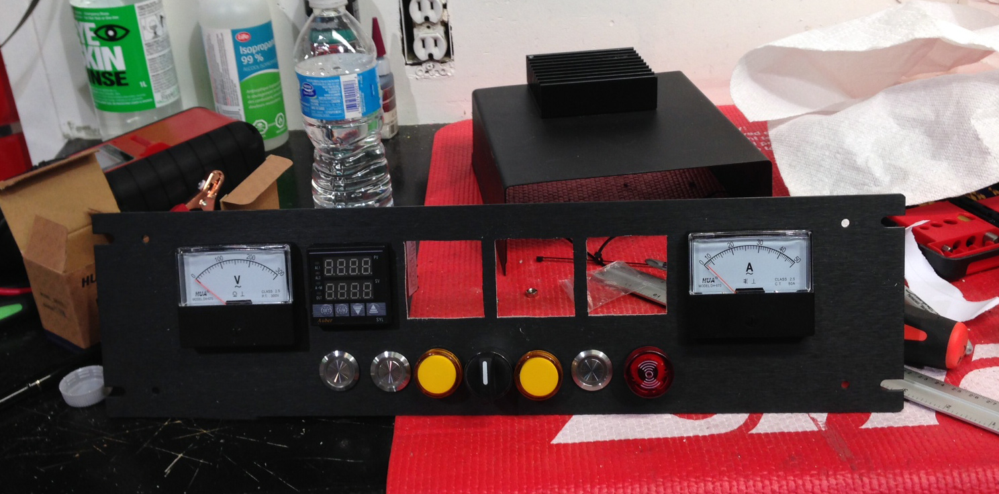After mounting the voltage and amperage meters

At that point, the front panel was basically done in terms of assembly, so I moved to the back one. There are five large cable connectors on the back, which I cut out using a drill press and various hole saws. Once that was done I positioned each connector onto the panel and then traced out where the screw holes were to go using a sharpie marker. Using the drill I quickly made holes for all the mounting screws and finished mounting all the connectors.

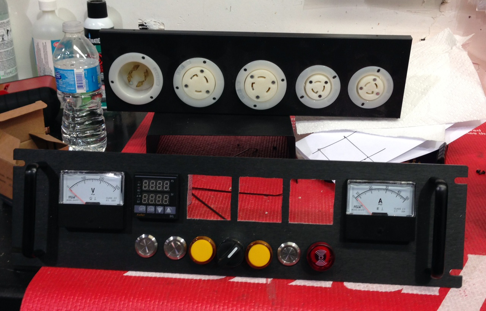Mounted connectors on the back panel for the brewery control panel

Tony’s shop was closing up around then, so I called it a night as well. All in all I spent probably around 6 or 7 hours drilling and jig-sawing that day. When I got home I finished assembling the control panel and snapped this shot.

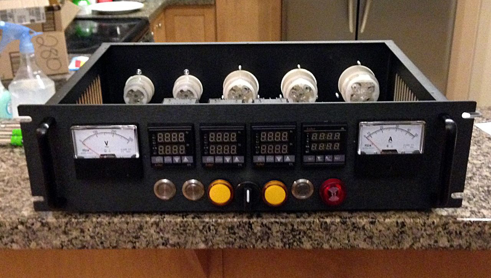Nearly finished control panel, minus the wiring and electronics.

I waited about a week before attempting the wiring, and also to stock up on a few more items such as wire. I managed to wire most of the control panel in one weekend, mostly in front of the TV. I didn’t have my 240V GFCI ready yet, so I just decided to wire the control panel for 120V only at this stage, which meant I didn’t have to be near the 30A dryer plug to work on it.

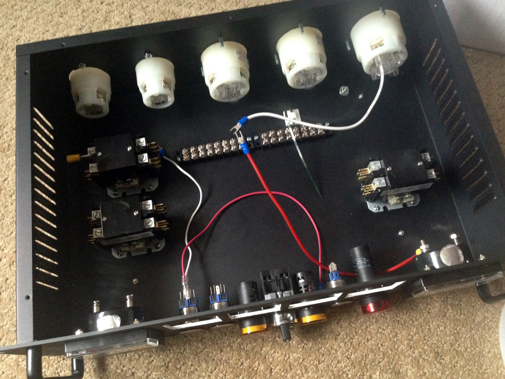Starting the wiring process

Once I had a few of the buttons wired up, I decided to press the power button and breathe the first bit of life into the control panel.

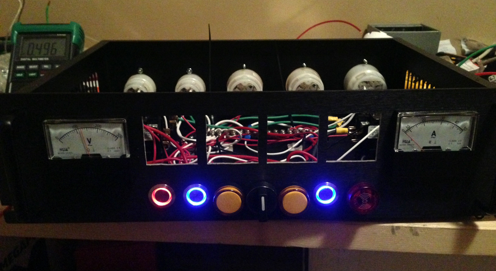Illuminated switches on my electric brewing control panel.

Not long after I was finished wiring up the PID controllers, the countdown timer, and the voltage meter and amperage meter (which hasn’t moved in this photo because really it’s only the SSRs that draw any significant current).

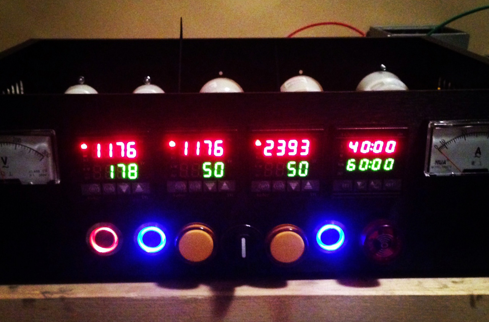After wiring the PID controllers and the countdown timer

Most of the wiring is complete at this stage, but I still need to wire up the SSRs and the temperature probes, which hopefully shouldn’t take me more than a few hours. At that point the control panel will be complete, and I can move my attention to assembling the kettles. It’s been a really rewarding project so far though, and I can’t wait until the day when I can brew my first beer on it.