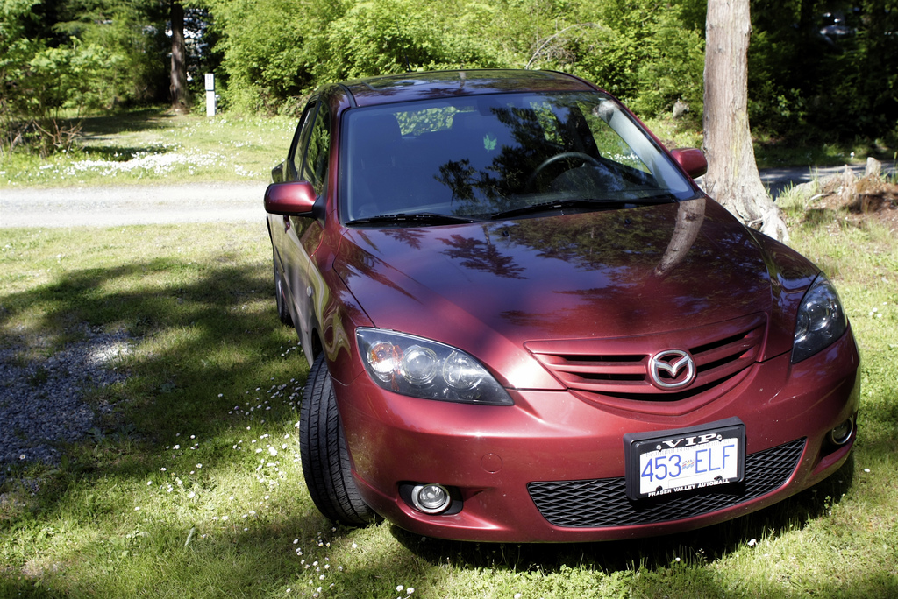
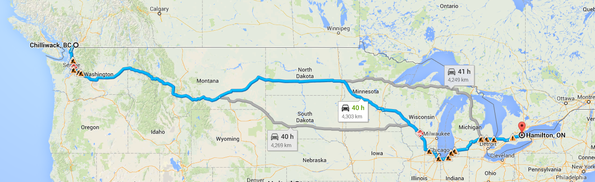

As I pointed out previously, I’m in the process of moving to Hamilton to spend a year working out of BraveNewCode’s new offices. I flew out and spent some time out there in April and May, mainly just to find a place to live. But now that I have an apartment lined up, I’m back in British Columbia getting ready to do a road trip across North America with my girlfriend.

My Car, a Mazda 3 Sport

Most people really have no appreciation for how large of a country both Canada and the United States are. I once had a friend fly into Toronto and email me to see if I could drive out to see him from Vancouver – people are often surprised to learn that it takes five or six days to do that drive, and usually at least five hours in an airplane.

### Canada or the United States?

The majority of Canadians live within 100 kms of the United States/Canada border. As such, when driving across North America most Canadians can choose either route – driving through Canada or the United States.

Both Canada and the US routes are very picturesque, so I don’t think a person could go wrong either way if the goal was primarily to see some amazing scenery. As for me though, I only have a limited amount of time to do the drive from British Columbia to Ontario, and won’t have much time for sightseeing.

By driving through the United States I’ll be able to shave a full day of driving off the entire trip on my route, which is what I’ve decided to do.

### Preparing My Vehicle

Before going on any long road trip, it’s always a good idea to have your vehicle inspected by a reliable mechanic. I recently took mine down to the shop and they told me that my engine mount had a slight crack in it and I had a bent control arm for my front suspension. I probably could have made it to Ontario without dealing with either of those issues, but I thought it was worth it to have it done beforehand to minimize the chances of anything going wrong on the road.

A few other items you may want to consider having done as well are:

- Have an oil change done if you’re getting close. If you’re not sure, have it done anyways.
- Have your air filter replaced, especially if you live in a dusty area.
- Check your tire pressure and fill any tires that are low. Many places such as Kal Tire will even do this for free for you. Make sure you check your spare tire as well.
- Have all your fluids (such as windshield wiper fluid) topped up before the trip.

### Choosing The Route

My goal is to do the drive from Chilliwack, British Columbia to Hamilton, Ontario in five days. Google says it’s 40 hours of driving when traffic is good, which means that my girlfriend and I have to drive an average of eight hours a day. Thankfully she can drive as well, which means both of us can take a break from time to time to make it easier on the other person.

Since we’ll be fresh at the start of the trip though, we’ve decided to do a few hard days so we can have a few easier ones at the end. Both my girlfriend and I would like to stop in Chicago for a few hours as well, so we’ll push hard at first to try and make that happen.

The route we’ll be taking is as follows:

Our Route to Hamilton, ON

Here’s a rough guess of where we’ll likely stop each night, and how long we’ll be driving each day:

- Day 1: Chilliwack, BC to Butte, MT – 11 hours, 1,150 kms
- Day 2: Butte, MT to Fargo, ND – 12 hours, 1,300 kms
- Day 3: Fargo, ND to Rockford, IL – 8 hours, 917 kms
- Day 4: Rockford, IL to Battle Creek, MI (stopping in Chicago for 4 hours) – 4 hours, 418 kms
- Day 5: Battle Creek, MI to Hamilton, On – 5 hours, 505 kms

### Taking My Belongings

The only real catch with driving through the United States is having a full carload worth of electronics with me. One of my concerns originally when planning was that Canada customs might give me some grief when I cross back into Canada if they think I purchased some items in the United States. I called Canada Customs the other day and they suggested that I stop at their facility on the border before crossing into the United States and present an inventory of all my items, along with each device’s serial number (for the electronics). Presumably they will stamp this document so I can show it to the custom’s agent near Sarnia when we cross back into Canada.

### The Final Countdown!

We’ll be leaving Chilliwack, BC, hopefully around 8am or so this upcoming Sunday and pressing hard towards Montana. I’m really looking forward to the drive, and ultimately ending up in Hamilton for Dale’s stag, Dale and Roz’s wedding, and then a one week all-inclusive trip to the Mayan Riviera. As such, I don’t mind pressing hard for five days knowing that in just a few weeks we’ll be sipping cervezas by the pool in Mexico.