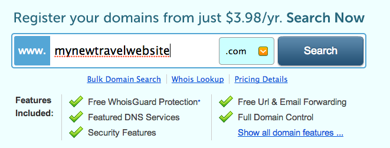
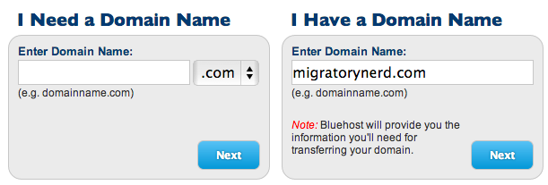
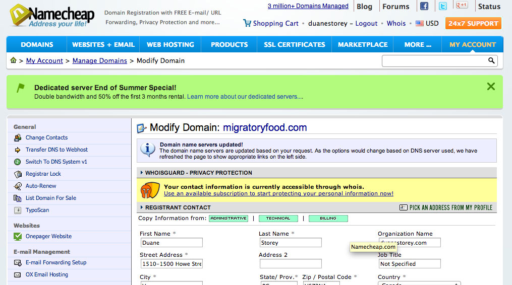
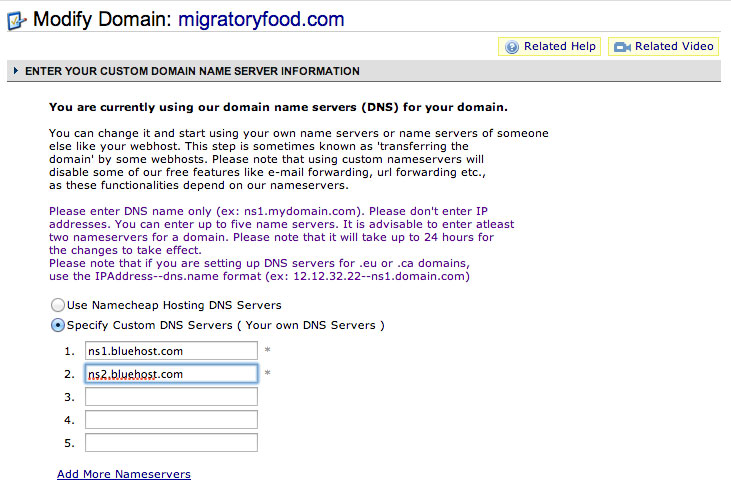
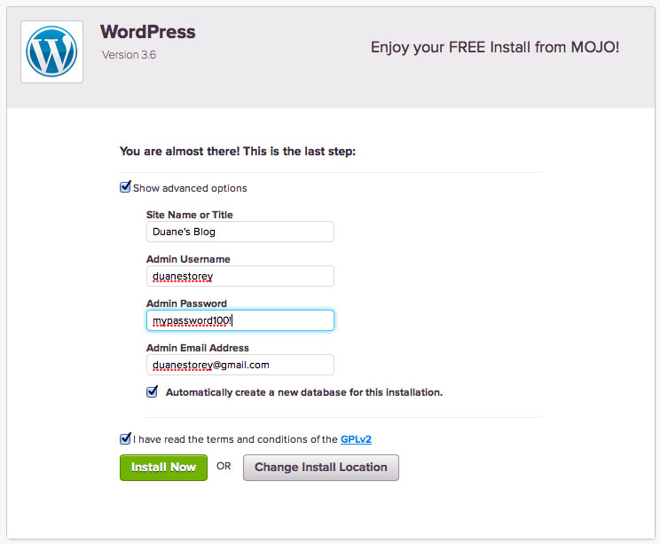
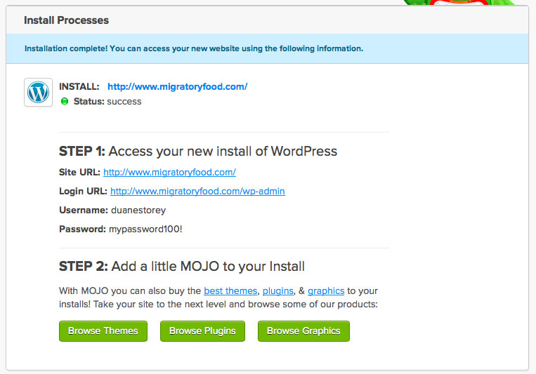
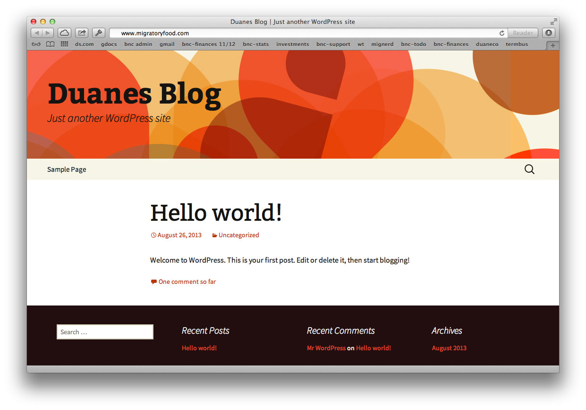

One of the first things I did when I committed myself to travelling around the world was to set up a blog. Indeed, I recently just assisted two other people in getting theirs up, one for a trip around the world, and one for a yearly RV trip down to Arizona. This post will give you easy instructions for how to set up a blog using WordPress.

Part of the motivation I find with most people is the desire to share some of their experiences, both positive and negative, with others. Since so much of travel research is done these days via the Internet, the desire for most people to contribute to that wealth of information during their own trip is great.

### Using WordPress

WordPress is one of the most popular blogging ‘engines’ powering the internet today. If you visit a website that looks like a typical blog, then chances are it is running a version of WordPress. What that means is that there is a computer somewhere in the world that is running a series of computer programs, collectively known as WordPress, to power that particular website.

Often you will see addresses that look like ‘mytravelwebsite.wordpress.com’ – these versions are hosted at WordPress.com and are generally free to run.

If you’re looking to try and get a quick blog up and running, then by all means sign-up for a free blog at WordPress.com. But one thing you should note is that you can’t always make money off of your own content at WordPress.com. I recently did an experiment where I added some affiliate links to a hostel website I booked at WordPress.com. In a self-hosted WordPress installation, if someone would have booked a hostel via my link, I would have made a few dollars. But in WordPress.com these links were rewritten by another advertising service they use on the free service, meaning I wouldn’t have made any commissions.

So if making any type of revenue from your blog is something you are considering, then I recommend hosting your own WordPress installation yourself. You’ll be able to generate income on your own via Google Adsense, or by recommended products or services that you’ve tried via affiliate programs. You’ll also be able to install any WordPress theme or add-on yourself, and won’t be limited to just those that are available on WordPress.com.

This website is currently running a self-hosted version (meaning that it is hosted on a computer on the internet instead of relying on WordPress.com to host it) of WordPress with a domain name (migratorynerd.com) I registered at NameCheap.

I’ll detail the instructions for exactly how to set up a WordPress blog.

### How To Setup A Blog

The following are the steps needed to [register your own domain name via NameCheap](http://www.namecheap.com/?aff=54958), to [sign-up for a shared hosting account at BlueHost](http://www.bluehost.com/track/migratorynerd) (where your website will live while you travel), to setup WordPress on the new server, and to ultimately start blogging on your new blog.

1. #### Register A Domain Name
    
    If you’re going to setup your own blog, then you should register your own domain name so that your website is more personalized. It also allows you to have your own email address at some point in the form myname@mydomain.com.
    
    The name of this website used to be duanestorey.com, but I decided to brand my own website by calling it *The Migratory Nerd*, which is basically what I consider myself as I travel around the world with my laptop. Try various domain names until you find one you like.
    
    Searching for a domain name with NameCheap
    
    
    
    I recommend using [NameCheap](http://www.namecheap.com/?aff=54958) to register your domain name as they are the least spammy of the major domain registrars (many of them will try to sell you product after product while you are trying to purchase a domain – NameCheap doesn’t and I appreciate that). I have 31 domain names hosted with them myself, and they are the only domain registrar that I personally use nowadays.
    
    To register simply visit [NameCheap.com](http://www.namecheap.com/?aff=54958) and then check to see if the name you want is available. If it is, you can purchase it using PayPal or a credit card typically for around $10 per year.
2. ### Purchase A Hosting Account
    
    The next step in setting up a new self-hosted blog is to sign-up for a hosting account. Typically the way hosting works is that there are various companies on the internet who host multiple websites on computers that they own. This type of hosting is called *shared hosting* and it is the best option for sites that have relatively typical amounts of traffic.
    
    The shared hosting provider I recommend is [BlueHost](http://www.bluehost.com/track/migratorynerd), since they provide great value at a low cost. I own two Bluehost accounts currently, and I actively host various websites on them.
    
    If you are interested, you can [sign-up for an account at BlueHost here](http://www.bluehost.com/track/migratorynerd). You can also choose another hosting provider, but the rest of this article deals exclusively with the Bluehost installation process.
    
    At the time of this article, one-year of hosting at BlueHost is roughly $6/mo. Compared to many other expenses, I’m sure most people will agree this is a relatively low cost.
    
    Signing Up At Bluehost
    
    
    
    You will be asked during the sign-up process if you already have a domain name, or if you want to register a new one. If you signed up for a new domain name via [NameCheap.com](http://www.namecheap.com/?aff=54958), then enter your domain name in the “I Have a Domain Name” area and click “Next”. You can also sign-up for a domain name here on Bluehost, but I personally prefer having my domain names in a separate company that doesn’t primarily get involved in hosting as well – in my case, that’s Namecheap.
    
    You can then select which hosting plan you want, either the 12 month, 24 month or 36 month packages. If you are planning on having a blog for a long time and are sure you will enjoy it, then by all means pick a 24 or 36 month plan. But if you’re not sure then I’d simply go for the 12 month option and renew it when that expires.
    
    The only optional package I’d recommend is BlueHost’s “Site Backup Pro” option. With this option BlueHost will make daily backups of your website in case something bad ever happens, like the computer that is hosting your website crashes. In that scenario BlueHost will be able to restore your website with minimal data loss. A crash may never happen, but you will certainly be glad you purchased this option in the event that it does.
3. #### Forwarding your Domain to Bluehost
The next step is to configure the domain you purchased at Namecheap to use the new hosting account that you just set up at Bluehost. If you’re not using Namecheap for your domain, then you’ll have to figure out how to do this step at your name registrar. But all name registrars allow you to specify the nameservers for where the website is hosted.

Namecheap Administration Panel

Login to Namecheap and modify the domain you want to use for your website. Once you are there, the page you are on will resemble the one shown above in the image. In my case, I’m modifying the domain information for the domain MigratoryFood.com.

The option you are looking for is in the sidebar, and it is likely called *Transfer DNS to Webhost*. If you have already configured DNS servers previously, it may be called something slightly different such as *Domain Name Server Setup*. In either case, click that option.

Pointing the domain to Bluehost

One the next screen, you can configure the DNS servers that are associated with your new domain. You want to select the option *Use Custom DNS Servers*, and then enter *ns1.bluehost.com* in the first field and *ns2.bluehost.com* in the second field. Once you save it, your DNS is properly configured for your website to be hosted at Bluehost and you’re ready to begin installing WordPress.

10. #### Setting Up WordPress at Bluehost
Thankfully Bluehost makes setting up a WordPress website extremely easy – as part of the services they provide, they also include an installation wizard for WordPress. All you have to do is answer a few questions and click a few confirmation buttons, and WordPress will essentially install itself.

The first step in the process is to login to your Bluehost account – the information to login should have been included in the welcome email you received from Bluehost after signing up for a hosting account.

Logging in to your Bluehost Account

If you can’t find it, you can always go to the main [Bluehost website](http://www.bluehost.com/track/migratorynerd) and click the *Control Panel Login* button in the top-right.

Continuing The Login Process

From there you will be asked to enter your login information. This information is in the welcome email, and is often the domain name you entered when you signed up for your Bluehost account as well as the password you selected or were emailed.

Bluehost Configuration Panel

Once you are logged in, you should end up at the main Bluehost administration panel, shown above. To begin installing WordPress (which is the last step before your website is officially active), click the *WordPress* icon from the *Website Builder* section of the Bluehost administration panel.

WordPress Automated Install at Bluehost

You’ll then enter to Mojo installation wizard, which can install a variety of different blogging platforms. Since we are focused on WordPress, we’ll install that one. Once Mojo analyzes the host, you’ll be presented with another screen (shown above) of popular applications to install – select *WordPress* here.

WordPress Automated Installer at Bluehost

Mojo will then launch *SimpleScripts* which will do the actual installation for you. You want to select the option to install *a brand new install* by clicking the green start button.

WordPress Installer

At this point you should be at the WordPress installation wizard, which should resemble the photo shown above. The list on the left is used to select which domain to install WordPress for. If you wanted your website to be in a subdirectory, you could specify it in the box on the right. In most cases though you shouldn’t need to do that.

Selecting Your Domain for Automated WordPress Installation

In my case I’m going to install WordPress into the domain *migratoryfood.com*. In your case though make sure you select the domain name from the list that matches the new website you are setting up. If you only have one domain on your account, it will likely be the first item in the list, even though it looks a little funky.

Once you select your domain, click the *Check Domain* button to analyze the directory. If things look good you’ll be asked if you want to proceed and can continue on.

In some cases the wizard will inform you at this point that the directory isn’t empty. If you are presented with an option to proceed anyway, and are sure you don’t need anything in that directory (if this is a brand new installation, then you don’t need anything in that directory), then you can proceed. If for some reason you aren’t presented with that option (and I’ve seen certain scenarios when it isn’t shown for some weird reason), then you’ll have to go to the *File Manager* in the *File Management* section of the Bluehost administration panel and remove all the files from that domain’s directory to proceed.

Advanced Configuration Options for WordPress Automated Installer

When you’re on the last step of the wizard (shown above), make sure you select the checkbox that reads *Show advanced options*. In this area you can configure some of the aspects of WordPress before it is too late. Put the title of your website here, but don’t worry too much about it – you can change it afterwards once WordPress is set up.

Pick the name you want to log into WordPress with in the *Admin Username* section. The username **cannot** be easily changed afterwards, so make sure it is something that makes sense and you will remember. If your name is Bob, then a reasonable username would be *bob*. The default WordPress username is *admin*, but it’s not recommended to use that since many hacking attempts try to exploit that login name.

Choose a password, and make sure it isn’t something easy to guess. You can always change this later, but make note of it for now since you’ll need it to login shortly. If you want to use a really strong password, then head over to [StrongPasswordGenerator.com](http://strongpasswordgenerator.com/) and generate one there.

Finally, put the email address that you want to receive WordPress notifications at. An example of a WordPress notification is when you receive a new comment on your website (WordPress will email you to let you know someone commented).

Make sure the checkbox *Automatically create a new database for this installation* is checked, then click *Install Now* after reading and agreeing to the terms and conditions.

Installation Progress Dialog

You can now relax – your WordPress website is in the process of being set up. This can take anywhere from sixty seconds to a few minutes, depending on how busy the Bluehost servers are at the time. You can watch the progress of it in the wizard, shown above.

WordPress Installation Complete

When your new WordPress website is finally installed, you’ll be shown a dialog similar to the one displayed above. In it you’ll see the URL of your new website (which should match the domain you registered and configured above), the URL you will use to login to WordPress (take note of this, since you’ll use it all the time in the future), the username you configured during the installation process, and finally the password you selected.

If you click the link for your website above, it should open a browser window and show you your new website in all its glory, now hosted on Bluehost and ready for your first blog entry to be created and published.

WordPress Website Ready

After walking through these instructions myself for the domain *MigratoryFood.com*, my new website (shown above) worked flawlessly. The name of the website, *Duanes Blog* in this case, is the name I chose during the installation process. The WordPress theme (which is the ‘look and feel’ of the website) shown above is the default theme in WordPress, and it is called *Twenty Thirteen* – you can change this at any time from the WordPress administration panel.

### Start Blogging!

That’s it! You should hopefully have a new domain name, a new [Bluehost hosting account](http://www.bluehost.com/track/migratorynerd), and a brand new shiny WordPress installation. I suggest you login to WordPress via the WordPress administration URL that Bluehost indicated above (usually it’s located at http://www.mywebsite.com/wp-admin/) and spend some time getting used to the WordPress administration panel. From there you can write new posts, moderate (i.e. approve or reject) comments that people leave, adjust the menu items for your website, install add-ons (called *Plugins* in WordPress terminology), and even change the entire look and feel of your website by installing and selecting a new theme.

If anyone has any questions, please drop a comment and I’d be happy to answer them. All in all this process should only take 15 minutes or so, and when it’s done you’ll be ready to start blogging to the world. If you’re a fellow traveller like me, then that will probably means you’re about to set out on a big adventure and can now share your journey with your friends and family. Enjoy!

If you’re looking for other possible web hosting providers, consider [FatCow](http://www.tkqlhce.com/click-4154459-10492170).