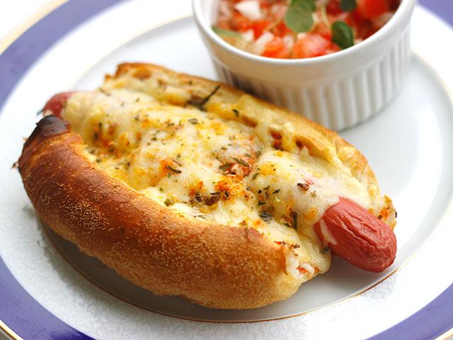
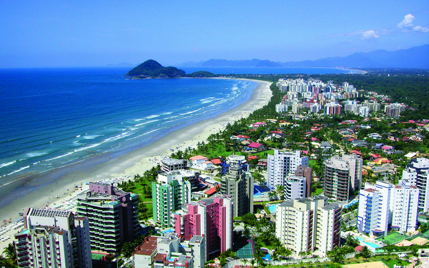
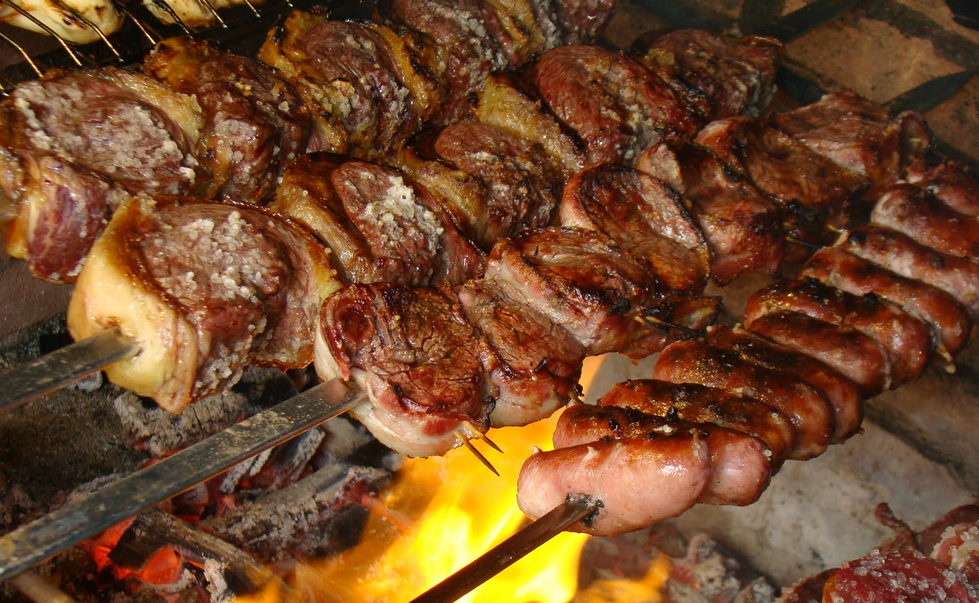
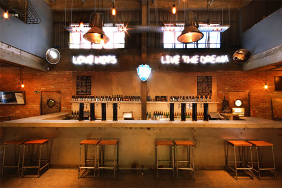

The last time I was in Brazil, I was there from June until August in 2013, which was basically the tail-end of their winter. The weather was actually quite nice (compared to a Canadian winter), with most days hovering around 20C. But I haven’t experienced summer in South America since my first trip to Argentina in 2011.

Given that it’s been snowing and below zero here in Hamilton for the last two weeks, seeing the sun again and 30C days is going to be a great change. I’m flying out of Pearson in the early afternoon on Wednesday, with a brief 4-hour stop over in New York City. I found a flight that was about $200 cheaper because it requires an airport change from Laguardia to JFK in New York City. It’s a bit of a pain, but I have four hours there and it’s just a 20 minute cab ride between them, so it was worth it. Given that I clear customs in Pearson, I’m hoping it will be a relatively smooth process moving between airports.

We’ll be staying with Luciana’s mother in a little town called [Boituva](http://en.wikipedia.org/wiki/Boituva), approximately 90 minute drive from São Paulo.

We don’t really have many plans for our five week trip there, other than visiting with Luciana’s friends and family. But there are few experiences we’d like to have that I’ll list below.

### Cachorro Quente

While you’ll often encounter the same types of foods as you travel around the world (pizza, hamburgers, etc.), often every country or locality has different variations that are well worth exploring. For example, a hot dog in Brazil (translated literally as cachorro quente) is a different experience altogether in Brazil, often being covered with mashed potato, corn, and parmesan cheese that’s eventually cooked again in a little toaster.

Cachorro Quente

I went to a restaurant called [Black Dog](http://www.blackdog.com.br/) (pronounced Black Doggie by Brazilians) and had one during my last visit, but I’m looking forward to trying another variant or two during this visit.

### Visit the Beach

Luciana has a friend with a house near the beach in Riviera de São Lourenço, so we’re planning on going there for a weekend. Obviously Brazil is known internationally for having some of the best beaches, so I’m definitely looking forward to spending some time near one.

Riviera de São Lourenço

### Churrascaria

One of the best experiences anyone can have in Brazil is to visit (and eat at) a Churrascaria. In Brazil, a Churrascaria is basically an all-you-can-eat BBQ house, where waiters walk around with mouthwatering cuts of meat and you can basically pick and choose what you want as it comes around. Some examples of meat that you’ll find are beef, pork, filet mignon, lamb, chicken, and sausage. We’re looking forward to visiting at least one while we are there, and I plan to be exceptionally hungry when we do!

Churrasco

### BrewDog

BrewDog

Beer in Brazil, for the most part, consists of lagers that are usually served ‘estupidamente gelada’ (crazy cold). It’s actually quite refreshing on a super hot day, but I’m personally more partial to IPAs. I was reading recently that a new brew pub opened in Sao Paulo called [BrewDog](http://www.brewdog.com/bars/sao-paulo), so I’m hoping to head down and check it out for an afternoon with a few friends.

Other than that, we’ll mostly just be hanging out around Luciana’s mother’s house. Thankfully, she has both Wi-Fi and a pool, so I’ll likely be chilling out near the pool with a caipirinha and my laptop periodically.