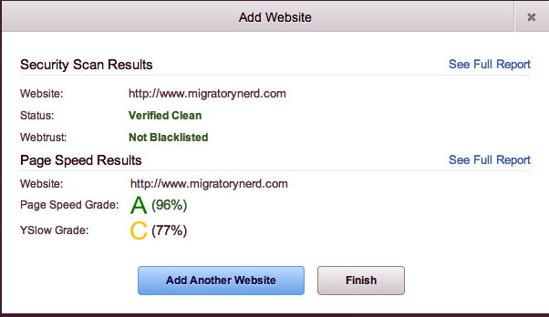
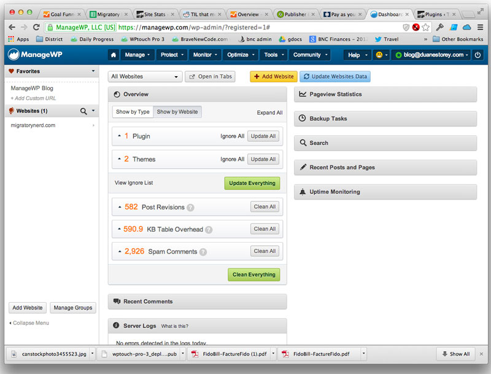
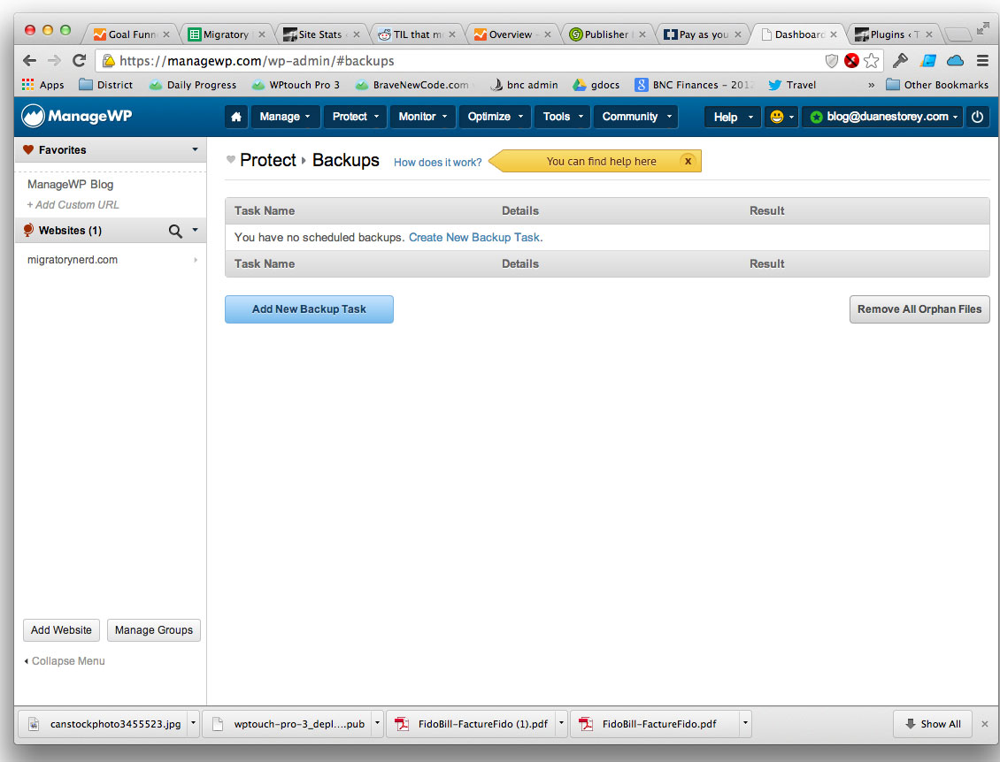
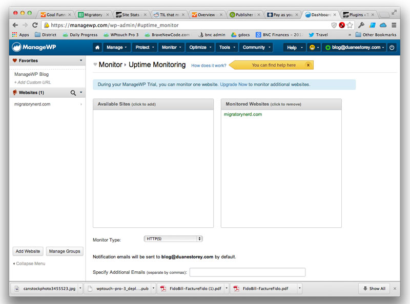
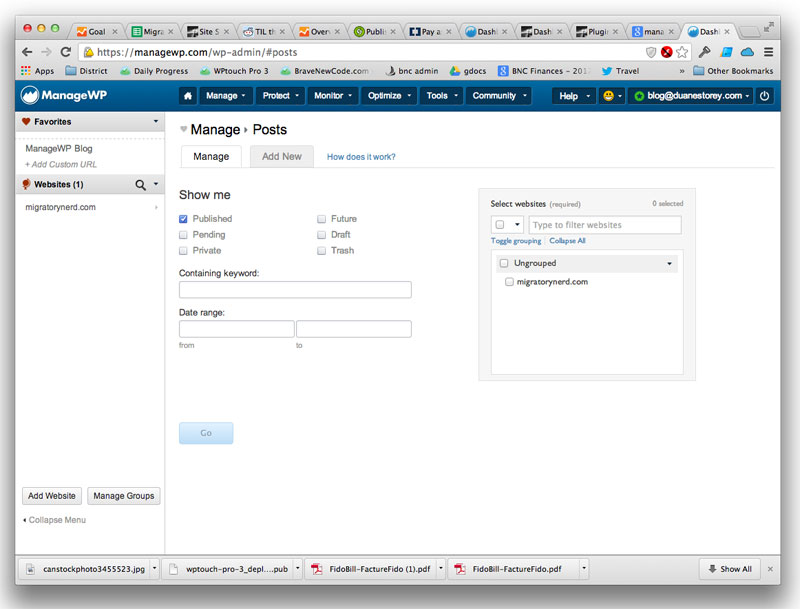

I was recently attending WordCamp Europe near Amsterdam, and met Vladimir from ManageWP. I’ve heard lots about [ManageWP](https://managewp.com/?utm_source=A&utm_medium=Link&utm_campaign=A&utm_mrl=1408) over the last year or so, and even helped do an integration with WPtouch Pro to make it work with their system. But I’ve never actually sat down and spent any time with their system, and decided it was time to sign-up for an account, do a bit of exploring and write a basic ManageWP review to let people know what the service is all about.

ManageWP is a service that basically helps you manage multiple WordPress websites, all from their own proprietary dashboard. As anyone who writes on more than one site knows, it can be a bit time consuming making sure all the plugins on each installation are up to date and that the system is in good health. ManageWP’s main value-add is helping to centralize the management of all your WordPress websites in one place.

I decided to sign-up for a free account just to see how it all worked. The first question I got asked was to enter my WordPress website, which in my case is this one, http://www.migratorynerd.com. At this point you can hand over your WordPress admin credentials, or install the ManageWP Worker plugin which helps communicate with their servers. Either way, you’re going to end up with the ManageWP Worker plugin installed, it’s just a question of whether you do it yourself or you let ManageWP do it for you.

Immediately after entering my credentials, ManageWP started a site scan to see how my website performed.

Initial Site Scan on ManageWP

At first glance, my website appears to do just fine. While I received a C grade for YSlow, my website hits about 96% on Google Pagespeed Insights (I’ve purposefully optimized for Pagespeed a few times). So basically my website is good to go.

Once the site scan is finished you’ll be presented with the main ManageWP dashboard – this is where most of the magic happens. Some of the tasks you can perform here are remote plugin updates, remote theme updates, cleaning of your databases remotely (such as removing old post revisions), and viewing of current tasks that are queued, such as backups. You can also navigate through the menus to do basic WordPress tasks such as writing new posts or organizing content.

Main ManageWP Dashboard

If you have a paid account with ManageWP you can set it up to automatically backup your website. I wasn’t able to test this feature out, but every website administrator should make sure they have a proper backup plan in place. Often shared hosting providers will do periodic backups on their own, but if you ever need access to them sometimes you will have to shell out up to $100 for them to spend the time restoring your website. Being able to backup your website is a great feature, especially for people who have their WordPress websites on unmanaged services, such as VPS providers.

Automatic Backups with ManageWP

Another cool feature is the ability of ManageWP to monitor your website remotely. Essentially ManageWP can ping your website periodically to make sure it is running properly. If your website ever fails to response to a ping request, you can set it up to receive an email or even an SMS. This is probably less of a concern for people who are on managed hosting accounts (such as WiredTree), but more of a concern for shared hosting providers or people (like me) who host their websites on a VPS.

Uptime Monitoring With ManageWP

And of course, no remote WordPress management service would be complete without letting people actually publish and manage content remotely. ManageWP appears to be built on WordPress, and it includes all the typical WordPress widgets for publishing new posts, links, categories and tags. The only difference is that you can do all of this remotely from their admin panel, which undoubtedly saves time and effort for anyone with multiple websites.

Easy Post Management with ManageWP

All in all it’s an impressive service, especially since they offer most of their features for free. For people who upgrade to their paid plan, you’ll often pay less than $1 a month for each website you manage, which is almost a no brainer for anyone who uses WordPress for their day-to-day tasks.

If you’re interested in signing up, you can use this link to receive a 10% discount for your [ManageWP purchase](https://managewp.com/?utm_source=A&utm_medium=Link&utm_campaign=A&utm_mrl=1408). They also have free accounts with limited functionality, so [sign-up for one of those](https://managewp.com/?utm_source=A&utm_medium=Link&utm_campaign=A&utm_mrl=1408) if you’re budget limited but still need some WordPress management assistance. Either way, it’s a great service that a lot of people seem to be talking about, and my experience with it so far is positive. I love seeing innovation in WordPress, especially for services that really are a win-win for both the business and the consumer – I wish these guys nothing but success.