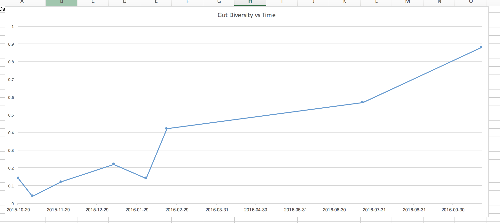

Back in roughly 2007, I managed to [acquire a clostridium difficile infection](/health/recovering-from-c-diff-clostridium-difficile-infection/). It’s a really serious infection, usually preceded by antibiotic exposure, and it can often can lead to death if not treated. In my case, it mostly started out with flu symptoms, but gradually led to me being hospitalized for a few days due to loss of fluids.

Once being discharged from the hospital, I was prescribed flagyl to combat the c. diff infection. I did one or two rounds of that over a month or two, but unfortunately still tested positive for c. diff. at the end of it. Since the c. diff wasn’t really responding to flagyl, I was prescribed vancomycin, which at the time was one of the last lines of defence for most bacterial infections. I did several rounds of that over the course of a few more months, and thankfully eventually tested negative for a c. diff infection.

Unfortunately after all of that, I was left with a really fragile digestive system. Often I would have to go to the bathroom immediately after eating, or unfortunately would often have to hover near a toilet during the day just in case I had to go to the bathroom without much notice. I remember one road trip in particular where I knew I only had about 30 seconds to get to the bathroom, and had to immediately pull over on the side of the highway and run into a forest by the side of the road. Not a very pleasant experience, as anyone with intestinal issues can related to.

Over the course of the next few years, I went to doctor after doctor, trying to figure out what was still wrong with my gut. The diagnosis from most of them was ‘post infectious IBS’, basically some untreatable form of irritable bowel syndrome that happens after treating some other type of infection. In my case, the treatment for my c. diff infection, including all the rounds of antibiotics, led to the IBS.

I was told then to basically just accept it, since there’s not much they could do to treat it. And that’s basically what I did for the next four or five years.

### The Microbiota

Up until recently, it was believed that the contribution of the bacteria in our intestines (the microbiota) was basically useless. But research over the past few years, thanks mostly in part to new 16S RNA sequencing technology, has led the realization that these bacteria are not only important, but may very well be implicated in many of the modern ‘diseases of civilization’ such as diabetes, obesity, IBS, Crohn’s, and even Parkinson’s disease.

Many people remember the Human Genome Project. It was an international effort to decode the human genetic code, which held the promise of a better understanding of human diseases. The hope was that through that effort, we could discover new and effective ways to treat and prevent modern disease. Unfortunately that project was basically a bust – it showed that we are all share roughly 99% of our genome, and that the remaining 1% didn’t really seem to do much to shed any light on disease.

As it turns out, in terms of sheer numbers, the bacteria in our gut have roughly 10 times the genetic material than our own genome. So it’s quite possible that when we went looking for the source of modern disease via the Human Genome Project, we went looking in the wrong place.

About a year ago I stumbled upon a service called [uBiome](http://ubiome.com) that uses cutting edge 16S RNA sequencing technology to analyze a stool sample and determine the composition of bacteria in the gut. This technology has opened up huge new avenues of research over the last few years, and has helped the medical community start to unravel the mysteries of the microbiota and how each bacteria possibly influences health.

For example, most lean people contain Bifidobacterium as well as a bacteria called Akkermansia Muciniphilia – these are often absent in obese people. One role of Akkermansia is to form a barrier in the gut and stop foreign bodies from entering the blood. Lack of this bacteria likely contributes to what naturopaths call “Leaky Gut Syndrome”, where the gut doesn’t have tight junctions but instead allows foreign material to pass. Recent research into obesity has shown that at its heart seems to be an elevated level of lipopolysaccharides (LPS) in the blood which leads to systemic low-grade inflammation. Where does LPS come from? The cell walls of gram-negative bacteria in the gut. I could probably write several posts just about this ailment, but I’ll digress for the time being.

Since I knew I already had gut issues at this point, I thought it would be a good idea to do a uBiome test and see just what my gut looked like from a bacterial perspective. My first sample came back and showed that I was roughly in the bottom 14% of all people in terms of diversity (diversity is usually a good metric to evaluate the health of an ecosystem).

For the next five months, I set out to determine if I could improve my gut health mostly just by modifying my diet. I started taking prebiotics, which are beneficial fermentable fibers that some bacteria like to eat, and probiotics, pills that contain bacteria such as bifidobacterium. I also ate a lot of yogurt, and started making and consuming naturally fermented foods such as sauerkraut and kimchi. The current wisdom, at least in naturopath circles, is that this combination of foods and functional foods should have led to an improvement.

Each month during that period I did another uBiome sample, and took stock of any improvements (or lack of improvements in my gut). In general, my overall gut health didn’t change very much during those months, and my uBiome diversity bounced between 4% and 20%, with an average of about 10%. So basically despite my best efforts over a period of five months, I was unable to make any real impact in my gut diversity or any of my symptoms. It was time for another approach.

### Fecal Microbiota Transplant

One of the most effective treatments for a c. diff infection these days is a fecal microbiota transplant (FMT). Basically you take the stool from a donor, extract the beneficial bacteria, and then transplant it into a patient with c. diff. The bacteria in the donor’s stool then immediately start to augment the bacteria in the patient, often re-establishing the defence mechanisms that normally protect against a c. diff. infection (in the case of a c. diff infection, it appears that most people become susceptible when an antibiotic disrupts the gut’s ability to generate secondary bile acids. These bile acids keep c. diff at bay, and the loss of the beneficial bacteria that convert primary bile acids into secondary ones cause c. diff to take hold and proliferate).

The cure rate for c. diff with a single FMT is about 90% – that’s far greater than any of the current antibiotic treatments such as flagyl or vancomycin. For three back-to-back FMT procedures, the cure rate is close to 97% – almost a home run as far as treatments go for any disease. The cure rate is in fact so high that during one study they had to stop it prematurely because it would have been unethical to continue to allow c. diff patients in the second arm of the study (those who weren’t having FMT) to continue to die when such an effective treatment was available.

While treatments for IBS and Crohn’s disease using FMT are still in their infancy (but they are being investigated), I was very convinced (based on all the research I had read to date) that since my gut problems started with a c. diff infection that perhaps a FMT would finally restore my gut to its previous healthy state.

Unfortunately here in Canada a person can only receive a FMT if they test positive for c. diff. Since I no longer do, I started investigating other options. I ended up stumbling upon a FMT clinic in Argentina known as the [Newbery Clinic](http://newberymedicine.com/), and contacted Dr. Silvio Najt for an initial Skype consultation.

Dr. Najt agreed that given my history, FMT would likely be able to help. So I decided to book a trip to Buenos Aires for the procedure, and to enjoy a little bit of sunshine. I previously spent several months living in Buenos Aires, so I was really familiar with the city and the culture. If anyone is considering going to Argentina, I highly recommend it as it’s one of my favourite places that I’ve visited in the world.

### The Procedure

Flying to Argentina

I arrived in Buenos Aires after about 18 hours of travelling, and met Dr. Najt at the clinic a few days later. Starting then, I received five FMT procedures over a course of two weeks, each of which took about 60 minutes total from start to finish.

Each person reacts to FMT a little different, and I got to talk to a few other patients while there about their experiences as well. For me, I noticed I had a mild fever for a few days after my first procedure, which seems to be fairly common (you are after all injecting your body with a bunch of foreign bacteria).

Since bacteria like to munch on fiber, I switched to a high fiber diet roughly around the same time I started the procedures. Unfortunately for me, this caused a lot of digestive distress, both before and after the procedure. If I could go back in time, I probably would have upped my fiber content at this time, but not to the extent I did.

I didn’t really notice much of a change in terms of my gut health during my two week visit. I had some days where things seemed slightly improved, and other days where I seemed to spend a lot of time in the bathroom. Dr. Najt checked in with me every day or so, and kept an eye on how things were going and also helped to manage expectations. After the procedures were over, I hopped back on an airplane and headed back to cold Vancouver weather, with hopefully a new and improved gut that hadn’t shown itself completely yet.

### The Results

Everyone I’m sure at this point is really curious to know what the end result was for me. It’s been roughly 10 months since I had the FMT procedure done in Buenos Aires, and it’s been pretty amazing just how much has improved since then.

In terms of my symptoms, I’ve gone from going to the bathroom 5 or 6 times a day to usually just once a day now. I used to have a lot of foods which would cause me digestive distress, such as almonds and grapes, neither of which cause me any issues anymore. In fact, there aren’t any foods at all now that cause me any issues. So in terms of my post-infectious IBS, I’m pretty confident in saying that I’m cured.

FMT Results

In terms of my gut diversity, uBiome shows that I’ve gone from roughly 10% diversity from before the FMT to 88% diversity as of my last test. Stated another way, I was in the bottom 10% of most people in terms of gut health, and am now in the top 12%. You can see the first five points on that graph from the period of time before the FMT, and the steady climb in diversity upwards since having it.

I suspect I’ll continue to have some positive gains over the next few months, but certainly the procedure seems to have significantly improved my gut diversity as evidenced by the 16S RNA sequencing data that uBiome does. I also have reacquired several important bacteria such as bifidobacterium longum and more recently, akkermansia. I’ve added a few more fiber sources to my diet recently, as well as resistant starch (both from whole foods), so I am interested to see if there’s even more improvement on my next uBiome test.

### Discussion

One aspect of my data that stands out to me is that despite five months of a eating very healthy diet (containing lots of prebiotics and probiotics, yogurt and fermented foods), I was unable to cause any significant improvement in my gut health (as measured by uBiome) or notice any improvement in my symptoms. So I would hypothesize that if a person has a very dysbiotic gut, FMT may in fact be the only long-term solution that leads to meaningful results, or at least the only solution that leads to results on a practical time scale. It’s like breaking your arm – you can rub as much polysporin as you want on it, but until someone sets the bone and puts a cast on it, it’s never going to heal properly.

Another aspect to take note of us that it has taken almost a full year to realize the full improvements from the FMT. So if anyone has recently had one or is debating having one, I think you should manage your expectations in terms of short term improvements.

Some people may question whether or not this procedure is safe. It’s a good question, even though FMT has an impeccable safety record so far. But the truth is that we are sharing bacteria with other people all the time – when we touch them, when we kiss them, and when we use public toilets. I would argue that this procedure, despite having an ‘ick factor’, isn’t really much different than needing a pint of blood in a hospital.

For me though, I’m happy I had the procedure done, and that after seven or eight years of having post-infectious IBS, am mostly cured at this point. Given the amount of diseases that are continuing to be linked to a disturbed microbiota, it’s good to know that my gut is now probably as healthy as its ever been. And in fact since my donor was breast fed and that I wasn’t, I may even have a healthier gut than I started with at this point.