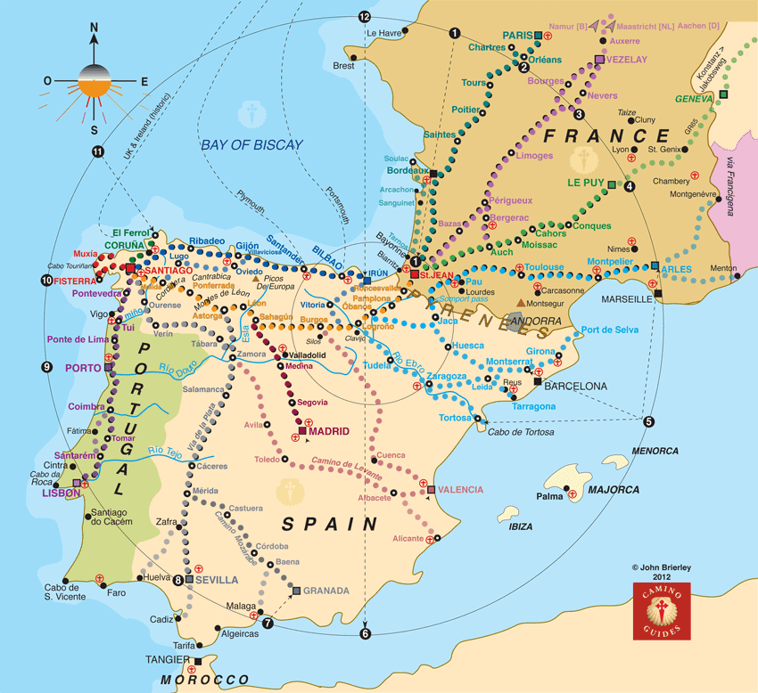
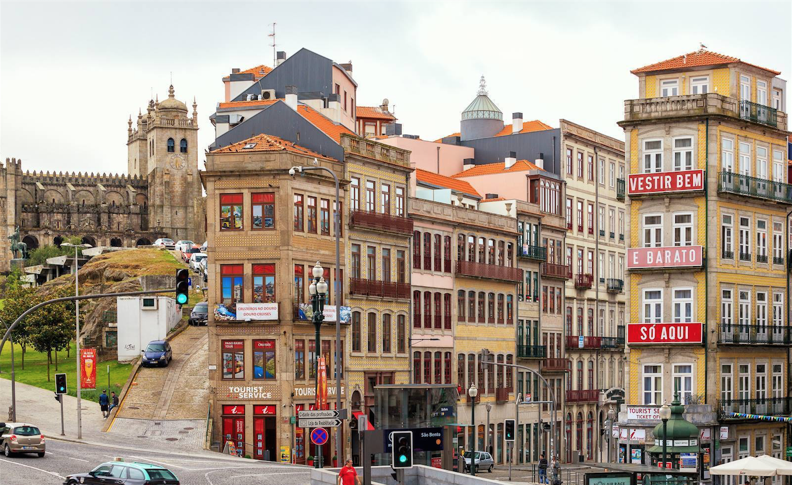

In about 90 days, I’m heading to London, England, to spend my birthday. As you get older, birthdays become less and less important I find, certainly not enough to warrant a huge drunk at the bar. So I thought this year I would spend my birthday in another country, hopefully meeting a few new people and maybe exploring the countryside.

A few days after my birthday, I’m heading to Spain to start the Camino de Santiago, a famous Christian pilgrimage that ends in the city of Santiago, Spain. Historically many people attempted the long walk as penance for their sins, but nowadays people walk it for a variety of reasons, often because they want some introspection on life.

Camino de Santiago Routes

There are many different routes to Santiago, most of which span various countries in Europe such as France, Spain and Portugal. The route I’ve settled on is called the [Camino Frances](https://en.wikipedia.org/wiki/French_Way), or The French Way. It starts in Saint Jean Pied de Por, France, and extends over the northern parts of Spain, eventually ending at Santiago.

Anyone who walks more than 100 kms. will acquire a certificate stating they are officially a pilgrim, so my original goal was to do at least that. Not being someone who likes doing the bare minimum, I thought shooting for at least 200 kms would be a better goal.

I haven’t decided my starting point yet – in terms of sheer distance, starting at [Ponferrada, Spain](https://en.wikipedia.org/wiki/Ponferrada) is roughly 200 kms from the end, so that’s certainly an option. That said, many people start further away from Santiago and simply take a bus to skip the sections of the walk that may not interest them (for example, some of the relatively flat, sparse sections in the middle), so I’ll explore that option as well.

My friend Scott is flying up from South Africa to join me on the camino, so we’ll finalize everything over the next month or so. While I saw Scott relatively recently on a trip of his to BC, Canada, we haven’t really had many opportunities to hang out since his wedding in [Cape Town, South Africa](/travel/destinations/africa/south-africa/visiting-cape-town/) nearly five years ago, so it will be great to catch up and experience this together.

The Camino Frances is the most popular route, and part of the appeal of it is interacting and meeting all the other future pilgrims who fly in for the experience. Most individuals choose to stay in the albergues, which are essentially hostels for pilgrims. These are very basic accommodations, often consisting of a single bunk in a room of 8 or 12 bunk beds. But the price (often $5 Eur – $10 Eur per night), and the opportunity to socialize, makes them extremely attractive options. In addition, most restaurants along the route have special pilgrim deals in recognition of their efforts. A friend of mine who did the camino years ago told me that it’s common for restaurants to serve a whole bottle of wine for lunch, regardless of how many people are in your party. So drinking lots of wine and eating lots of food also appear to be important parts of the camino – sign me up! I’ve also been told that English still isn’t very prevalent along the route, so it will be a great opportunity for me to brush up and hopefully improve my Spanish while there.

To record your progress to Santiago and also to stay in the albergues, you need a pilgrim passport, technically called a *credencial*. You can pick these up at various places along the route, but many countries have their own. I recently ordered two for Scott and myself from the [Canadian Company of Pilgrims](https://www.santiago.ca/), so we’ll be all set when we arrive. Churches, albergues and various restaurants have official stamps, so one of the daily tasks along the camino is to get your credential stamped in each new town.

Years ago I hiked the West Coast Trail on the West Coast of Canada. It’s a 75 km hike with a few difficult sections, and I did it in six days (with one rest day in the middle). My longest walking day on that hike was about 17 kms, so a reasonable walking goal per day for the camino I figure is about 20 kms for now. A friend of mine who did the camino a few years ago was doing about 25 – 30 kms per day, and he recommended going at a slower pace in retrospect.

Over the next few months I’ll be hitting the gym hard, and hopefully getting in some long walks. I’m about 20 lbs heavier than my “travel weight” (I blame the Canadian winter!), so I’m hoping to knock all that off before I leave in April. Regardless, most people lose a bunch of weight during the walk, so hopefully I’ll come out the other end much more fit than I started.

Porto, Portugal

After Scott and I arrive in Santiago and officially become pilgrims, we’re slowly going to migrate south to Porto, Portugal, where we’ll be meeting Scott’s wife (and my former Thailand neighbour!) Samantha. I was in Porto approximately three years ago, but strangely I can hardly remember it. So I’m looking forward to having a bit more time there to explore.

If you would like updates of all my Camino de Santiago posts, please sign up here – <http://eepurl.com/cylAY5>.