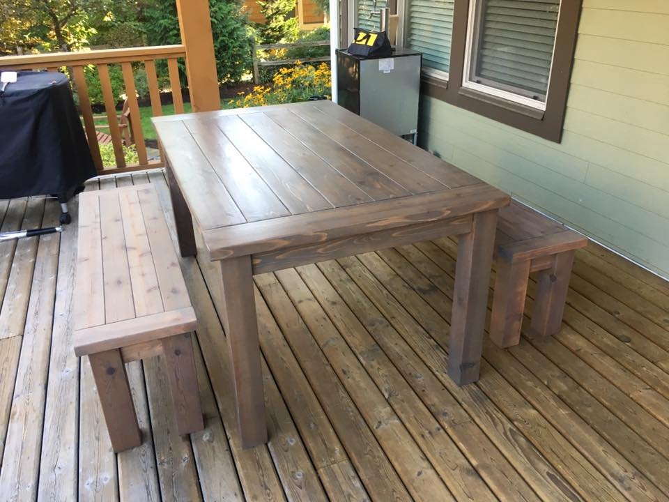
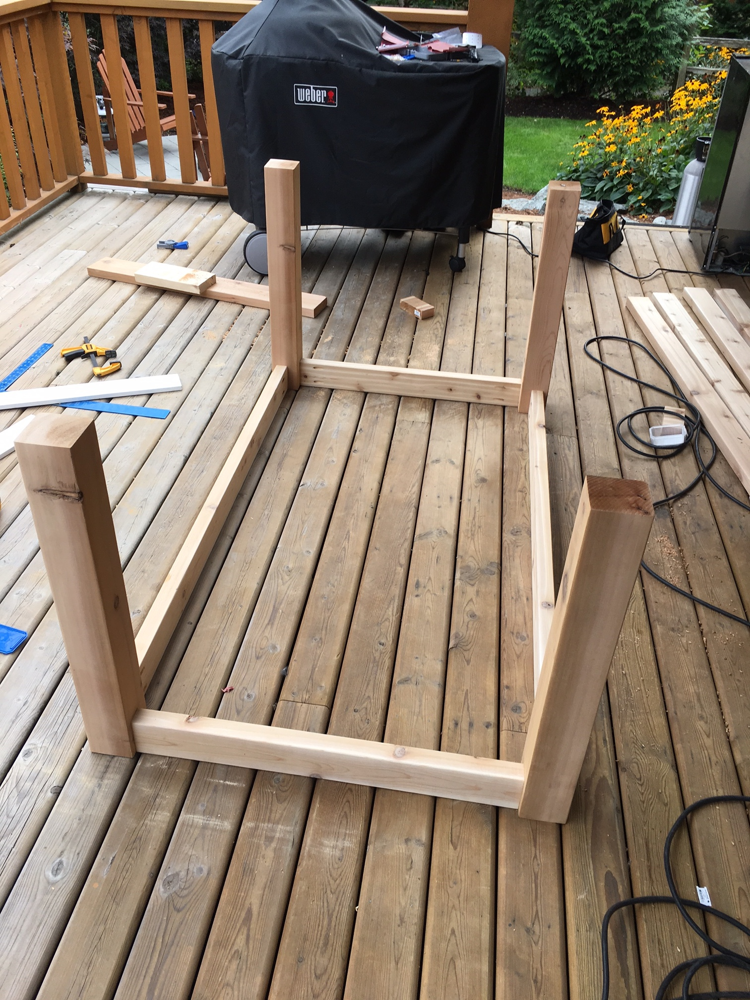
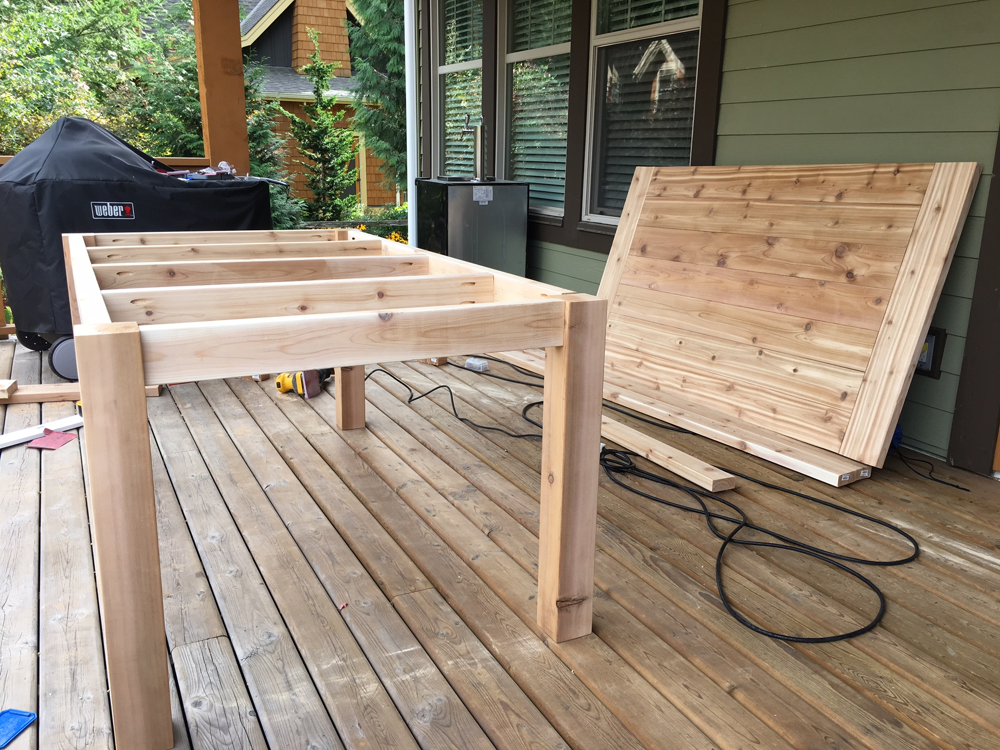
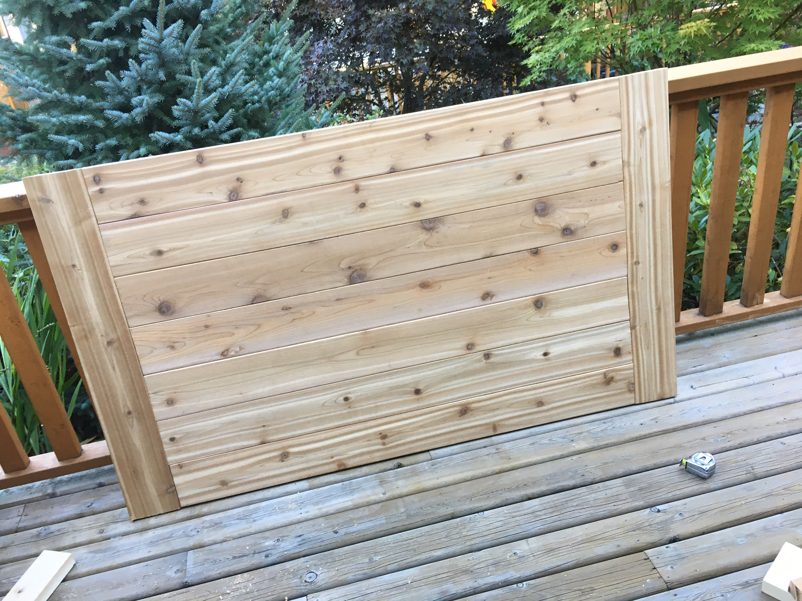
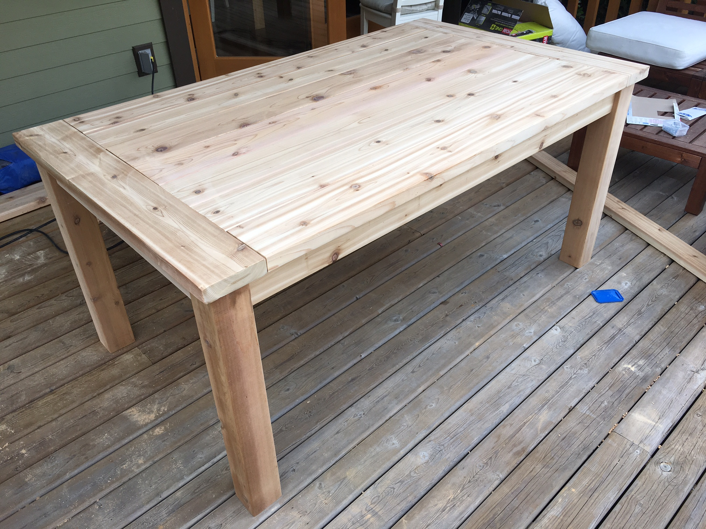
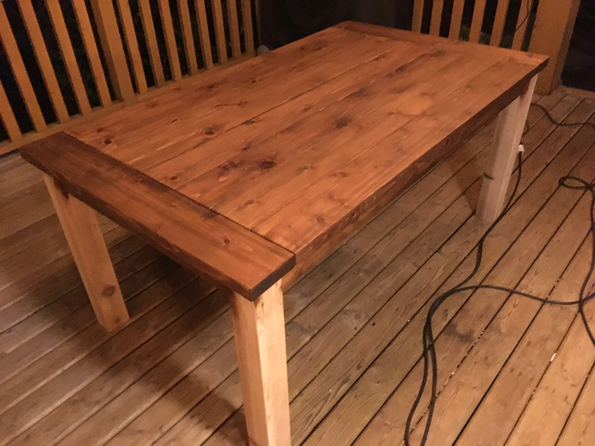
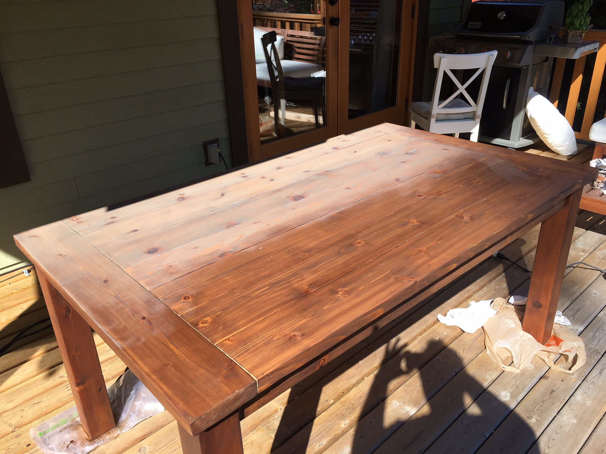
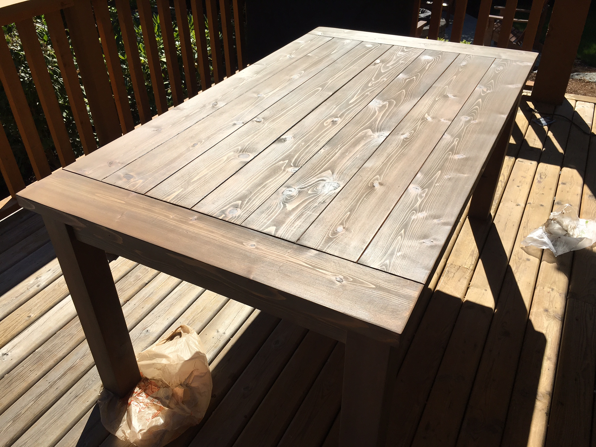
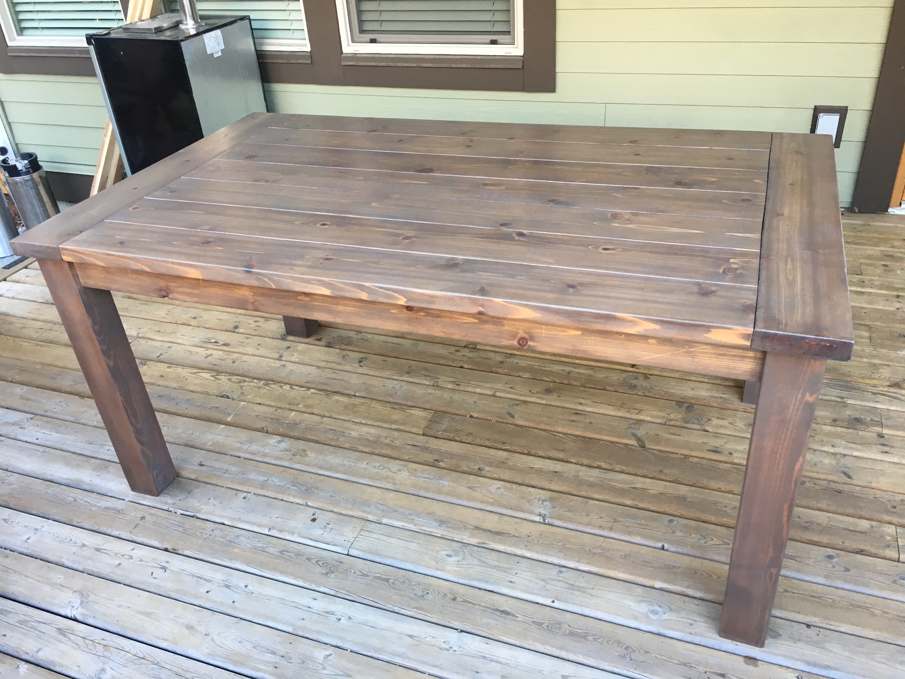

I’ve been in the market for a new outdoor patio table for quite some time. Unfortunately for me, I didn’t really want to spend a huge amount of money on one, which is why I originally was looking at buying a used one.

As I live in a cottage, I really wanted a wood table for my outdoor patio as opposed to a metal one. I spent the last few weeks looking at used offerings in the area, but everything looked pretty beat up or just in an older style that wouldn’t really fit in with my decor.

I started browsing on Pinterest for some cool ideas for tables, and ended up really liking the look of a few different farmhouse/harvest tables. I decided then that the answer to my problem was to simply build a patio table myself.

Outdoor Farmhouse/Harvest Patio Table

### The Logistics

In terms of style, I decided to construct a wood farmhouse table that could seat six people, two at each side and two at the ends. In terms of table length, most websites said a table of between 5 and 6 feet long could handle that many people. I measured up the area I envisioned the table sitting on my back patio, and realized a length of about 66 inches would be perfect, so 5 feet 6 inches.

My indoor harvest table (that I didn’t make) is 33 inches wide, and that is a fairly manageable width. I figured something around that size would be perfect, or maybe even a bit wider. Since I decided I wanted to do the table top using 2×6 boards, the width I settled for is 38.5 inches, which is seven 2×6 boards placed side by side (these boards are 5.5 inches wide each).

In terms of the type of wood, I really wanted to avoid using pine or fir, even though that’s what most people typically use. For me, pine was the wood we used in high-school woodworking class when cost was the primary concern.

Since this table was going outside, and Home Depot had a huge stock of it, I decided to build the table out of premium cedar decking.

Most tables are around 30 inches tall, so I decided to use that height. Since the primary table top is made out of 2×6 boards, and those have a height of 1.5 inches, the legs would be 28.5 inches tall.

### The Table Build

Knowing that I wanted a table that measured 66 inches by 38.5 inches by 30 inches tall, I created a spreadsheet to try and work out the sizes of all the individual pieces of wood that would compose it. Here’s the final parts list:

- 7 – 55″ 2×6 pieces for the table top
- 2 – 38.5″ 2×6 pieces for the breadboards (the two end pieces of the table top)
- 4 – 28.5″ 4×4 cedar posts for the table legs
- 2 – 57″ 2X4 pieces for the apron
- 2 – 29.5″ 2×4 pieces for the apron
- 3 – Cut to measure middle supports for the table

In terms of rough usage, I believe this was 5-2×6 cedar boards, 2-2×4 cedar boards, and 1-4x4x10 cedar post. All together this cost about $150 CAD for the wood for the table.

In terms of other tools and materials, here’s what else I needed:

- [Kreg Jig](https://www.amazon.com/gp/product/B000J43A7W/ref=as_li_tl?ie=UTF8&camp=1789&creative=9325&creativeASIN=B000J43A7W&linkCode=as2&tag=duanstor-20&linkId=9fc568272d283bf4bdf3114218459b56) for drilling pocket holes
- [2.5″ pocket screws](https://www.amazon.com/gp/product/B000VK3TES/ref=as_li_tl?ie=UTF8&camp=1789&creative=9325&creativeASIN=B000VK3TES&linkCode=as2&tag=duanstor-20&linkId=2a25326a6d85dbeef9c0fcd776786933)
- [80 grit sandpaper](<https://www.amazon.com/gp/search/ref=as_li_qf_sp_sr_tl?ie=UTF8&tag=duanstor-20&keywords=80 grit sandpaper&index=aps&camp=1789&creative=9325&linkCode=ur2&linkId=773574b6904f7a5b45f023d2805339b6>)
- [150 grit sandpaper](<https://www.amazon.com/gp/search/ref=as_li_qf_sp_sr_tl?ie=UTF8&tag=duanstor-20&keywords=150 grit sandpaper&index=aps&camp=1789&creative=9325&linkCode=ur2&linkId=04b2ff9ad0f6b85857903ad17878a2e>)
- [Water-based semi-gloss Wood Finish](https://www.amazon.com/gp/product/B00CA6AEO4/ref=as_li_tl?ie=UTF8&camp=1789&creative=9325&creativeASIN=B00CA6AEO4&linkCode=as2&tag=duanstor-20&linkId=200a47ecae92204dbda505f423dbe926)
- [Provincial gel-based stain](<https://www.amazon.com/gp/search/ref=as_li_qf_sp_sr_tl?ie=UTF8&tag=duanstor-20&keywords=provincial stain gel&index=aps&camp=1789&creative=9325&linkCode=ur2&linkId=b136056f1206c6d6b9238c66bd0ec80e>)
- [Weathered Grey Stain](https://www.amazon.com/gp/product/B011VTBDDG/ref=as_li_tl?ie=UTF8&camp=1789&creative=9325&creativeASIN=B011VTBDDG&linkCode=as2&tag=duanstor-20&linkId=bc453e75b95854ca2ebc1cc327a414e7)

It’s best to use an orbital sander to sand all the pieces before they are assembled. While you can sand most of it after the build is done (and you will do this for sure), for some pieces it’s much easier to do prior to assembly. I used 80 grit sandpaper for the first pass, and ended with 150 grit sandpaper. If this was an indoor non-rustic piece of furniture, probably would have gone to 220 grit or further, but since it’s a rustic table that’s going to be outside, I didn’t see any benefit to going finer than 150.

### The Table Build

I used pocket screws and holes for most of the assembly. If you don’t have a [Kreg Jig](https://www.amazon.com/gp/product/B000J43A7W/ref=as_li_tl?ie=UTF8&camp=1789&creative=9325&creativeASIN=B000J43A7W&linkCode=as2&tag=duanstor-20&linkId=9fc568272d283bf4bdf3114218459b56), you should get one, as it makes doing projects like this much simpler.

The table base was constructed by putting two pocket holes in each side of each apron piece, and joining them to the table legs using [2.5″ pocket screws](https://www.amazon.com/gp/product/B000VK3TES/ref=as_li_tl?ie=UTF8&camp=1789&creative=9325&creativeASIN=B000VK3TES&linkCode=as2&tag=duanstor-20&linkId=2a25326a6d85dbeef9c0fcd776786933). So in total there were 16-2.5″ screws used to assemble the first part of the table base.

Building the base for the farmhouse table

Normally in most farmhouse tables I saw on the internet there is a series of cross braces on the bottom of the table (these are called stringers). While I liked the look of them, their placement meant nobody could comfortably sit at the two ends of the table since there were cross braces in the way. So I decided to ditch them.

In order to make the table more stable with the removal of the cross braces I decided to add three additional pieces of wood between the apron pieces. I cut these to measure, and joined them to the apron using [2.5″ pocket screws](https://www.amazon.com/gp/product/B000VK3TES/ref=as_li_tl?ie=UTF8&camp=1789&creative=9325&creativeASIN=B000VK3TES&linkCode=as2&tag=duanstor-20&linkId=2a25326a6d85dbeef9c0fcd776786933).

Assembled table base with additional cross braces

You can see the additional cross braces between the two lengthwise aprons in the photo above. I tested the stability at this point, and it seemed rock solid.

**The Table Top**

The first step in assembling the table top is to align the 7-2×6 table top pieces and make sure the ends (where the breadboards will attach to) are straight. I drilled about five pocket holes in six of the seven pieces to attach them all together. Once done, I screwed them together with 30-[2.5″ pocket screws](https://www.amazon.com/gp/product/B000VK3TES/ref=as_li_tl?ie=UTF8&camp=1789&creative=9325&creativeASIN=B000VK3TES&linkCode=as2&tag=duanstor-20&linkId=2a25326a6d85dbeef9c0fcd776786933).

To attach the breadboards, I drilled seven pocket holes on each side, one at the end of each 2×6 board. I figured this would increase the stability of the table top. Once these were drilled, I simply attached the breadboards using 14-[2.5″ pocket screws](https://www.amazon.com/gp/product/B000VK3TES/ref=as_li_tl?ie=UTF8&camp=1789&creative=9325&creativeASIN=B000VK3TES&linkCode=as2&tag=duanstor-20&linkId=2a25326a6d85dbeef9c0fcd776786933).

Completed farmhouse table top

**Attaching the table top**

The final step was to attach the table top to the base. This is best done with the table top inverted and the base placed onto it upside down. To connect the table top with the base I drilled various pocket holes in the aprons and cross member braces, probably about 20 in all.

Before screwing the table top on, it’s best to make sure the overhang for the table top is the same on all sides. I purposefully designed the aprons so that there was roughly a 1.5″ overhang all around for aesthetic reasons. Once this was properly aligned on the table base, I screwed the [2.5″ pocket screws](https://www.amazon.com/gp/product/B000VK3TES/ref=as_li_tl?ie=UTF8&camp=1789&creative=9325&creativeASIN=B000VK3TES&linkCode=as2&tag=duanstor-20&linkId=2a25326a6d85dbeef9c0fcd776786933) in, securing the table to the base.

Assembled farmhouse table

### Finishing the Table

In terms of finish, I knew I was going to do some combination of stain and sealant since it was going to be on my back patio and subjected to rain and cold. The hard part was deciding what colour to ultimately stain it.

Since I wanted something rustic, I decided to try and do a combination of stains, one to set the overall tone for the table and the second to make it look weathered. After doing several tests on scrap pieces of wood, I settled on using a Provincial gel-based stain and a diluted oil-based “Weathered Grey” colour.

Prior to staining, I sanded everything again using 150 grit sandpaper. There was various bumps and nicks that happened during assembly that I mostly removed at this stage. Since it’s a rustic table I wasn’t super anal about removing all of them, since they add to the overall look and feel of the table.

Once that was done I used a leaf blower to remove all the sawdust from the table. If you don’t have access to one, a damp cloth can be used to wipe the table down and remove all the dust.

I applied the Provincial stain in the evening on my back patio. I like working with gel stains, but you have to be a bit careful because they sometimes go on fairly dark. Here’s how the table looked part way through the application of the Provincial stain.

Provincial stain applied to the farmhouse table

Once the Provincial stain dried, I prepared a 2:1 mixture of turpentine to weathered grey stain to dilute it. If you use a water-based stain, you can dilute with water instead.

I applied the mixture to each board, let it sit approximately 60 seconds then wiped it off. I did my best after each application to remove all the extra stain so it didn’t continue to change the colour of the base layer.

Weathering the farmhouse table using ‘weathered grey’ stain

Once the staining was all done, I ended up with a weathered looking farmhouse table, which is exactly what I was after.

Weathered farmhouse table

In terms of the final sealing, I chose a water-based semi-gloss sealant. The directions said to apply a minimum of four coats, so I did that over two days. In retrospect, while I like the semi-gloss, I probably would have preferred a matte satin finish. So that may be something other people consider using instead.

Here’s the final farmhouse table, built, stained and sealed.

Finished Farmhouse Table

As you can see from the photo at the very beginning of this post, I also built two benches for this table. I’ll post information on how I built those shortly – if you’d like to receive information about these farmhouse benches or any other upcoming woodworking projects I undertake, please sign-up to be [notified via my mailing list](http://eepurl.com/c3Hqnr) when they are available.