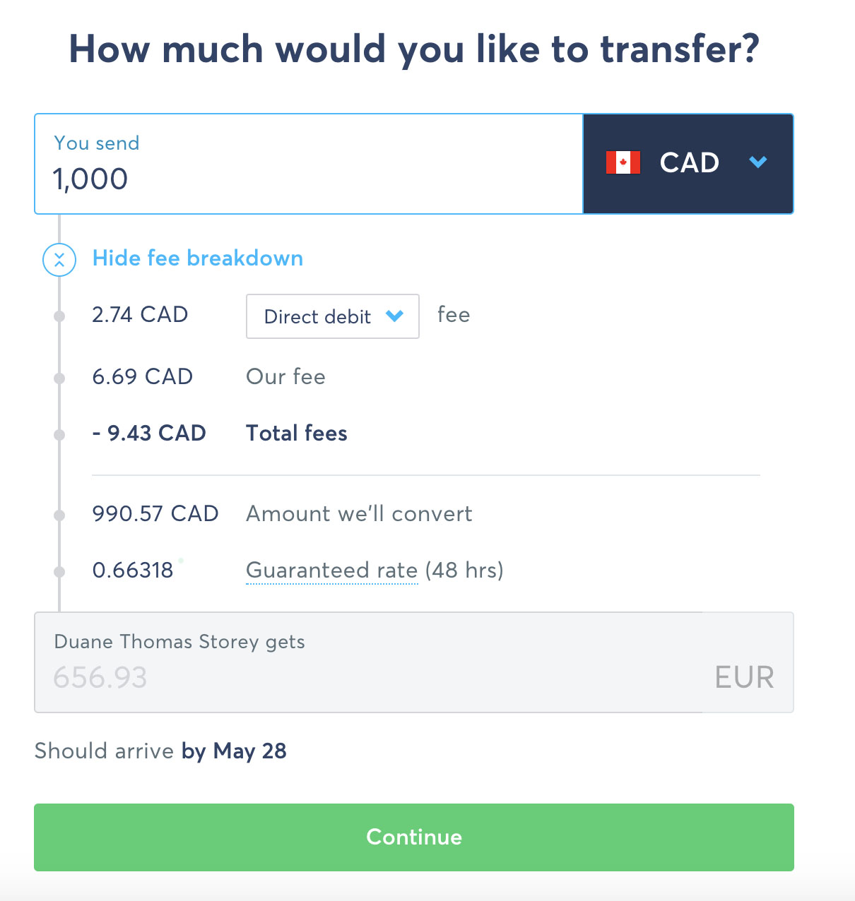
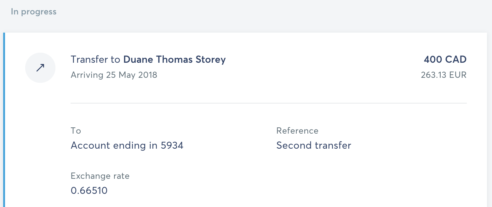
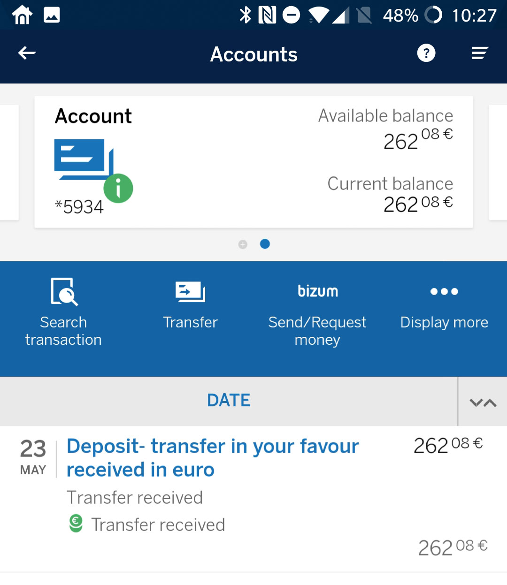

So if you’re here, you’re likely thinking about moving to Spain at some point. I know this, because that’s my end goal as well. Maybe not forever, but likely for a year or more.

One of the first hurdles you may encounter is opening a bank account. Once you have a long-term stay visa or a temporary residence in Spain, you can open an account as a resident. But there are certain advantages to having one sooner. For example, I thought moving larger amounts of money from Canada to Spain would probably be much easier when I am actually physically present in Canada, so I thought opening a bank account before heading back should make things smoother.

Given that I was in Spain for a month recently, I decided to go down to the bank and try to open an account – you need to be physically present in Spain to open one as a non-resident. While I speak enough Spanish to usually get by, I wasn’t confident that I’d be able to navigate the wide world of banking with my limited vocabulary. At this point I could have found someone local to help me, or hopefully someone who speaks english at the bank.

In terms of choosing a bank, you have a lot of options. After asking around most people locally recommended BBVA or La Caixa to me, since they have really great online access as well as mobile phone access. Since that will likely be how I use most of these accounts, I decided to go with one of those. And since BBVA was right around the corner from where I was staying, a few days ago I walked in there.

Luckily for me, I found someone who speaks english, so it made the process much easier. When I asked her what documents I need, she told me she needs my passport, proof of income back in Canada, and something to show I’m still a resident back in Canada. I went back to where I was staying and printed out a few pages from my 2017 Canadian tax return, and also my latest cable bill with my Canada address on it. When I went back with these documents, she looked over them and said they were fine.

The process took about 30 minutes, and the lady who helped me was very thorough in making sure I understood everything. Unfortunately you have to sign a few documents, all of which are in Spanish, but most of them just seemed to be related to me understanding that I had a small (600 Eur) line of credit, and also what their privacy policy is.

At this point, she told me to go home and come back the next day, as apparently the bank account needs to be approved at their head office. When I came back the next day at roughly the same time, she checked and everything had been approved. At that point she helped me set up the BBVA app on my phone and make sure it was working for me before I left. I was actually amazed just how far ahead the Spanish were in terms of banking, possibly due to the ease of use of the IBAN number here compared to our complicated institution/branch/account format back in Canada. But you can simply scan a barcode to send a friend or a company money from the application, which makes paying bills trivial each month.

Tomorrow I’ll receive my Visa/Debit card (apparently you can use the same card for both – withdrawing money from your account, and also paying for items in stores and what-not – once a month the card will pay itself off from my bank account, which is fine by me), but for the most part after only 48 hours my bank account was ready to go.

## Ok, so now what?

One of the first issues I wanted to solve was how to exactly fund the account from Canada. Canada banking is pretty archaic, and I assumed I would have to take my Spanish banking information into a branch in Canada and set up an international wire transfer. Those transfer are error-prone, and usually quite expensive ($20 fee to send, and often $20 to receive). So I was looking for something that was cheaper.

I found a few people talking in various online forums about using TransferWise, so I decided to give that a shot. Basically TransferWise is a company that facilitates transferring money between international accounts with what they claim to be really low fees.

I quickly added my Canadian bank account information into TransferWise, and also my Spanish bank information. Once that was done, I simply clicked ‘Send Money’ on the Spanish bank account and started the process.

Sending money with TransferWise

Once you start the process, you can select how much money you want to send and also see all the relevant fees. The cheapest option in my case is to directly fund the transaction from my Canadian bank account. But there are other options too, like starting a wire transfer, or even funding via a credit card.

The fees are a bit deceiving in that TransferWise boasts really great currency conversion fees – this seems to be true, but instead of those fees changing, the actual “Our Fee” field seems to be based on a percentage as well. So instead of a 3% currency spread at most banks, you’re looking at roughly a 1% total fee for the transaction with minimal explicit exchange fees. It’s still roughly a 1% fee, but I doubt I could do any better myself in person, not without using a Forex company to exchange a larger amount of money. And in that case, it would take me two or three individual transactions and a lot of stress to pull off.

I thought for some reason when I started this transaction that it would simply grab the CAD from the Canadian bank account I set up. But in terms of TransferWise’s terminology, those accounts only seem to be destinations, not sources. So once you initiate the transaction, you have to fund it yourself, either by doing an explicit transfer to TransferWise (they give you the information after you start), or by linking your bank account to the transaction (by clicking on your bank icon, like TD Bank in Canada, and authenticating). Once that was done, TransferWise started the transaction.

TransferWise Transfer in Progress

TransferWise is really great at letting you know what’s going on. For example, the moment my TransferWise transfer received money from my Canadian bank, TransferWise sent a push notification to the application on my phone, as well as an email. Both of these let me know they had money, and were now converting it between currencies (at the rates they advertised previously), into Euros. Later that evening the money physically (or virtually I guess) showed up in my account, and was listed on the BBVA application. All in all it took about 24 hours to move money from my Canadian bank account to my Spanish one, and cost me approximately 1% in the process (or about $4 on $400).

Completed Transfer

If you’re looking to move money between your accounts, I definitely recommend using TransferWise – the process was really straightforward, and the transaction completed in probably the same amount of time it would take if I was trying to send money to someone else in Canada. Plus, their exchange rates seemed to match what Google said the rates were at the time, even though they had an explicit fee that seems to be roughly 1% of the total. But as I mentioned, I doubt I could do much better myself by moving money between two currencies, and certainly not without a bunch of hassle and stress.

If you want to sign-up to TransferWise, you can do it by [clicking here](transferwise.com/u/duanes15) (affiliate link – if enough of you decide to use it, I may earn enough to buy a few beers 🙂 ). But regardless TransferWise is going to be my go-to tool for moving money from Canada to Spain while I am here.

## Final Thoughts

All in all the process took about 2 hours of time spread out over roughly a week. The account was active after the first 48 hours, but took roughly a full week before I had the Visa/Debit card in my hand and money in my account. So if you are in Spain and want to get this done, make sure you have enough time in one location to see it through.