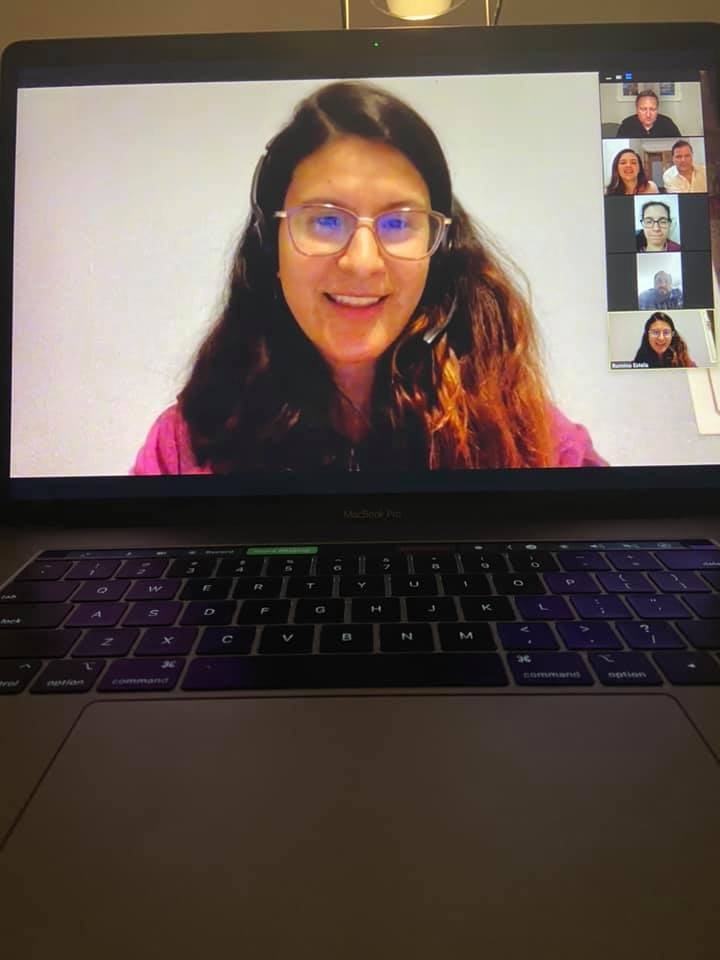

This morning I woke up and like most days since the quarantine started here in Spain, immediately checked the official statistics to see if the curve has started to flatten yet. Today’s update shows rough 5,500 new cases since yesterday with another 443 people having died. roughly the entire capacity of Surrey Memorial Hospital back home in the Fraser Valley. While these numbers are slightly less than the ones from the day before, I’ve learned not to get too excited with a low day on the charts since often the next day more than makes up for it. What these numbers mean, besides the obvious horridness of people dying daily, is that we still have no idea when things will get better or the quarantine will be lifted. After reading that I put my head back on the pillow and went back to sleep.

Quarantine Video Chat

Days have this weird duality here where they simultaneously seem to take forever to be done and often feel like they are moving so quickly as to blur into one another. Despite having ample things to do at home that involves housework – laundry for example – I don’t particularly feel motivated to do any of them, usually preferring to read a book or toss on some Netflix. I try to get a little exercise in each day, at least a bit of time swinging some kettlebells, but I do miss being able to go for walks outside. On the week prior to quarantine I think I averaged 10,000 steps per day on my FitBit – I’m lucky to get 1,000 a day in currently. I’m certainly not depressed or particularly anxious about what’s going on, but I think there is a certain type of melancholy that a person feels when they become socially isolated.

I try to check in with friends via Zoom every few days – the last meetup was an impromptu one last Monday night, and some of us are doing another one tonight. Those are great, and they definitely help maintain sanity in trying times. But I’m sure we are all looking forward to the day when we can all meet up again, likely in a few months, and share our quarantine stories over a few cold cervezas, with maybe even a hug or a kiss or two tossed in.

My goal is to come out of quarantine a bit healthier than I went into it, which means that as much fun as it is to cook up masterpieces in the kitchen, I’m only cooking every few days, and usually only meals that I can freeze in batches. For example tonight’s dinner will be spaghetti bolognese, round 3. I was enjoying making sourdough bread every few days, but the last few times that I’ve visited the grocery store they have been completely out of flour. And in terms of drinking, I’m trying to only have a glass of wine once a week or so, usually coinciding with one of our online video chats.

Obviously being stuck at home is trying, but I certainly don’t want to complain. So many medical workers and front-line retail workers are essentially risking their lives daily to fight this, so by comparison staying at home is a small price to pay. But it does start to wear on your psyche as time goes on, and it would be nice, for everyone’s benefit here in Spain, to see the curve start to flatten out soon. For those of you in North America, my recommendation (and probably the same recommendation everyone in Europe would give you) still stands – lock yourself down at home and stay there for the foreseeable future.