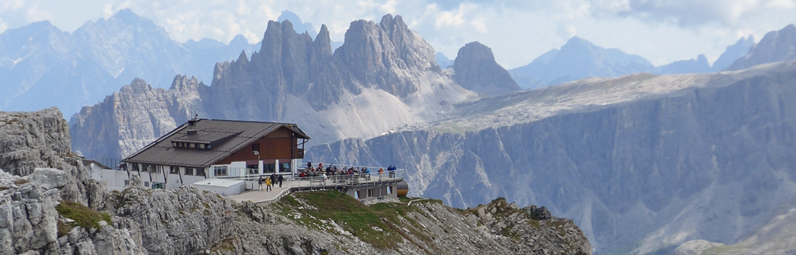

The Italian Mountain range known as the Dolomites is famously home to several amazing long distance thru hikes known as the Alta Vias, the High Routes. Many of these are old trails from World War I, complete with Via Ferratas, difficult stretches of climbing where a person needs to physically link themselves to metal guide wires. It’s been on my wishlist for a few years now to actually walk one of these routes, and I may finally have the chance.

A few months ago I started planning to do one of long distance hikes in Italy this summer. At the time, I wasn’t sure if the situation in Europe would have stabilized enough to actually travel to Italy or to stay in any of the mountain huts for the hike. But Italy seems to be open to other European visitors, and I successfully made reservations at many of the mountain huts. So right now it seems like everything is a “go”, and I should be able to head to Italy later next week and start hiking.

The most famous of the Alta Vias is Alta Via 1. I originally was going to attempt that one, but it’s also the busiest. With COVID restrictions many of the mountain huts are at half capacity, so my friend and I decided to switch over to Alta Via 2, which is arguably the harder of the two.

Scenary In The Dolomites

I’ve done many long distance walks before, but I’ve never done one that focuses more on elevation than on horizontal distance. Alta Via 2 will have us climbing 700-1200m a day, which I suspect is going to be extremely difficult. I’ve done elevation gain on other hikes, but usually it’s just one day and then it’s over. On Alta Via 2 we will likely have large elevation gains every day, so I’m a tad worried how my body is going to respond. In addition, most days are spent at an elevation of 2000-3200m, which is high enough to start causing biological changes. At those altitudes your body definitely feels the affects of lower oxygen (and higher carbon dioxide levels). This often manifests itself as a shortness of breath and a faster heart rate.

Years ago I spent time in Cusco, Pero (3400m), and I felt pretty horrible while there due to the altitude. Even climbing a flight of stairs was difficult, and I had a mild headache the whole time. Last year I spent one day in the Dolomites, basically going directly from sea level, and climbing 600m in the first day at that altitude was amazingly difficult. One thing you should never do is move directly to a high altitude from a low altitude (especially sea level), which is what I did in Cusco and again last summer (stupid me).

So this time I’m going to stay in a little village nestled in the mountains, Vigo di Fassa (1400m), for three days before the hike. In addition I went to the pharmacy here in Spain and picked up some Diamox (without a prescription, gotta love Spain), which is a medicine meant to help with acclimatization. Diamox basically fools the body into thinking it is at altitude by acidifying the blood slightly (by excreting bicarbonate), which then causes the blood to dump carbon dioxide and absorb more oxygen. It’s a good way to shave a few days off of the acclimatization process, so I’ll start it a few days before the hike.

Right now the plan isn’t to finish the entire hike, more like 65% of it, mostly due to time constraints and some of the other sightseeing we want to do in the area. But even so, we’ll likely hike around 120km with around 8000m of elevation gain, which will be pretty exhausting. This time around I’m hoping to bring my SLR camera, and with luck I’ll come back with some amazing photography to put up on my walls in my flat back in Spain.

Rifugio in the Dolomites

Each night we will stay in a series of mountain huts known collectively as rifugios. The rifugios are conveniently sprinkled all throughout the Dolomites, and usually contain a bar, a restaurant, and sleeping quarters for overnight hikers such as ourselves. Many rifugios aren’t connected to any road system, so other than hiking in and out on foot, or receiving supplies from helicopters, there aren’t any easy entry or exit points. I’ll be hiking with a friend, and he has a satellite GPS emergency beacon in the odd event anything happens, but it’s a pretty well traversed hike so I’m not super worried.

With COVID19, I basically doubled down on work during the last year, and haven’t had many opportunities to unplug and disconnect since last summer. So I’m really looking forward to two weeks of hiking in the mountains with a friend, and spending the afternoons sipping Spritz while admiring all the beautiful vistas. So next week I’ll head to Italy for a little pre-hiking pasta sampling in Bologna and Florence, then make my way north to the mountains, and two weeks of hiking.

Next stop, Alta Via 2.