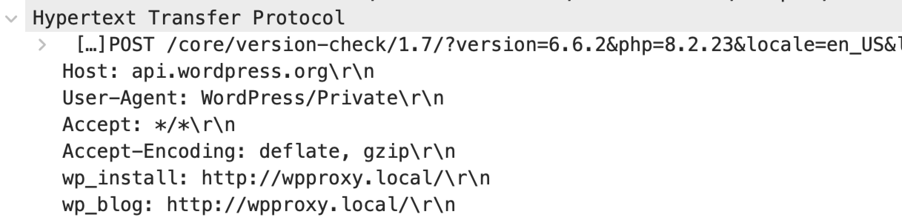

A few weeks ago, I sat down with my WordPress installation to see how difficult it would be to actually use a different API endpoint entirely instead of the default WordPress.org site. As others have pointed out, there are roughly 1,500 hard-coded WordPress.org links throughout the code, pointing to various API endpoints and reference documentation. What I discovered is, despite what some people are parading online, that there is no real easy way via the code to swap out the API entirely. In fact, the HTTP API within WordPress is probably one of the least useful APIs in terms of being able to extend it using available hooks and filters.

### Leaky User-Agent Header

While investigating this though, I did notice one peculiar item involving a usually silent header that is passed between clients and servers, called the User-Agent. The User-Agent header is used by clients to let servers know what type of client they actually are. This is the field that can be used to discover if a viewer of a website is a regular user using Mozilla, or if they are a robot acting on behalf of Google or Twitter. 

What was odd about the WordPress one is not only was it advertising that a web request was happening from WordPress itself, but it was also advertising the version of WordPress and, more alarming, the website URL itself.  

For example:
```
user-agent: WordPress/6.6; http://mywebsite.com
```
There's nothing uniquely wrong about advertising the request is coming from WordPress, that's probably considered "polite" at the internet level (some servers actually won't respond at all without some type of User-Agent). I'm of the opinion though that you should never provide data that isn't absolutely required in any type of web request.  Adverising the version as well may seem benign, but what if you're on a version of WordPress that contains a critical bug that lets someone take over the admin?  You're basically advertising this to anyone you make a HTTP request to from within WordPress.

The other part though, including the website home URL, is a much bigger issue. I'm no expert on GDPR, but this URL might be considered identifying information.  Without it, the server you are connecting to typically gets your IP address, but that's about all. If you think about this from a hosting provider perspective, there can potentially be thousands of websites on one IP, so having that information isn't always particularly revealing on its own.  But once you know the URL and the IP, you know *exactly which* website made the request, potentially the owner behind it, and likely even where it's hosted (GoDaddy, WP Engine, etc). That's a lot of data when you don't have an end user license agreement, or some explicit opt-in request.

Another disturbing scenario is the fact that even local development environments would send the URL to WordPress.org. In my case, I had several requests with https://local.dev, one of my test environments, get sent to WordPress.org.  Imagine if you were tasked with working on a brand new government website that nobody was supposed to know about, and you set it up on a staging site like https://medicare.whitehouse.gov. It would seem even in that scenario WordPress would advertise in the User-Agent header that a site with that URL was making a request. The User-Agent header gets added even to non-WordPress.org requests, so anything that local website attempting to contact using HTTP within WordPress would advertise that URL.

### Plugin And Theme Data

The next area I looked at was what type of data was being provided to the WordPress.org APIs having to do with plugins and themes. When you visit the plugins page or themes page within WordPress, at various times during the day it'll generate a web request to WordPress.org basically looking for which themes or plugins have updates available. That's typically a good thing, as you don't have to update those manually.

The URLs endpoints associated with these updates look like:
```
https://api.wordpress.org/themes/update-check/...
https://api.wordpress.org/plugins/update-check/...
```

What I found was for these requests not only did they also contain this User-Agent modification which advertises the website address, but they also transmit detailed information about *every* plugin and theme installed within WordPress.  Not just active ones, and not just ones installed from the WordPress.org repositories. If you have a Pro theme, or a privately developed plugin, information about both are being sent to WordPress.org in the form of every header entry in the style.css or main plugin file.

For example, for the HTTP Requests Manager plugin, all the information contained in the main plugin file is transmitted back home.
```
Plugin Name: HTTP Requests Manager
Plugin URI: https://veppa.com/http-requests-manager/
Description: Limit, Debug, Optimize WP_HTTP requests. Limit by request count, page load time, reduce timeout for each request. Speed up login and admin pages.
Version: 1.3.6
Author: veppa
Author URI: https://veppa.com/
Text Domain: http-requests-manager
Domain Path: /languages
Requires at least: 4.7
```
I mean, why does WordPress want these headers for plugins that are already on WordPress.org?  It seems redundant. But for plugins that maybe come from somewhere else I can see it potentially being more useful.

In 2011, WordPress introduced a new header called *Update URI*, which can be used by plugins and themes to indicate they don't update from the WordPress.org servers.  You would think though having a non WordPress.org URL defined in a plugin or theme and indicated as the *Update URI* would stop information about those plugins and themes from being sent to WordPress.org (why would they need to be sent? - there is no update there to receive), but they are sent as well. So basically every plugin and theme on the entire WordPress install, along with their complete headers (and the website URL from above) are sent with each transactions.

### Core Updates

To determine whether or not an updated version of WordPress itself is available, WordPress makes another API call via the core API. The API endpoint associated with this looks like:

```
https://api.wordpress.org/core/version-check/...
```

If you look at the actual URL sent to WordPress.org, it's revealing, and not in a good way:


If you actually break this apart and look at the data, here is what is being sent to WordPress.org with each core update request:

- The version of WordPress you are running
- The version of PHP you are running
- The version of MySQL you are running
- The number of blogs being hosted on your website (I assuming for multisite)
- The number of users you have on your website
- Whether or not multisite is enabled on your website
- The initial version of your database (I have no idea what these means, I'm guessing it correlates to when you installed WordPress)
- Every single PHP extension that's enabled on your site
- Information about your platform, likely from a *uname -a* type call. This indicates the operating system and architecture (Mac etc) you are running
- What types of advanced images you support (Avif/Webp)

Don't forget that they are also supplying the User-Agent field above, which gives them the actual URL associated with all this data, along with the IP which they get from the inbound request. Even if they didn't have that though, it wouldn't matter since for these core updates, they are also adding two non-standard HTTP headers in the request, *wp_install* and *wp_blog*.  

At this point I was so surprised by this, that I wondered if what I was seeing in the code wasn't really what was happening.  So I installed the [WireShark](https://www.wireshark.org/) Network packet sniffer to actually see what was going out on my network interface.  As the request to the WordPress API is usually encrypted over https (and thus, wouldn't be visible when sniffing packets), I had to hack WordPress to send them over http instead so I could see them in Wireshark.  

And sure enough, these headers actually are sent as well:



First off, any non-standard headers are supposed to prefixed with a *X-*, so these two fields technically should have been X-wp_install and X-wp_blog. I'll ignore that since they were likely implemented a long time ago. But more to the point, these two fields just represent another case of potentially sensitive information being broadcast with all requests to the WordPress.com core update API.


## Privacy Policy

I haven't installed a version of WordPress in a while, so I don't remember if there is any type of wizard that includes an End User License Agreement (EULA).  It's sort of a moot point if it does, since most hosting providers provide one-click WordPress installations these days, the same as many development tools I use like *Local*.

So without a EULA, the next best place to look is at the [privacy policy on WordPress.org](https://en-ca.wordpress.org/about/privacy/).  Now of course, that privacy policy may just refer to visitors on WordPress.org, but since the WordPress API data ends up there, it's possible it applies as well.

> WordPress.org also collects potentially personally-identifying information like Internet Protocol (IP) addresses. WordPress.org does not use IP addresses to identify its visitors, however, and does not disclose such information, other than under the same circumstances that it uses and discloses personally-identifying information, as described below.

As I showed above, not only are they obtaining the IP address, but they are also receiving the website URL as well. That's identifying information as far as I'm concerned. 

> Certain visitors to WordPress.org choose to interact with WordPress.org in ways that require WordPress.org to gather personally-identifying information. The amount and type of information that WordPress.org gathers depends on the nature of the interaction. For example, we ask visitors who use our forums to provide a username and email address.

> In each case, WordPress.org collects such information only insofar as is necessary or appropriate to fulfill the purpose of the visitor’s interaction with WordPress.org

I would argue that the information being sent in the above request is above and beyond what is necessary for any of those requests, and ultimately provides an incredible amount of information to WordPress.org. 

## Use Of Collected Data

I have no idea what WordPress.org is doing with this data. It's of course possible that this data isn't even stored, but I personally find that unlikely (why spend effort coding this up if you're just going to toss the data away?)  Last night Automattic released what they call the [WordPress Engine Tracker](https://wordpressenginetracker.com/), a project that can be used to see how many people are leaving WP Engine since Matt's keynote speech at WordCamp USA.  When I saw that website, I immediately wondered how Automattic had access to all the sites hosted on WP Engine. 

One scenario, of course, is that they bought this data from some of the third-party services that scrape the internet looking for which platforms are run there.  Another possibility though is that they used the data acquired from the WordPress.org API to generate that data. There is no proof of that, of course, but it does seem at least to me that they possibly *have* all this data for this purpose - IP addresses, website URLs, specific WordPress install information, etc.  So it's certainly possible.

Is recent weeks, many of us (myself included) also surprisingly learned that WordPress.org isn't in fact owned by the WordPress Foundation, but is in fact owned personally by Matt Mullenweg, the co-creator of WordPress and CEO of Automattic Inc. That means that all this data (if it's being processed and stored in its entirety), representing the WordPress usage and installation specifics of 43% of the internet, is essentially in the possession of one private citizen.

## Next Steps

If any plugin or theme tried to collect even a fraction of that type of data from the admin panel in WordPress, I imagine they would soon be delisted from the repository for breaking the [plugin guidelines](https://developer.wordpress.org/plugins/wordpress-org/detailed-plugin-guidelines/) and theme guidelines. If we look at the plugin guidelines, point 7 explicitly states:


> In the interest of protecting user privacy, plugins may not contact external servers without explicit and authorized consent. This is commonly done via an ‘opt in’ method, requiring registration with a service or a checkbox within the plugin settings. Documentation on how any user data is collected, and used, should be included in the plugin’s readme, preferably with a clearly stated privacy policy.


I checked the WordPress download ZIP to see if there was any additional content inside that might detail this data, but I didn't find anything in the normal download package. I also don't remember anywhere in the admin panel where a user is asked to agree to sending this information, and to opt-in to it.  Like always, I believe what's fair and right for one group of people should be fair and right for everyone.

Of course, it's easy to say that WordPress itself is a different beast, but I do think it has an obligation to inform users properly about what data is being sent, collected, how it's used, and how to get rid of it. And so far I haven't found any real information on any of that, which was one of the reasons I went down this rabbit hole. 


Since there appears to be currently no easy way to opt-out of sending this data, I decided to create a new WordPress plugin to help. You can find it on the [WP API Privacy Plugin on Github](https://github.com/wp-privacy/wp-api-privacy). This is a very early beta version, so I don't recommend installing it on any production sites yet. But by all means, please test it out on any non-essential or local development sites.

This plugin performs the following:
- it strips the version information and the website URL from the User-Agent header
- it strips all plugins and themes from the HTTP API request that represent themes and plugins updated from other repositories outside of WordPress.org (indicated by the *Update URI* field)
- it strips all the identifying information from the core update URLs and the headers the leak the website URLs

I've tried to do this in the most benign way, that is, without polluting the data of sites that continue to provide this information to WordPress. There is a less friendly way to do this, and that's to continue to provide all these fields, but just make them completely inaccurate. I have chosen not to do that, since I believe it's important for users to be able to opt-out of any type of data collection that occurs from their website, and I want to do it in the least intrusive way.

Based on what I'm seeing on Twitter and other social networks, It wouldn't surprise me at all if in the next few weeks we start seeing alternative plugin repositories emerge. As it's possible these will continue to use the same WordPress APIs, but talk to different servers, this plugin will also ensure that only the minimal amount of data is presented to them as well, helping to protect your site's privacy.

If anyone has any feedback about the plugin, by all means drop me a line or drop an issue on Github. But I wanted to share some of what I learned while investigating how all these WordPress APIs actually work, and what data they appear to be sending back home.

