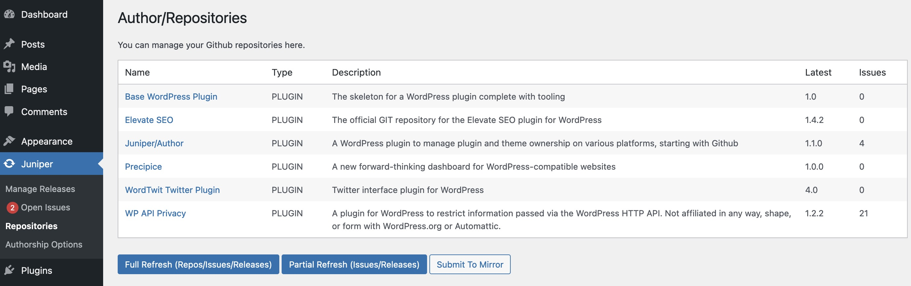
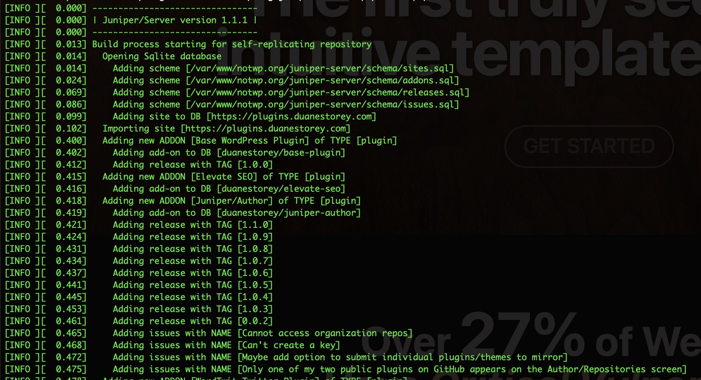

I set out [last week to try and build a bare-bones repository](/posts/a-prototype-for-a-new-plugin-and-theme-update-mechanism.html) of WordPress plugins and themes and an associated management plugin.  For the most part, I think I managed to get done what I wanted, although I still haven't started the actual update mechanism for it.  There are already great Github updaters, including Github Updater and Repoman.  But at some point I want to add the ability to verify cryptographically signed ZIP archives, and that will require some code on the client site.

But the results of that marathon coding session are now available online at [The Not WP Repository](https://notwp.org).

## Juniper/Author

The client-side plugin and theme management plugin I created to help with the repository is called [Juniper/Author](https://notwp.org/plugins/duanestorey/juniper-author/), and it has the ability to automatically determine all plugins on Github for a particular user, and submit those to the public repository.  I've made some improvements over the past few days, and it's almost working without any intervention on my part. 



Since I have full access to the Github API, I also pulled in all the issues and releases. The releases can be cryptographically signed using a private key, which at some point will allow the future Juniper/Berry plugin to confirm that a release is legitimate before installing it.  

This mechanism would protected against a supply-chain attack, similar to what happened with the Advanced Custom Fields takeover.  In that scenario, the Secure Custom Fields plugin would not have been automatically installed because it would have failed the digital signature check (since the private key would not have been available to sign it).

What's next is as follows:
- Right now updating the Github information is time consuming, so there is a manual button to push for updates.  I'll be making this automatic soon
- Code signing is half-baked, so I'm going to put it back in the oven and finish it off
- I want to pull in a bit more Github data and expose that via the XML API that Juniper/Server uses.  That way the repository site can continue to have more information for end-users (including links to author X/Bluesky accounts etc).

## Juniper/Server

The repository is a mostly-statically generated series of HTML files generated using the [Latte templating engine](!https://latte.nette.org/en/). I say mostly, as adding a new site to the repository does include a simple PHP file that isn't static, but it doesn't depend on WordPress and it just adds the new site in the local database to be included during the next build, which is currently happening every ten minutes.



Juniper/Server pulls all the data from the Juniper/Author APIs, stores it locally in a Sqlite database, and then generates the entire repository statically in just a few seconds. As part of this process, the ZIP files are downloaded locally and the SHA256 hash is generated for each file (since Github doesn't provide it). That allows someone to verify if the ZIP file has been tampered with.

For example, let's say you received a copy of [Robert's new Benchpress plugin via ZIP](https://notwp.org/plugins/robertdevore/benchpress/), but aren't sure it's legit. 

On the website you can look and see that the current hash is:

```
cf3d6d379edacd093d37a9f56cb5e56a162cfbbf84ed5b1b5764c8abe927cf59
```

If you're on a Mac, you could open terminal and run the following, supplying the name of the ZIP file you downloaded:

```
sha256 benchpress-1.1.0.zip 

```

Which in my case returned:

```
SHA256 (benchpress-1.1.0.zip) = cf3d6d379edacd093d37a9f56cb5e56a162cfbbf84ed5b1b5764c8abe927cf59
```

As you can see, the hashes match, which means it's a binary exact copy of the original file. If someone had changed the file, or if this had been a Pro plugin that had been nulled, the hash would not have matched. At that point you know it's not legitimate, and would be looking for a better source from the original author.

### Easy Mirroring

I wanted to support repository mirroring out of the box, so I baked in that support from the beginning.  Because I used a simple Sqlite database for the content, all a mirror had to do was grab the entire database in one transaction (by downloading it from the source website), and then execute the build process. 

There is a single site.yaml configuration file for the server that has a producer field.  The main website has producer equal to 1, which is a master site. Simply changing producer to 0 will tell the build process it is not a master, which will trigger the Sqlite download from consumer_source and start the build process.

```
  role:
    producer: 1
# change producer to 0 to product a mirror of the 'consumer_source' target
    consumer_source: https://notwp.org
```

I tested out the mirroring process by setting up a quick PHP website at [mirror1.notwp.org](https://mirror1.notwp.org/), which worked flawlessly.

The last piece of the puzzle was to make the repo address be configurable in Juniper/Author, which it now is.  So conceivably there could be mirrors at different locations or within an organization.  For example, a host like WP Engine could set up a mirror and make the default repository location in Juniper/Author on their installs point at their mirror instead.

This configuration would also work for completely private repositories.  I have a bit more work to do in Juniper/Author for that, but there isn't any reason someone couldn't stand up their own version of Juniper/Server, for their organization for example, and put all their private plugins there within an internal network.

Someone sent me a private X message asking why I was doing this, and if I was trying to consolidate power.  I'm actually trying to do the opposite, and distribute that power instead. Once this is done, I don't have to be involved at all. If I decided to take down https://notwp.org one day because I was grumpy, one of the mirrors could simply change *producer: 0* to *producer: 1* in their site.yaml, and at that point they are in charge.  This would necessitate a simple config change in Juniper/Author (adding the new repository in the backend), but it would be a minor blip and that's it.  The plugin authors themselves are the ones in charge of their own data, and that remains the same irregardless of the mirror or repository site.

The next stage is to add more content for WordPress itself, and also build out the author pages.  I also want to add a site-wide "Sponsor" page which will highlight the plugins or themes that are looking for financial backing.  And at that point I hope some of the larger corporate entities might take a look and try to contribute to a few of them, even if it's a monthly coffee budget for a project that they support.

## Future Work And Discussions

It sounds like there will be some discussions in the new year, possibly hosted by Joost, regarding future infrastructure. The point of this project was mostly a proof of concept to show what types of things can be done.  I'm going to continue to build it out over the next few weeks, as there are a few items I really want to include.  I'm still looking for individuals and corporations that want to add their plugins to the repository, as it gives me more data to play with and to generate additional ideas for the future.

The first thing I personally want to do is provide more funding opportunities for plugin and theme developers. As a plugin developer myself, I know that a lot of people contributing free plugins and themes do so because they care about WordPress and want to give back to the community, often working on these projects in the late evenings. That said, I'm sure life would be a lot easier for those people if they had opportunities to receive funding directly. These were ideas that were floated to Matt back In 2018 and 2019, and were mostly met with silence. But in an ideal open-source project, funding would be received by everyone contributing if possible, not just plugin and theme authors, but security researchers, content providers, etc. That's a great goal for whatever happens in 2025.

Recently the [WP Community Collective](https://www.thewpcommunitycollective.com/) launched, which is a non-profit that has transparent budgeting.  So I want to work in something similar into the repositories, even if that's just bringing more exposure to the ability to sponsor authors via Github sponsors, which is a tried and true system with transparency.

If you like where this is going and want to help support its development, you can find a sponsor button on the main [Juniper/Server](https://notwp.org/plugins/duanestorey/juniper-server). You can also find sponsorship buttons on the pages of all the other plugins there too, which I hope inspires some people or corporations to support projects they support.

And on that note, Merry Christmas!  I'm having turkey and pierogis with the family today, and will be doing a bit of coding in front of the TV later.  I hope everyone has a great day, and that the future for all of you, and the WordPress community, will be bright.

