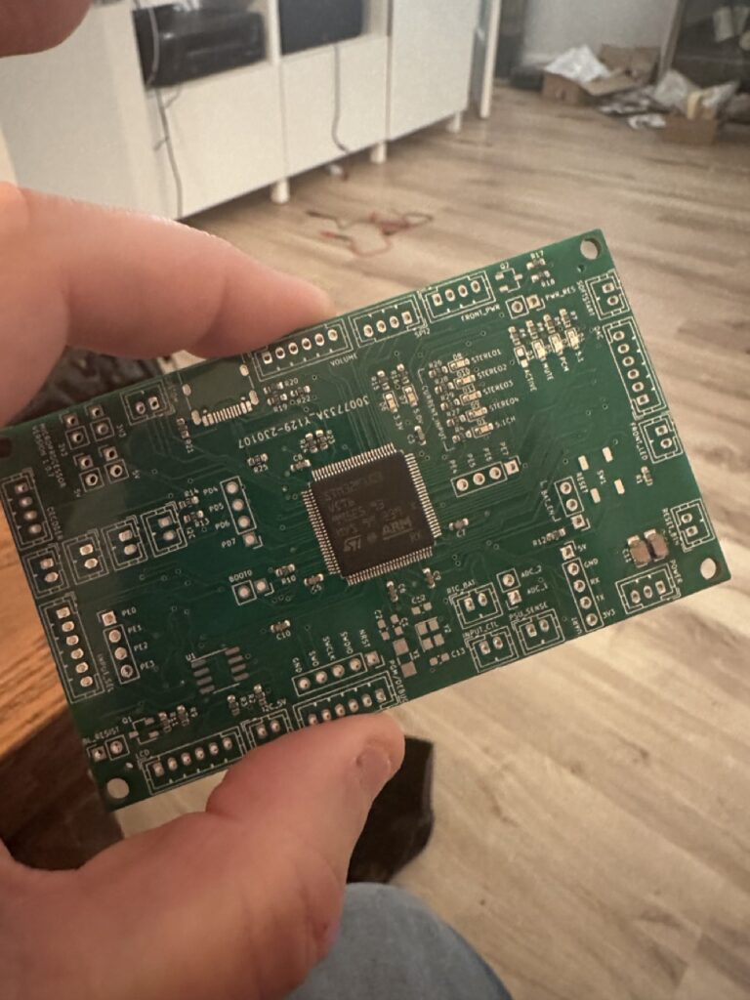

While I don't have a ton of experience making PCBs or designing hardware, I do have a small amount. During the COVID lockdowns I started playing with some tube amplifier designs, and to make them more interesting, I threw in some digital logic to control a display and what not.

At the time, my only hardware experience was using the Arduino platform. But since them I've played a tiny bit with both Raspberry Pi and the STM32 ecosystem. Arduino is great for tinkering around, but the general consensus is that it's mostly for just tinkering at home, and not used in anything serious.

As I stated previously, one of the goals of this entire endeavour was to improve my skills in the domain of electrical engineering. So I figured if I'm pushing my boundaries, I may as well push all of them at the same time. So I figured I might as well get some real world experience using the STM32 family of microprocessors, even though it would involve a bit of a learning curve.

Unlike Arduinos, where the Arduino editor does a lot of the work for you in making things work, the STM32 is a much more complicated processor that involves a ton of bootsrapping code to configure clocks, pins, timers, etc. While you can do simple programs with it using the Arduino tools, there's no way to unlock any of the more sophisticated functionality without diving right into some of the STM32 tools like the Cube IDE.

\[caption id="attachment\_14625" align="aligncenter" width="768"\] STM32 Microprocessor Board\[/caption\]

A few of the core features I liked in the STM32 ecosystem that I figured I may need to utilize were:

- Timers that support an encoder mode - basically the hardware would handle increasing and decreasing an internal counter based on a rotary encoder input. I figured this would probably be useful for a volume knob.
- I2C & SMP buses - to communicate with any other hardware, you need to support either the I2C or the SPI bus interfaces, and most chips support both
- I2S bus - 1 in the cheaper chips, 4 in the more expensive chips. I2S is the hardware format for digital audio. I liked right away that these chips could communicate over an I2S bus. Not without issues, of course, since doing high end audio is pretty difficult, but I figured it might come in handy.
- Multiple pin configurations - some of the smaller chips only have 64 pins, but you go all the way up to 200 pin variants if you need more GPIO pins

To start getting acquainted with the ecosystem further, I bought a few Nucleo test boards to play with. It took some getting used to, but in a few hours I managed to write my first simple "blink" program to toggle a few LEDs. Knowing that I could write code and get it onto the chip was enough for me to plunge forward, and I decided to just roll with the STM32 architecture.
