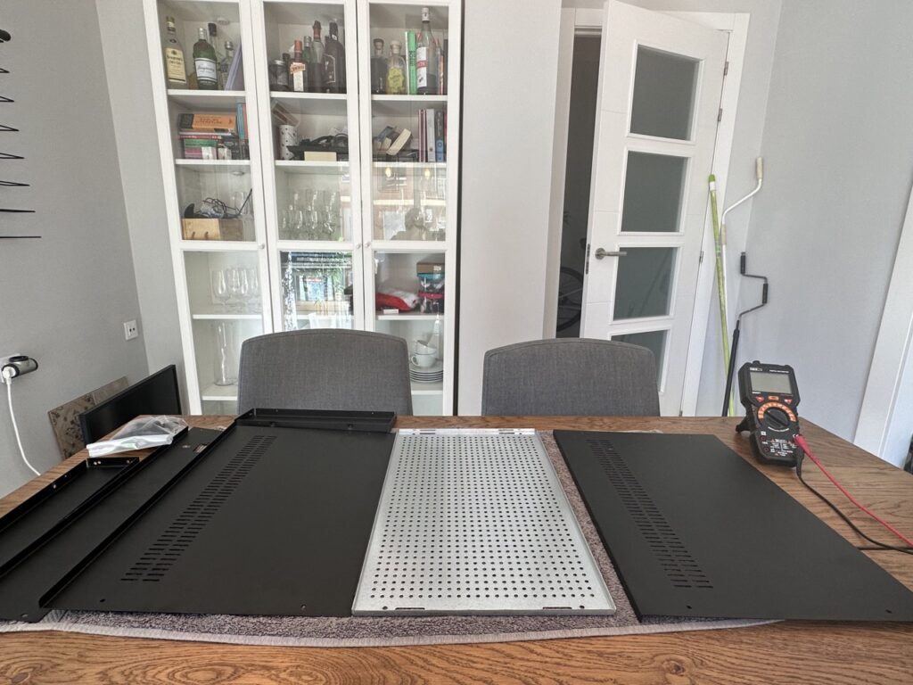
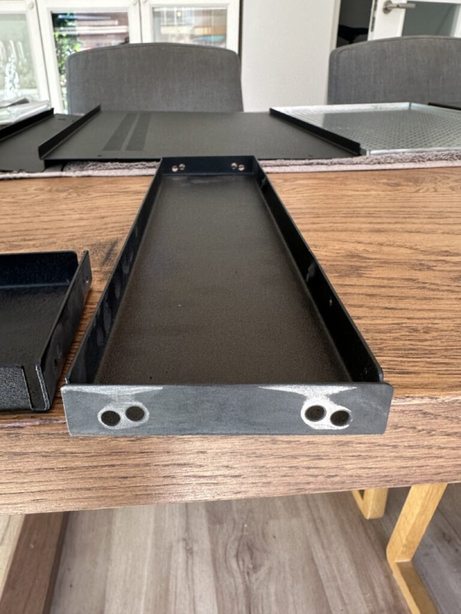
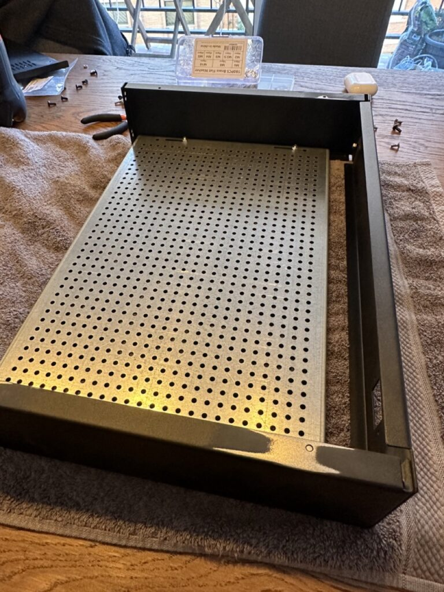
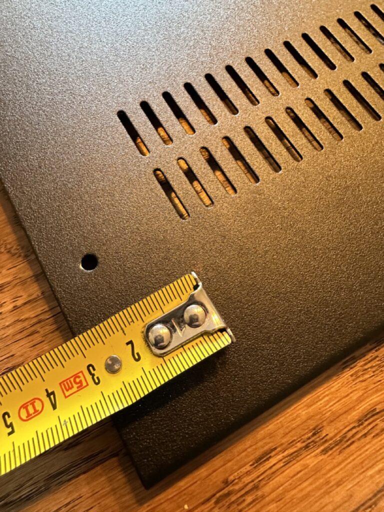
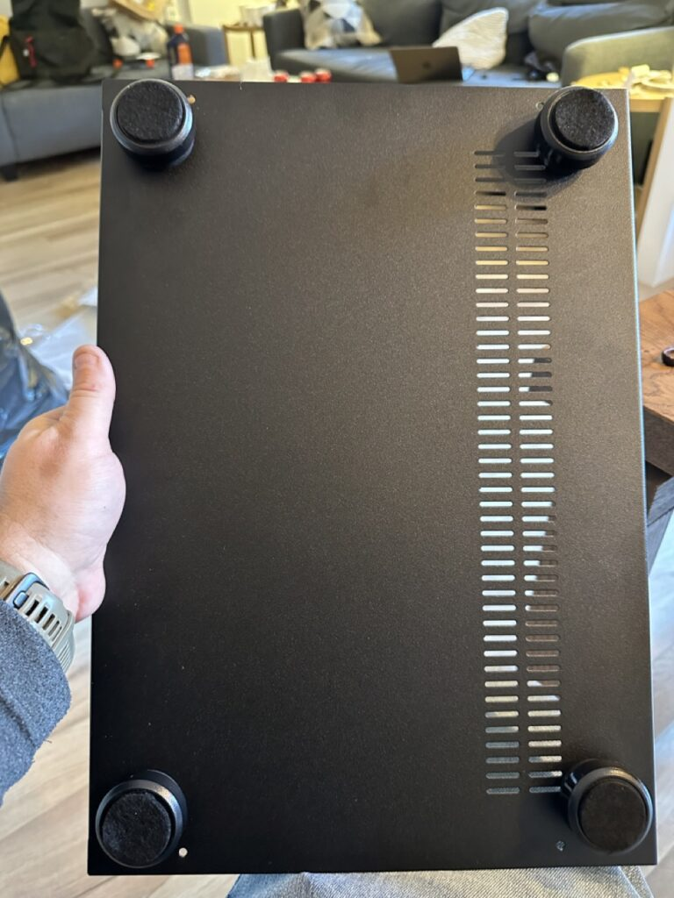
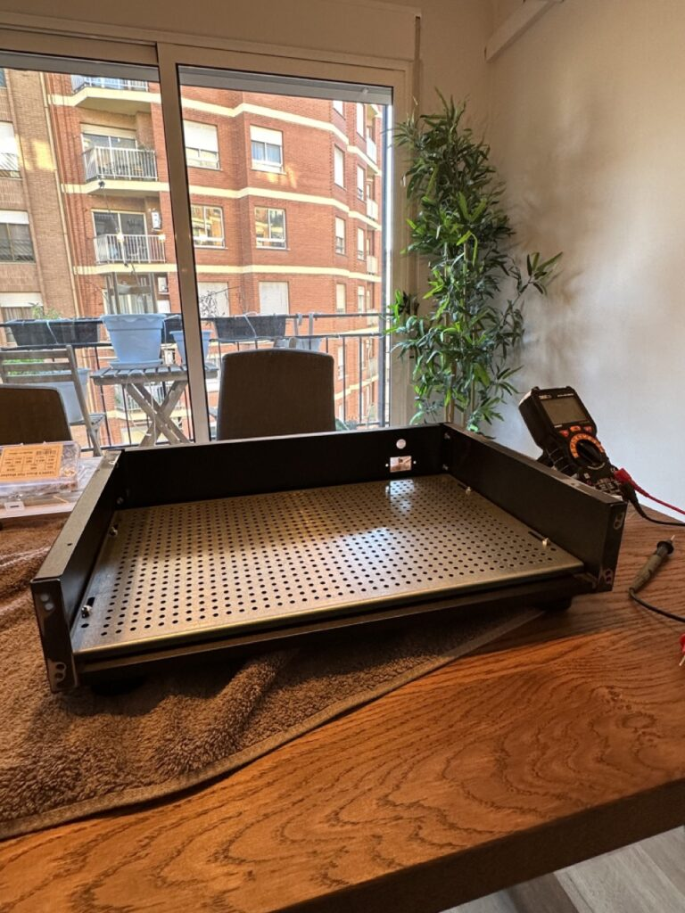

Once I had the idea of building an amplifier, the next step was to find a decent chassis for it. While I appreciate the idea that anything you build yourself is going to be special, not only did I want an amplifier that sounded good, I also wanted one that looked good. I remember reading Walter Isaacson's biography about Steve Jobs, and how Steve Jobs' father taught Steve that even though nobody could see the inside of a computer, or the back of a cabinet, it was important that it looked good as well. So I wanted both the inside and outside of my amplifier to look like it was done with care and attention.

There are a lot of amplifier chassis online to buy, but sadly many of them look pretty clunky. Thankfully I stumbled upon a site in Europe, Modushop.biz, that had a nice selection of chassis to choose from. I eventually settled on the [Pesante 2U chassis with 10mm aluminum front in silver](https://modushop.biz/site/index.php?route=product/product&path=171_229&product_id=157). I picked up the optional base plate as well which makes mounting the internal components really easy as it has a built in 10mm by 10mm spacing for M3 screws.

\[caption id="attachment\_14527" align="aligncenter" width="1024"\] Unassembled Chassis\[/caption\]

There aren't really any decent instructions with the chassis, but it's not too difficult to put together. When I built my original prototype, I was surprised to notice at the end that the panels weren't electrically connected to each other. I had assumed that the screw holes where exposed enough internally to connect the various panels, but that turned out not to be the case. So I decided that when I built the second unit (shown here) that I would expose metal on each panel to make sure they were electrically connected to each other.

\[caption id="attachment\_14528" align="aligncenter" width="768"\] Sanding Anodized Coating\[/caption\]

This serves two purposes. First, in terms of safety, if the panels are all electrically connected and one of them accidentally becomes energized with a live wire, the electricity should travel through the ground wire and trip the residual current device (RCD) at the main breaker (assuming you have one).

The second one is that if the entire chassis is at earth potential, it essentially acts like a faraday cage for electromagnetic radiation, and helps reduce spurious emissions from entering the amplifier. Removing the anodization layer was harder than I thought. I originally tried sandpaper manually, but it was taking forever. I eventually busted out my power sander and used that to remove some of the black anodization layer on each panel. This didn't turn out as clean as I had wanted, but when it's all assembled the pieces properly hide all the spots I removed the black layer from.

When I connected each panel to the next, I used a star washer to bite into the metal that was exposed while making the connection. If you do something similar, you'll want to have a continuity checker handy to verify that each panel is electrically connected to each other and the base plate.

\[caption id="attachment\_14532" align="aligncenter" width="768"\] Partially assembled chassis. Note the removal of the anodization layer to make a connection to the top panel.\[/caption\]

When I had most of the amplifier together, I got to work on measuring and drilling the holes for the bottom feet. I played around with various locations, but ended up choosing a spot that was 35mm away from each of the closest sides. Using my calipers I measured the size of the through-bolt, and ended up using a 5mm drill bit.

\[caption id="attachment\_14533" align="aligncenter" width="768"\] Measuring the drill holes for the feet\[/caption\]

Once the holes are done, it's just a matter of installing the feet, securing the nuts, and placing the felt stickers on the bottom. \[caption id="attachment\_14535" align="aligncenter" width="768"\] Installed Feet\[/caption\]

Securing the top of the bottom panels the chassis can be done with the included screws, but for most of the build the top and bottom will be off as I'll need access to the inside of the amplifier, and the bottom plate for installing the standoffs for the various components.

\[caption id="attachment\_14536" align="aligncenter" width="768"\] Partially completed chassis\[/caption\]

The next step will be to install the IEC power socket, fuse, and hook up the main earth connection.
