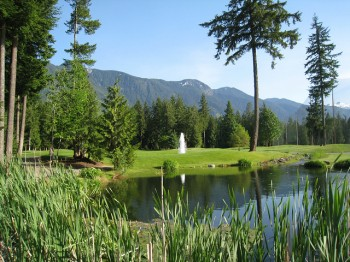

I'm down to 12 days until I leave to Thailand, and it's definitely fast approaching. My friends Scott and Samantha leave tomorrow, so I'll get to starting watching their Facebook stream in the next few days to see my first glimpses of Thailand.

\[caption id="attachment\_2176" align="alignright" width="350" caption="Cultus Lake Golf"\]\[/caption\]

I spent the last few days camping up at Cultus Lake, which is one of my favourite summer activities. It was pretty much perfect weather, other than being a tad cold at night, and was really enjoyable and relaxing. I have all my camping gear in my car right now, and am going to start getting it ready this afternoon to put back into storage for probably another year.

Tomorrow I plan on spending the entire day sorting out my storage locker out in Chilliwack. It's been almost nine months since I put the first few boxes into my locker, and some of them have started to buckle and bend. So I need to reorganize and replace a few of the boxes tomorrow, as well as locate a few documents for tax purposes. Once that's done, I'll head back to Port Coquitlam and start boxing up my remaining items there.

I haven't really had an opportunity to get really excited about heading out again - mostly I've been busy taking care of errands and sorting out all the things I still need to do before I leave. But hopefully by next weekend I'll have all the heavy lifting done, at which point I can spend a bit of time with some friends and family and then head to the airport for round two.
