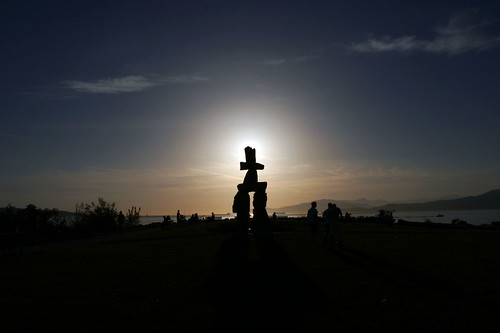

I'm now the proud owner of my first L-series lens: the Canon EF 17-40mm f/4.0L. I'm just charging my 20D now, and then I'm heading out for a couple hours of shooting to see what this puppy can do (or can't do maybe). Look for a few pictures later tonight or tomorrow.

Update -- I'm back, and I took some photos.. I found out that flickr doesn't support the Adobe colour profile, which is why alot of my photos end up looking washed out on there.. I'm going to have to start shooting in sRGB again I think.

