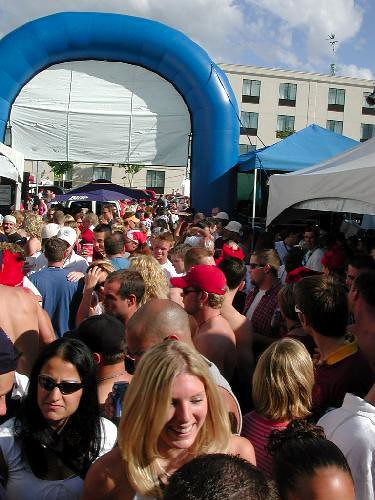

My last Canada day in Ottawa, my friends and I woke up around 10am in the morning, and started drinking our first few beers. That day, we ended up sitting in 43C weather on the rooftop of the Hard Rock Cafe in the Byward Market. I remember that I had to drink about two water for every beer, just to keep hydrated in that heat. Now by comparison, Vancouver is pretty tame on Canada day. This one will be even worse, since everyone is preoccupied watching the world cup (which I have to say, looks pretty sweet in high definition at my place). However, a bunch of us are still going to brave today's heat, and crawl amongst a few pubs, seeing how much trouble we can get into. I may post a few photos during the day from my cell phone to my flickr account, so check that out from time to time!

Here's a shot from Canada day in Ottawa - this beer garden was fully formed at around noon. 
