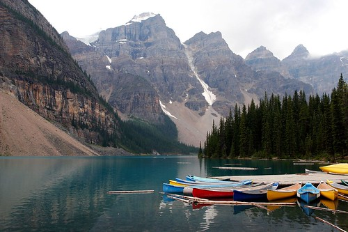
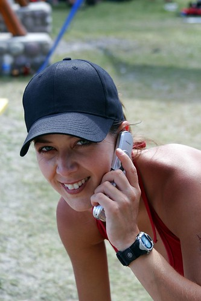
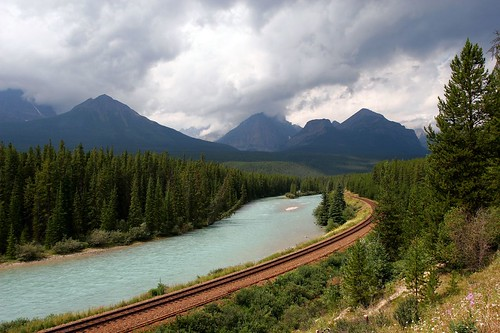
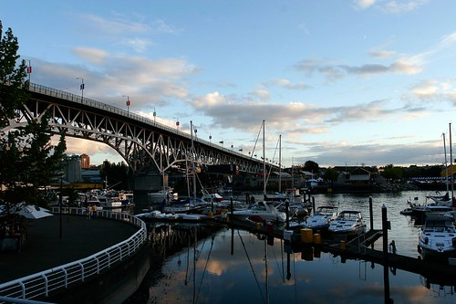

Well, I walked in the door about an hour and a half ago, and man oh man, am I beat. Today was a pretty rough day. I woke up in a hotel in Invermere, BC, at around 9am, seriously hungover and in a hurry to get back to Vancouver. I really wasn't looking forward to the nearly ten hour drive to get back, especially considering that I have to work again in the morning.

I had a really cool time in the Rockies. I left Wednesday and made it as far as Golden BC the first night. Camping there wasn't very restful since there was a train track right beside where my tent was pitched. In the morning, I drove to Banff and set my tent up there for the night. Right before I left for the Rockies, and old friend of mine from elementary school dropped me a note and said if I was ever in the area, I should look her up. So Saturday afternoon I met Joyce and one of her friends for a few beers in Calgary.

Afterwards, I headed back to Banff and enjoyed a nice rainy night in the rockies.

The next day, I originally had planned to drive up to Jasper and camp, but I decided instead to just go up to Lake Louise and enjoy a full day of camping. I met lots of cool people at this camp site, including a group of older Japanese guys that were exploring Canada for 30 days. Turns out they like rum.

I spent Saturday in Invermere for a dragonboat festival, and then headed back to Vancouver this morning. I really wish I had a few more days to relax, but duty calls, and I have to head back to work. I just got back from a quick walk near my place since I haven't been here in about a week.

All in all, I had a really great vacation, and I'm already starting to think about where I'm going to go next. Hawaii is still pretty high on the list, as is Mexico.
