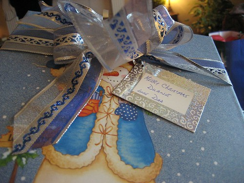
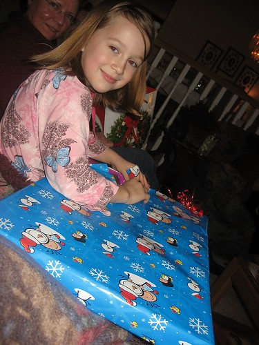
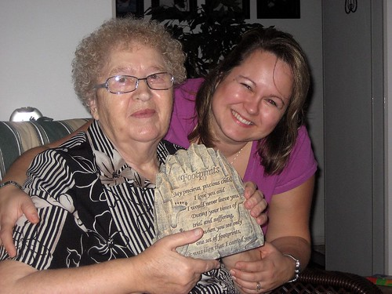
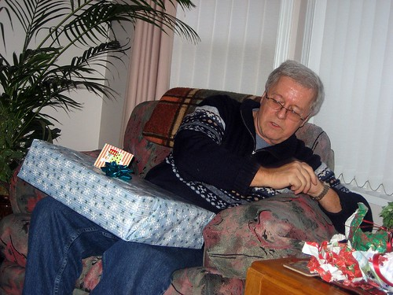

Hey everyone,

I just wanted to wish you all a very Merry Christmas! I'm in Chilliwack for a few days enjoying some R & R with my family. I got about twelve hours of sleep last night, plus around 3 or 4 during the day on my dad's couch this afternoon in front of his new 46" 1080p TV. I'm at my sister's tonight hanging out with some relatives.

 **A present to me from my dad**

Update -- well, it's officially Christmas now so Merry Christmas. Time sure is flying. It's already Monday, and it seems like I just started relaxing. I've gotten tons of sleep so far, which is really good. Apparently I've been pretty run down. On Saturday night I hung out at my sister's with some of my cousins, and then yesterday afternoon hung out at my mom's for some dinner there. Of course, in true Ukranian style, I passed out on the couch shortly after demolishing a plate full of perogies.

 **Jessica, waiting to open her present**

I woke up this morning at my mom's and headed over to Uncle Lyles for a few 11am beers. After, I came over to my dad's for yet another Christmas meal, and to relax on the couch playing my new computer game, Neverwinter Nights 2. Tomorrow I'm gonna take it easy and maybe head over to Andie's parent's house for another dinner.

 **My grandma and sister**

 **My dad opening a gift**
