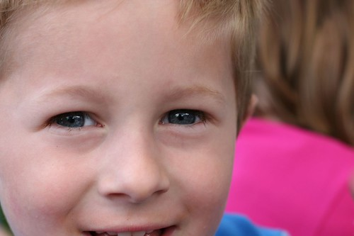

So, a few years ago, Des got me an iPod for my birthday. And while I really love having a MP3 player for when I want to listen to music, the novelty has worn off, and I find myself more frustrated with it with each passing day.

The first thing I hate is that the battery is always dead. It doesn't matter how often I charge it, or how much care I take in shutting it off when I'm not using it, it always seems to be almost dead whenever I pick it up to do anything. Part of my morning routine involves me plugging in my iPod before taking a shower so that there's a hope it will make it to work with me before dying.

The second thing I hate is how easy I can blow headphones. Maybe this isn't specific to iPods, but I'm on my fourth or fifth pair of headphones with my iPod, and replacing them every few months is getting a bit old. It seems like it's almost a never ending money-pit that you can put into these things.

Lastly, I hate how I have to clear the songs whenever I want to get a few songs tied to another computer. In a normal day, I probably touch three computers pretty regularly (my home PC, my laptop, and my desktop PC at work). I have songs on each of them, so if I want to listen to a certain set, I need to wipe my iPod, and add the music from that machine only. Surely Apple is smart enough to figure out a better DRM scheme for this type of use.

Oh well. Travel plans with work are starting to emerge. There's definitely a trip to North Carolina in the near future, and a possibility I'll be in Boston for [Fall VON](http://www.von.com/ "Voice on the Net"). If I do either of those trips, I'd like to bounce back through Chicago and see my old friend Jan Podolej from JDS Uniphase in Ottawa. We've been talking about visiting each other for a few years now, but haven't been able to pull it together. Hopefully we can make it work soon.

I've also been messing around with my blog theme. I haven't found anything I am totally in love with, but this one was pretty cool I thought.. Here's a shot of my nephew Derek (who recently graduated pre-school) taken a few weeks ago in Chilliwack.

