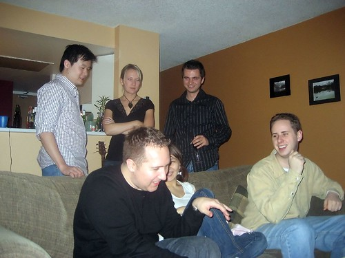
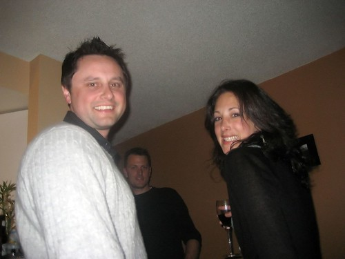

So, despite having been at my place now for nearly a year and a half, I never had the opportunity to have a bunch of people over for a party. Last night seemed like as good a time as any, so I invited a small group of people over for some beer, wine and of course, nachos. It was alot of fun, so thanks to everyone who came and helped drink. I'm still sort of amazed that there were more beer bottles here than there were boxes to put them in, which means some of you hardcores brought beer in a bag or something crazy like that.

 **Me telling some weird joke that apparently involves my hand**

Some of my old friends from university showed up, which was great, since most of them were down in Mexico for the trip I couldn't go on. But they old had a good time, and it was fun hanging out with them again.

 **Ryan, Bob and Candice**

The full set of photos from that night can be [found on my flickr page](http://www.flickr.com/photos/duanestorey/sets/72157594412687659/). The next few weeks are pretty crazy with Christmas festivities, but all of them should be a lot of fun.
