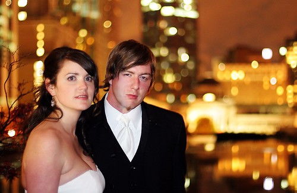

So, I had my appointment today with the plastic surgeon. First, the bad news -- it will take between three and six months before I'll be able to feel my face again. Also, the double vision at the extremities needs to clear up on its own. If it doesn't I need to go back in a few months and go see an eye specialist.

Now the good news -- although my cheekbone \*has moved\*, it's only moved about 1mm or so (inwards I believe). So, they gave me the option of having surgery (which amounts to having three incisions -- one in my mouth, and two around my eyes -- and also having titanium plates and screws fastened to my bones), or to leave it thinking that nobody will notice 1mm. Considering that he said even if they go in and try to adjust it, that they might not be able to make it any better, I chose the less painful approach -- that is, I'm not going to have surgery. He also removed the stitches on my face, which is good. I have to keep the ones on my head in another week or so.

Also, more good news -- he said there's really no medical reason for me to skip my trip to Mexico. So, assuming the pain and swelling subsides, I should be all set for my vacation in two weeks time. I'm missing out on Bob's stag this weekend, but it's good because I still need a few days of sleep and R & R before I'm ok again.

I'm at home in Vancouver again, so I'm just catching up on things around here. My sister and brother and law drove out from Chilliwack on Wednesday to clean my place for me (so I'd have a nice clean place when I got home), which was super nice of them. My mom also did some cleaning this afternoon while I was at the hospital again. Family is great. Thanks to Dad & Cathy for looking after me this week -- Cathy came home every lunch hour to make me some food and to visit, and always made sure I had clean sheets on my bed. My dad was great company, and my biggest supporter. Mom and Marty made me dinner one night, kept checking in on me from time to time, and drove me to the hospital from Chilliwack this afternoon. Jessica and Derek absolutely couldn't believe that there's any person out there that would actually want to kick uncle Duane in the face, which was cute to hear (you could just see the disbelief in their eyes). Baba called me over and made me perogies one day, and let me sleep on her couch for a while. Chris and Andie went around my apartment and hung all the photos I hadn't had time to hang yet, and even fixed an appliance or two.

I have lots of food from relatives, cards from high school friends, and a full inbox of email from people that just wanted to show they cared. Thanks again guys -- you're the best!

So, I managed to assemble all the photos of my injury together. If you want to check these photos out, be warned -- some are graphic, and some have blood in them. Doesn't look too bad, but the three fractures under my cheek are what caused me most of my grief.

- [Saturday night - bloody shirt](Injury/Injury8.jpg)
- [Saturday night - nose cut 1](Injury/Injury1.jpg)
- [Saturday night - nose cut 2](Injury/Injury2.jpg)
- [Saturday night - after stitches and morphine - starting to swell on left side](Injury/Injury3.jpg)
- [Monday morning - starting to swell](Injury/Injury5.jpg)
- [Tuesday morning - swollen](Injury/Injury4.jpg)
- [Thursday afternoon - healing](Injury/Injury6.jpg)
- [Friday night - no more face stitches, still a bit puffy](Injury/Injury7.jpg)

And finally, here are some of the photos I took at Erin and Matt's wedding reception last Saturday night:

