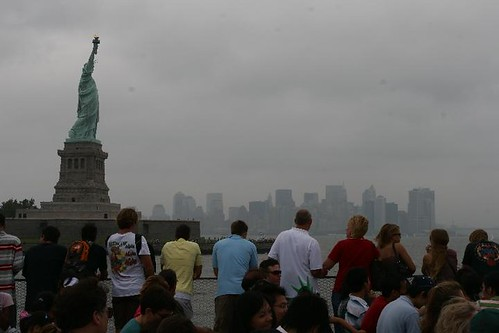

Well, I made it. I'm sitting in the hostel near central park, trying to upload a few photos to flickr using this crazy setup they have here.. I got a few there, although the quality sucks.

Lots of delays yesterday leaving Vancouver. Apparently our plane was busted, so they were frantically trying to replace some parts on it so we could take off - not a very good start to a trip, especially for someone that doesn't like flying. We landed at JFK about 1.5 hours late. Thankfully I met a nice lady on the plane who offered to pay for my cab down to times square (she could expense it she said). So, about 60 minutes after landing, I stepped out of a cab and saw New York in all her glory. It's a really great city, and the people here are very friendly. I spent most of today walking around Lower Manhattan. Visiting ground zero was surreal, and it was actually pretty sad standing there thinking about all those people that died. I also saw the Brooklyn Bridge, the Statue of Liberty and Grand Central station. Tomorrow I'll spend my time near midtown.

